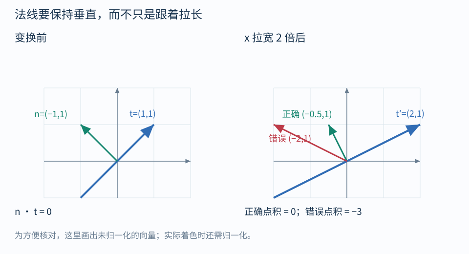

# 06｜点积、法线与切线空间

## 点积：一个方向在另一个方向上占多少

$$
a\cdot b=a_xb_x+a_yb_y+a_zb_z
=\|a\|\|b\|\cos\theta
$$

当 $b$ 是单位向量时，$a\cdot b$ 是 a 在 b 方向上的**带符号投影长度**。两个向量都是单位长度时，结果就是夹角余弦：

- 同向为 1；
- 垂直为 0；
- 反向为 -1。

美术上，$\max(0,n\cdot l)$ 可以表达表面朝向光源的程度。前提是 n、l 已归一化，并且用**同一套正交坐标**描述。模型法线与世界灯光方向直接点积，数字能算出来，但几何含义错了。

这种 Lambert 朝向项只是简化光照的一部分，不包括阴影、衰减、环境光与完整 BRDF。

## 法线的职责是“保持垂直”

切向量描述沿着表面前进的方向。法线描述表面朝向，它必须与表面的切向量垂直：

$$
n^Tt=0
$$

如果表面经过线性变换 A，切向量变为 $t'=At$。希望新法线仍满足：

$$
n'^TAt=0
$$

取：

$$
\boxed{n'=A^{-T}n}
$$

就有 $n'^TAt=n^Tt=0$。最后再归一化。

逆转置不是为了让代码显得复杂，而是为了让箭头继续垂直于已经变形的表面。

## 拉宽后的斜面最容易暴露错误

取二维截面：

$$
t=(1,1),\quad n=(-1,1),\quad A=\mathrm{diag}(2,1)
$$

原来二者点积为零。拉宽之后：

$$
t'=(2,1)
$$

如果把法线当普通方向：

$$
n_{\text{wrong}}=(-2,1),\quad
t'\cdot n_{\text{wrong}}=-3
$$

改用逆转置：

$$
n_{\text{correct}}=(-1/2,1),\quad
t'\cdot n_{\text{correct}}=0
$$

错误法线即使归一化，仍然不垂直；归一化只能修长度，不能修方向。因此错误会表现为明暗和高光朝向不对。

纯旋转时 $R^{-T}=R$，所以用旋转变换法线没问题。统一缩放与旋转组合时，归一化后也能得到一致的方向。非均匀缩放或错切时不能这样简化。

## 在 URP 里优先表达语义

~~~hlsl
float3 normalWS = TransformObjectToWorldNormal(normalOS);
~~~

片元插值后通常需要再 normalize。对于顶点形变，只有原始模型法线还不够：若波浪、弯曲改变了表面，要根据形变重新求法线或相应的局部导数。

Unity 实现中可能看到法线放在 mul 左边。这是用行向量乘逆矩阵来实现相应的逆转置运算，并不是普通方向变换参数可以随意交换。[Unity SpaceTransforms.hlsl](https://github.com/Unity-Technologies/Graphics/blob/master/Packages/com.unity.render-pipelines.core/ShaderLibrary/SpaceTransforms.hlsl)

## 切线空间：表面上的一套小坐标框架

想象给表面贴一张小坐标纸：

- T：沿着纹理 u 方向的切线；
- B：沿着纹理 v 方向的副切线；
- N：指向表面外的法线。

在理想正交单位框架中，切线空间法线 $(x,y,z)$ 表示：

$$
n_W=\operatorname{normalize}(xT+yB+zN)
$$

例如 $(0,0,1)$ 完全沿 N，是“没有额外偏转”的法线；$(0.6,0,0.8)$ 则向 T 方向倾斜。

正常导入的法线贴图存储的是编码后的方向信息，不是可直接照搬到世界的 RGB 颜色。不同压缩与打包方式需要相应解码，实际采样应使用管线支持的法线解码方法。

## TBN 最常见的行列陷阱

数学中把 T、B、N **作为列**写成 C，则：

$$
n_W=Cn_{TS}
$$

HLSL 的下列写法把三个向量组成**三行**：

~~~hlsl
float3x3 rowsTBN = float3x3(T, B, N);
float3 normalWS = normalize(mul(normalTS, rowsTBN));
~~~

它仍得到 $xT+yB+zN$。如果使用 mul(rowsTBN, normalTS)，就不是同一运算。最容易检查的办法，是输入 $(1,0,0)$ 看结果是否为 T。

只有在 T、B、N 为正交单位基时，从世界返回切线空间才可简单用三个点积。真实网格、插值、镜像 UV、非均匀缩放会增加细节，不要把这个理想框架推导当成任何烘焙工作流的完整替代。

## 叉积与镜像符号

叉积产生一个同时垂直于两输入的向量；交换顺序会取反。常见构造为：

~~~hlsl
float handedness = tangentOS.w * GetOddNegativeScale();
float3 B = cross(N, T) * handedness;
~~~

tangentOS.w 保存切线框架的方向性信息；物体存在奇数次负缩放时还需处理镜像符号。这个片段说明符号的来源；生产 Shader 应沿用管线与法线烘焙约定，不随意重建一套不同的 TBN。

## 自测

法线贴图采样的 $(0,0,1)$ 是否永远代表世界朝上？

答案：不是。它代表沿该表面的 N。表面旋转后，世界方向随之变化。这正是切线空间法线贴图可以跟着曲面工作的原因。

导航：[[00-学习路线|目录]] · 上一篇：[[05-相机投影与屏幕坐标]] · 下一篇：[[07-把空间选择变成视觉效果]]
