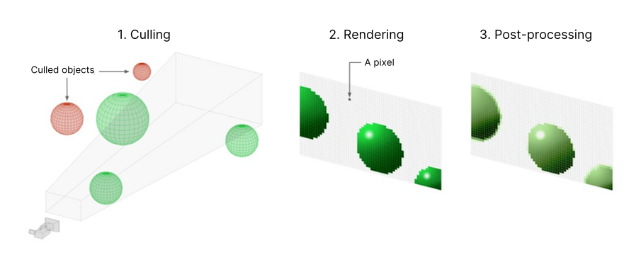
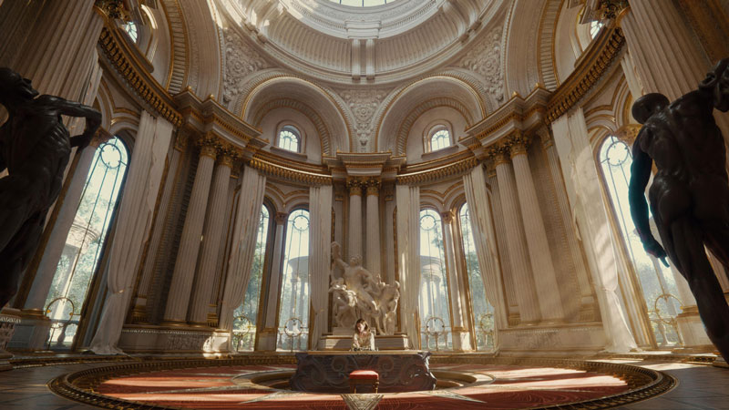

# 渲染管线简介

> 原文：[Introduction to render pipelines](https://docs.unity3d.com/6000.7/Documentation/Manual/render-pipelines-overview.html)

> **重要**：内置渲染管线已弃用，并将在未来版本中停止使用。
> 
> 在整个 Unity 6.7 LTS 生命周期内，Unity 仍会支持内置渲染管线，包括错误修复和维护。
> 
> 有关迁移的信息，请参阅 [[05-使用通用渲染管线/04-开始使用 URP/02-安装和升级 URP/02-从内置渲染管线升级到 URP/00-从内置渲染管线升级到 URP]] 和 [[03-选择渲染管线/02-渲染管线功能比较参考]]。

渲染管线获取场景中的对象并在屏幕上显示它们。

## 渲染管线工作方式

渲染管线遵循以下步骤：

1. **剔除（Culling）**：管线决定显示场景中的哪些对象。这通常意味着移除摄像机视图之外的对象（[视锥体剔除（Frustum Culling）](https://docs.unity3d.com/6000.7/Documentation/Manual/UnderstandingFrustum.html)）或隐藏在其他对象之后的对象（[遮挡剔除（Occlusion Culling）](https://docs.unity3d.com/6000.7/Documentation/Manual/OcclusionCulling.html)）。
2. **渲染（Rendering）**：管线将具有正确光照的对象绘制到像素缓冲区（pixel buffers）中。
3. **后期处理（Post-processing）**：管线修改像素缓冲区，以生成显示器的最终输出帧。修改示例包括颜色分级、泛光和景深。

Unity 每次生成新帧时，渲染管线都会重复这些步骤。

## Unity 中的渲染管线

在 Unity 中，可以选择不同的渲染管线。Unity 提供了三个具有不同功能和性能特征的预构建渲染管线，也可以创建自己的渲染管线。

[[05-使用通用渲染管线/00-使用通用渲染管线]] 是一种可自定义的可编程渲染管线（SRP）。它允许您在各种平台上创建可扩展的图形。

[[06-使用高清渲染管线资源]] 是一种可编程渲染管线，可让您在高端平台上创建尖端的高保真图形。

[[07-使用内置渲染管线/00-使用内置渲染管线]] 是一种自定义选项有限的通用渲染管线。

可编程渲染管线可让您直接在 C# 中检查和更改剔除、渲染和后期处理的工作方式。当您在 C++ 中[购买对 Unity 引擎源代码的访问权限](https://unity.com/products/source-code)时，也可以在内置渲染管线中实现这种自定义级别。

如果您是有高级自定义需求的经验丰富的图形开发者，还可以使用 Unity 的可编程渲染管线 API [创建自定义渲染管线](https://docs.unity3d.com/Packages/com.unity.render-pipelines.core@17.0/manual/srp-custom.html)。

有关为项目选择合适管线的更多信息，请参阅 [[03-选择渲染管线/01-选择渲染管线]]。

## 其他资源

- [光照和渲染教程简介](https://learn.unity.com/tutorial/introduction-to-lighting-and-rendering-2019-3)

---

## 文档导航

- 上一页：[[00-渲染管线]]
- 目录：[[00-渲染管线]]
- 下一页：[[02-可编程渲染管线基础知识]]
