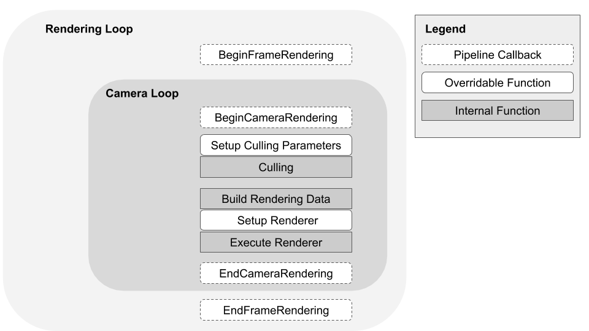

# 通用渲染管线中的渲染

> 原文：[Rendering in the Universal Render Pipeline](https://docs.unity3d.com/6000.7/Documentation/Manual/urp/rendering-in-universalrp.html)

通用渲染管线 (URP) 使用以下组件来渲染场景：

- URP 渲染器。URP 包含以下渲染器：
  - [[../../08-通用渲染管线参考/02-URP 的通用渲染器资源参考]]。
  - [2D 渲染器](https://docs.unity3d.com/6000.7/Documentation/Manual/urp/Setup.html)。

- URP 附带的着色器的[着色模型](https://docs.unity3d.com/6000.7/Documentation/Manual/urp/shading-model.html)
- 摄像机
- [[../../08-通用渲染管线参考/01-URP 通用渲染管线资源参考]]

下图显示了 URP 通用渲染器的帧渲染循环。

URP 通用渲染器：前向渲染路径

当[[../02-安装和升级 URP/02-从内置渲染管线升级到 URP/02-将 URP 安装到现有项目中]]时，Unity 使用 URP 渲染项目中的所有摄像机，包括游戏和场景视图摄像机、反射探针以及 Inspector 中的预览窗口。

URP 渲染器为每个摄像机执行一个摄像机循环，其中执行以下步骤：

1. 剔除场景中的已渲染对象
2. 为渲染器构建数据
3. 执行将图像输出到帧缓冲区的渲染器。

## 摄像机循环

摄像机循环执行以下步骤：

| 步骤 | 描述 |
| --- | --- |
| **设置剔除参数** | 配置决定剔除系统如何剔除光源和阴影的参数。可使用自定义渲染器覆盖渲染管线的这一部分。 |
| **剔除** | 使用上一步中的剔除参数来计算一组可见的渲染器、阴影投射物以及对摄像机可见的光源。剔除参数和摄像机[层距离](https://docs.unity3d.com/ScriptReference/Camera-layerCullDistances.html)会影响剔除和渲染性能。 |
| **构建渲染数据** | 根据剔除输出、[[../../08-通用渲染管线参考/01-URP 通用渲染管线资源参考]]、[摄像机](https://docs.unity3d.com/6000.7/Documentation/Manual/Cameras.html)和当前运行平台的质量设置来捕获信息，以便构建 `RenderingData`。渲染数据告诉渲染器相关摄像机和当前选定平台所需的渲染工作量和质量。 |
| **设置渲染器** | 构建一组渲染通道，并根据渲染数据将它们排队以供执行。可使用自定义渲染器覆盖渲染管线的这一部分。 |
| **执行渲染器** | 执行队列中的每个渲染通道。渲染器会将摄像机图像输出到帧缓冲区。 |

---

## 文档导航

- 上一页：[[00-通用渲染管线基础知识]]
- 目录：[[00-通用渲染管线基础知识]]
- 下一页：[[02-URP 中的渲染路径/00-URP 中的渲染路径]]
