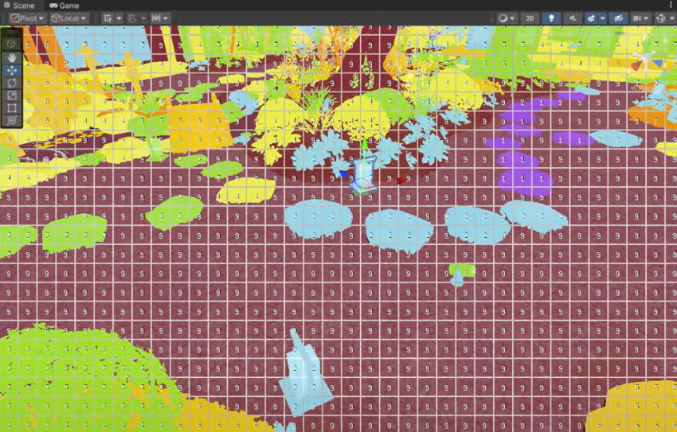

# URP 中的前向渲染路径

> 原文：[Forward and Forward+ rendering paths in URP](https://docs.unity3d.com/6000.7/Documentation/Manual/urp/rendering/forward-rendering-paths.html)

通用渲染管线 (URP) 具有以下前向渲染路径：

- 前向
- Forward+

## 前向渲染路径

前向渲染路径是 URP 中的默认渲染路径。Unity 依次照亮每个游戏对象，并且对可影响每个游戏对象的光源数量有限制。

## Forward+ 渲染路径

Forward+ 渲染路径类似于前向渲染路径，但对可影响每个游戏对象的光源数量没有限制。每个摄像机的可见光数量仍然有限。

使用 Forward+ 渲染路径可以减少 Unity 为每个游戏对象计算的光源数量。Unity 将屏幕划分为图块，然后识别哪些光源会影响哪些图块。Unity 计算游戏对象的光照时，仅使用影响游戏对象所在图块的光源。

使用 Forward+ 渲染路径的光照复杂性调试绘制模式的示例。每个网格方块是一个图块，每个值代表影响图块的光源数量。

如果选择 Forward+ 渲染路径，Unity 会忽略以下设置：

- URP 资产中的**其他光源 (Additional Lights)**。
- URP 资产中的**主光源 (Main Light)**。
- URP 资产中的**其他光源 (Additional Lights)** > **每对象限制 (Per Object Limit)**。
- 光照窗口中的**反射探针 (Reflection Probes)** > **探针混合 (Probe Blending)**。

## 其他资源

- [URP 中的光源限制](https://docs.unity3d.com/6000.7/Documentation/Manual/urp/lighting/light-limits-in-urp.html)
- [[01-URP 中渲染路径简介]]

---

## 文档导航

- 上一页：[[03-在 URP 中设置渲染路径]]
- 目录：[[00-URP 中的渲染路径]]
- 下一页：[[05-URP 中的延迟渲染路径/00-URP 中的延迟渲染路径]]
