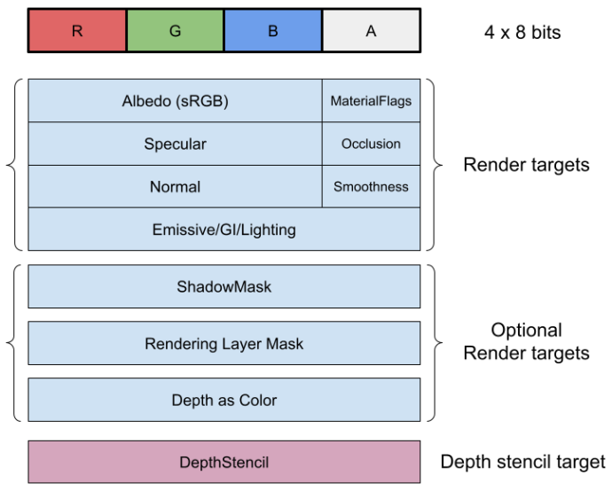

# URP 中延迟渲染路径中的 G 缓冲区布局

> 原文：[G-buffer layout in the Deferred and Deferred+ rendering paths in URP](https://docs.unity3d.com/6000.7/Documentation/Manual/urp/rendering/g-buffer-layout.html)

下图显示了 Unity 在延迟渲染路径中的 G 缓冲区使用的渲染目标的每个像素的数据结构。

Unity 在延迟渲染路径中所使用渲染目标的数据结构

## Albedo (sRGB)

此字段包含 24 位 sRGB 格式的反照率颜色。

## MaterialFlags

此字段是包含材质标志的位字段：

- 位 0，**ReceiveShadowsOff**：如果设置，则像素不接收动态阴影。

- 位 1，**SpecularHighlightsOff**：如果设置，像素不会接收镜面高光。

- 位 2，**SubtractiveMixedLighting**：如果设置，则像素使用减法光照模式。

- 位 3，**SpecularSetup**：如果设置，材质将使用镜面工作流程。

位 4 至 7 保留供将来使用。

## Specular

此字段包含以下 24 位值：

- Simple Lit material：以 24 位存储的 RGB 镜面反射颜色。
- Lit Material with metallic workflow：以 8 位存储的反射率。未使用其他 16 位。
- Lit Material with specular workflow：以 24 位存储的 RGB 镜面反射颜色。

## Occlusion

此字段包含来自烘焙光照的烘焙遮罩值。对于实时光照，Unity 通过将烘焙遮挡值与屏幕空间环境光遮罩 (SSAO) 值结合来计算环境光遮挡值。

## Normal

此字段包含以 24 位编码的世界坐标系法线。有关更多信息，请参阅[[03-在 URP 的延迟渲染路径中启用 Accurate G-buffer normals]]。

## Smoothness

此字段存储 SimpleLit 和 Lit 材质的平滑度值。

## Emissive/GI/Lighting

此渲染目标包含材质发光输出和烘焙光照。Unity 在 G 缓冲区渲染通道期间填充这一字段。在延迟着色通道期间，Unity 将光照结果存储在此渲染目标中。

默认格式为 `B10G11R11_UFloatPack32`。

如果以下任一情况为 true，Unity 将使用 `R16G6B16A16_SFloat`：

- 在 [[../../../../08-通用渲染管线参考/01-URP 通用渲染管线资源参考]]中，已启用**质量设置 (Quality Settings)** > **HDR**，但构建平台不支持 HDR。
- 在[播放器设置 (Player Settings) 窗口](https://docs.unity3d.com/6000.7/Documentation/Manual/class-PlayerSettings.html) 中，启用 **PreserveFramebufferAlpha**。

如果 Unity 无法使用 `B10G11R11_UFloatPack32` 或 `R16G6B16A16_SFloat`，则使用[默认 HDR 格式](https://docs.unity3d.com/ScriptReference/Experimental.Rendering.DefaultFormat.HDR.html)。

## ShadowMask

当[光照模式](https://docs.unity3d.com/6000.7/Documentation/Manual/lighting-mode.html)设置为 **Subtractive** 或 **Shadow mask** 时，Unity 会将此渲染目标添加到 G 缓冲区布局。

## Rendering Layer Mask

启用[渲染层](https://docs.unity3d.com/6000.7/Documentation/Manual/urp/features/rendering-layers.html)时，Unity 会将此渲染目标添加到 G 缓冲区布局中。

## Depth as Color

启用原生渲染通道 (Native Render Pass) 并且平台支持该通道时，Unity 会将此渲染目标添加到 G 缓冲区布局。Unity 会将深度作为颜色渲染到此渲染目标中。此渲染目标具有以下用途：

- 在 Vulkan 设备上提高性能。
- 让 Unity 在使用 Metal 图形 API 上获取深度缓冲区，该行为不允许在同一渲染通道内从 DepthStencil 缓冲区获取深度。

此渲染目标的格式为 `GraphicsFormat.R32_SFloat`。

## DepthStencil

Unity 保留此渲染目标的四个最高位用于材质类型。有关更多信息，请参阅 [URP ShaderLab Pass 标签](https://docs.unity3d.com/6000.7/Documentation/Manual/urp/urp-shaders/urp-shaderlab-pass-tags.html#universalmaterialtype)。

此渲染目标的格式为 `D32F_S8` 或 `D24S8`，具体取决于平台。

## 其他资源

- [[01-URP 中延迟渲染路径中的渲染通道]]
- [渲染层性能](https://docs.unity3d.com/6000.7/Documentation/Manual/urp/features/rendering-layers-introduction.html#performance)

---

## 文档导航

- 上一页：[[01-URP 中延迟渲染路径中的渲染通道]]
- 目录：[[00-URP 中的延迟渲染路径]]
- 下一页：[[03-在 URP 的延迟渲染路径中启用 Accurate G-buffer normals]]
