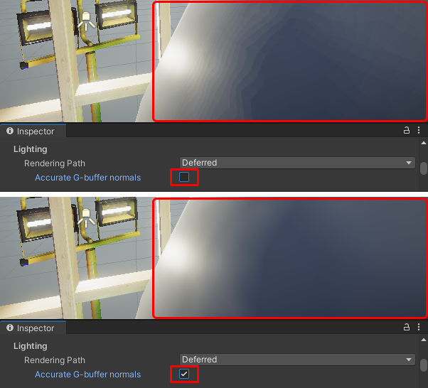

# 在 URP 的延迟渲染路径中启用 Accurate G-buffer normals

> 原文：[Enable accurate G-buffer normals in the Deferred and Deferred+ rendering path in URP](https://docs.unity3d.com/6000.7/Documentation/Manual/urp/rendering/accurate-g-buffer-normals.html)

在延迟渲染路径中，Unity 将法线存储在 G 缓冲区中。

默认情况下，Unity 在法线纹理的 RGB 通道中对每个法线进行编码，x、y 和 z 各使用 8 位。这些值经过量化并因此损失一定的精度。此操作可提高性能，尤其是在移动端 GPU 上，但可能会导致光滑表面上出现色带瑕疵。

为了提高法线的质量，可以在通用渲染器资源中启用 **Accurate G-buffer normals** 属性。请遵循以下步骤：

1. 在**项目 (Project)** 窗口中，选择通用渲染器 (Universal Renderer) 资源。
2. 在**检视 (Inspector)** 窗口中，转到**渲染器 (Renderer)** 部分。
3. 将**准确的 G 缓冲区法线 (Accurate G-buffer normals)** 设为**开 (On)**。

将 **Accurate G-buffer normals** 设置为 **On** 时，Unity 使用八面体编码。法线矢量的值更加准确，但编码和解码操作会给 GPU 带来额外的负担。编码法线矢量的精度与前向渲染路径中采样值的精度类似。

下图显示了当摄像机非常靠近游戏对象时两个选项之间的视觉差异：

Accurate G-buffer normals，两个选项之间的视觉差异。

此选项不支持：

- 与 [Screen Space decal technique](https://docs.unity3d.com/6000.7/Documentation/Manual/urp/renderer-feature-decal.html) 一起使用时的贴花法线混合。
- 具有四个以上地形层的地形混合，因为使用八面体编码的不同层中的法线由于编码的逐位性质（2 x 12 位）而无法混合在一起。

## 其他资源

- [[02-URP 中延迟渲染路径中的 G 缓冲区布局]]
- [Normals](https://docs.unity3d.com/6000.7/Documentation/Manual/StandardShaderMaterialParameterNormalMapSurfaceNormals.html)

---

## 文档导航

- 上一页：[[02-URP 中延迟渲染路径中的 G 缓冲区布局]]
- 目录：[[00-URP 中的延迟渲染路径]]
- 下一页：[[04-延迟渲染路径简介]]
