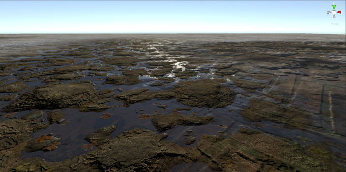
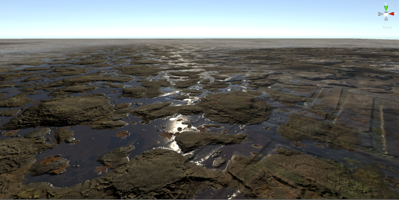

# 延迟渲染路径简介

> 原文：[Blend terrain accurately in the Deferred and Deferred+ rendering paths in URP](https://docs.unity3d.com/6000.7/Documentation/Manual/urp/rendering/deferred-rendering-path-introduction.html)

通用渲染管线 (URP) 中的延迟渲染路径首先创建一个 G 缓冲区，这是一组纹理，用于存储有关场景的信息，然后使用该信息一次性照亮所有游戏对象。

## 地形混合精度

在 Deferred+ 中，由于 Unity 组合地形层的方式，地形可能看起来有所不同。

- 在前向渲染路径中，Unity 使用多通道渲染来计算一次四个层的光照，并在每组四个层的计算后进行 Alpha 混合。
- 在延迟渲染路径中，Unity 使用硬件混合以一次四层的方式在 G 缓冲区通道中合并地形层，然后在延迟渲染通道期间只计算一次光照。

延迟渲染路径中的方法限制了属性值组合的正确性。例如，不能单独使用 Alpha 混合方程来正确组合像素法线，因为一个地形层可能包含粗糙的地形细节，而另一层可能包含精细的细节。法线的平均或求和算法会导致精度损失。

使用前向渲染路径渲染的地形层

使用延迟渲染路径渲染的地形层

## 默认着色器兼容性

Unity 使用前向渲染通道来渲染以下默认着色器：

- 复杂光照着色器：光照模型过于复杂，无法放入 G 缓冲区。
- 烘焙光照着色器或光照着色器：没有实时光照，因此 Unity 将数据渲染到 G 缓冲区的 Emissive/GI/Lighting 字段中。这比使用延迟渲染通道更快。

## 其他资源

- [[../01-URP 中渲染路径简介]]
- [[01-URP 中延迟渲染路径中的渲染通道]]
- [[05-在 URP 中使着色器与延迟渲染路径兼容]]

---

## 文档导航

- 上一页：[[03-在 URP 的延迟渲染路径中启用 Accurate G-buffer normals]]
- 目录：[[00-URP 中的延迟渲染路径]]
- 下一页：[[05-在 URP 中使着色器与延迟渲染路径兼容]]
