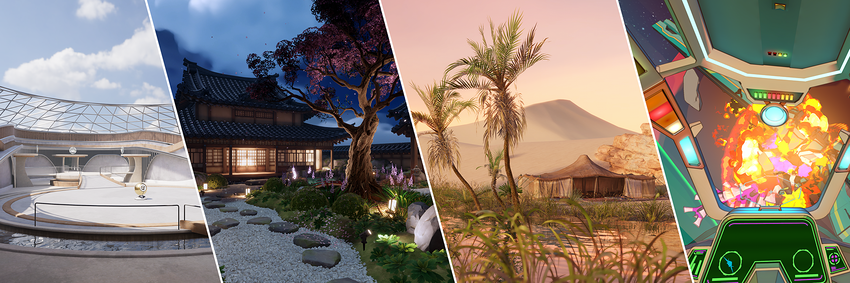

# 创建 URP 项目

> 原文：[Creating a URP project](https://docs.unity3d.com/6000.7/Documentation/Manual/urp/creating-a-urp-project.html)

URP 3D 示例

创建使用通用渲染管线 (URP) 的新项目，或浏览 URP 场景模板和包示例。

| 页面 | 说明 |
| --- | --- |
| [[01-使用 URP 创建新项目]] | 使用 Unity Hub 中的模板创建使用 URP 的新项目。 |
| [[02-URP 中的场景模板]] | 了解可快速创建场景的 URP 场景模板。 |
| [[03-在 URP 中导入包示例]] | 导入可用于构建项目或学习功能的一组资源。 |
| [[04-URP 的包示例参考]] | 了解 URP 提供的包示例。 |

## 其他资源

- [[../02-从内置渲染管线升级到 URP/00-从内置渲染管线升级到 URP]]
- [包和功能集](https://docs.unity3d.com/6000.7/Documentation/Manual/PackagesList.html)
- [URP 3D 示例](https://unity.com/demos/urp-3d-sample)

---

## 文档导航

- 上一页：[[../00-安装和升级 URP]]
- 目录：
- 下一页：[[01-使用 URP 创建新项目]]
