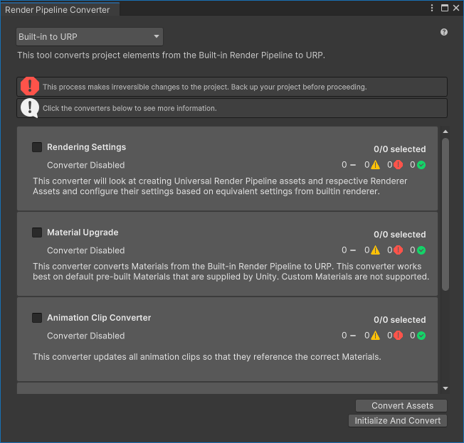
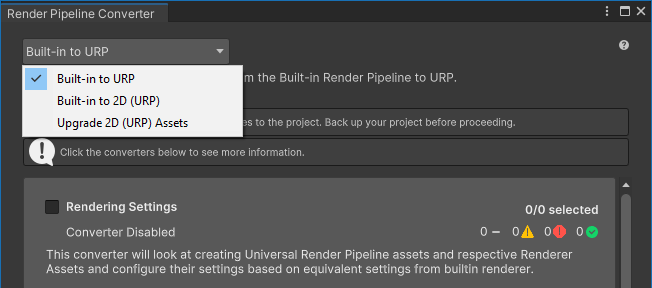
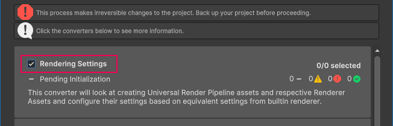
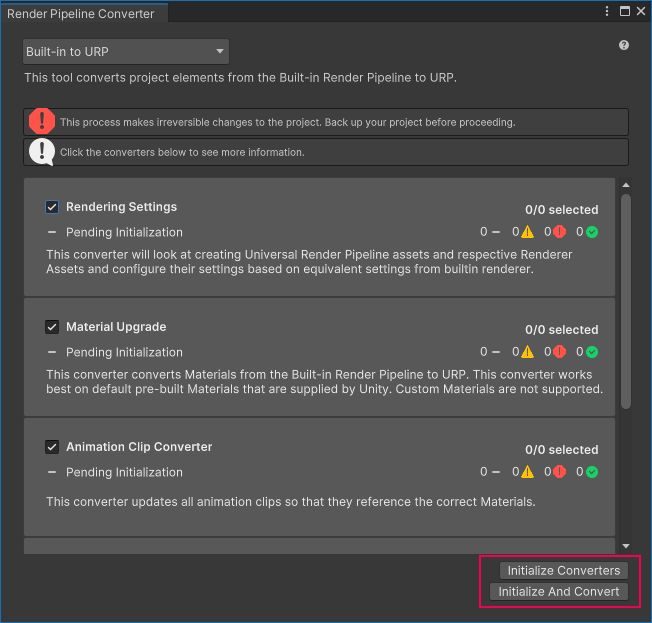
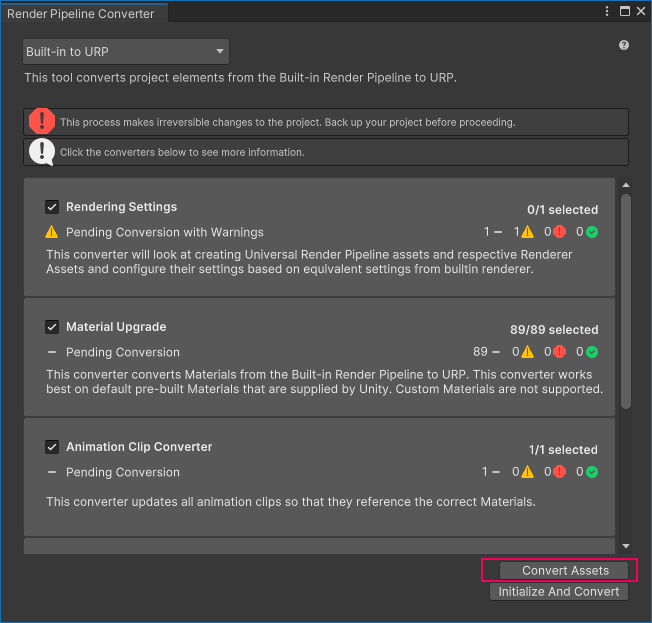
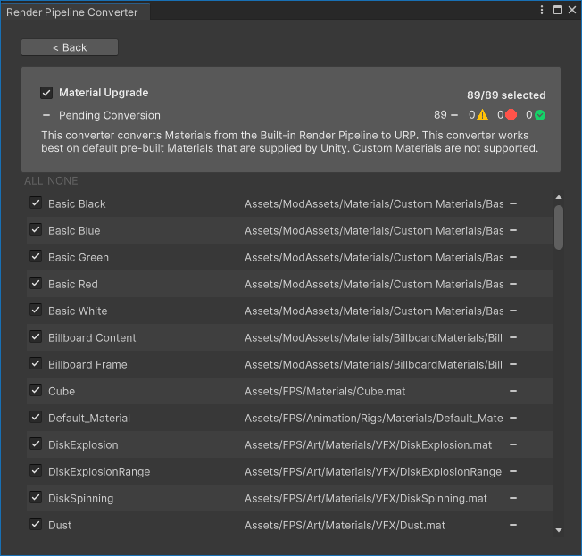
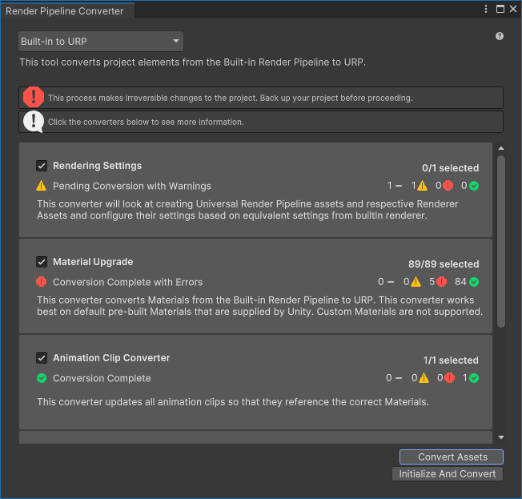
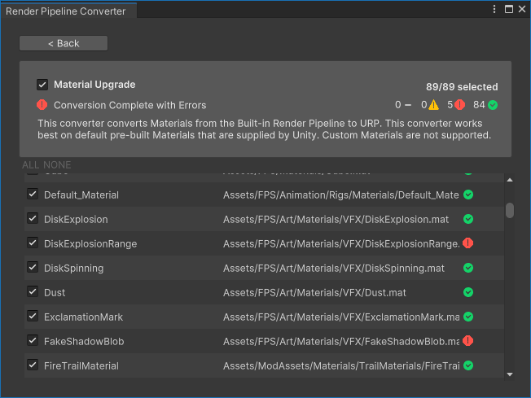

# 使用渲染管线转换器转换资源

> 原文：[Render Pipeline Converter window for URP reference](https://docs.unity3d.com/6000.7/Documentation/Manual/urp/features/rp-converter.html)


**渲染管线转换器**可以将针对内置渲染管线项目制作的资源转换为与 URP 兼容的资源。

> **注意**：转换过程会对项目进行不可逆转的更改。在转换前，请备份项目。

## 如何使用渲染管线转换器

要转换项目资源，请执行以下操作：

1. 选择 **Window** > **Rendering** > **Render Pipeline Converter**。Unity 将打开 Render Pipeline Converter 窗口。   Render Pipeline Converter 对话框
2. 选择转换类型。   转化类型
3. 根据转换类型，对话框会显示可用的转换器。选中或清除转换器名称旁边的复选框可启用或禁用转换器。   选择转换器  有关可用转换器的列表，请参阅部分。
4. 单击 **Initialize Converters**。渲染管线转换器会预处理项目中的资源并显示要转换的元素列表。选中或清除资源旁边的复选框可将资源包含在转换过程中或从转换过程中排除。   初始化转换器  下图显示了初始化的转换器。   初始化的转换器  单击转换器可查看转换器要转换的项目列表。   转换器详细视图   **黄色图标**：元素旁边的黄色图标表示可能需要用户操作才能运行转换。将鼠标指针悬停在图标上可查看问题描述。
5. 单击 **Convert Assets** 开始转换过程。   **注意**：转换过程会对项目进行不可逆转的更改。在转换前，请备份项目。  转换过程完成后，窗口会显示每个转换器的状态。   转换完成   **绿色勾号标记**：转换没有问题。  **黄色图标**：转换已完成，但出现警告，可能需要用户执行操作。  **红色图标**：转换失败。
6. 单击转换器可查看该转换器中已处理项目的列表。  的详细视图 查看转换后的项目后，关闭 Render Pipeline Converter 窗口。

## 转换类型和转换器

渲染管线转换器允许选择以下转换类型之一：

- 内置渲染管线到 URP
- 内置渲染管线 2D 到 URP 2D
- 升级 2D URP 资源

选择其中一种转换类型时，该工具会显示可用的转换器。

以下几节介绍了每种转换类型可用的转换器。

### 内置渲染管线到 URP

这种转换类型将项目元素从内置渲染管线转换为 URP。

可用的转换器：

- **Rendering Settings** 此转换器将创建 URP 资源和渲染器资源。然后，转换器会评估内置渲染管线项目中的设置，并将它们转换为 URP 资源中的等效属性。
- **Material Upgrade** 该转换器转换材质。该转换器适用于 Unity 提供的预构建材质，它不支持具有自定义着色器的材质。
- **Animation Clip Converter** 此转换器将转换动画剪辑。此转换器在 **Material Upgrade** 转换器完成之后运行。   **注意**：仅当项目包含影响材质属性或后期处理栈 v2 属性的动画时，此转换器才可用。
- **Read-only Material Converter** 该转换器转换预构建的只读材质，其中 **材质升级** 转换器无法替代着色器。此转换器对项目进行索引并创建临时 `.index` 文件，这可能需要很长时间。 只读材料的示例：`Default-Diffuse`、`Default-Line`、`Dafault-Terrain-Diffuse` 等。
- **Post-Processing Stack v2 Converter** 该转换器将 PPv2 卷、配置文件和层转换为 URP 卷、配置文件和相机。此转换器对项目进行索引并创建临时 `.index` 文件，这可能需要很长时间。

### 内置渲染管线 2D 到 URP 2D

这种转换类型将项目的元素从内置渲染管线 2D 转换为 URP 2D。

可用的转换器：

- **Material and Material Reference Upgrade** 此转换器将所有材质和材质引用从内置渲染管线 2D 转换为 URP 2D。

### 升级 2D URP 资源

这种转换类型将 2D 项目的资源从较早的 URP 版本升级到最新的 URP 版本。

可用的转换器：

- **Parametric to Freeform Light Upgrade** 此转换器将所有参数化光源转换为自由形式光源。

# 使用 API 或 CLI 运行转换

渲染管线转换器使用 [RunInBatchMode](https://docs.unity3d.com/Packages/com.unity.render-pipelines.universal@latest/index.html?subfolder=/api/UnityEditor.Rendering.Universal.Converters.html#UnityEditor_Rendering_Universal_Converters_RunInBatchMode_UnityEditor_Rendering_Universal_ConverterContainerId_) 方法实现 [Converters](https://docs.unity3d.com/Packages/com.unity.render-pipelines.universal@latest/index.html?subfolder=/api/UnityEditor.Rendering.Universal.Converters.html) 类，这些方法允许您从命令行运行转换过程。

例如，以下脚本初始化并执行转换器 **Material Upgrade** 和 **Read-only Material Converter**。

```
using System.Collections;
using System.Collections.Generic;
using UnityEditor;
using UnityEditor.Rendering.Universal;
using UnityEngine;

public class MyUpgradeScript : MonoBehaviour
{
    public static void ConvertBuiltinToURPMaterials()
    {
        Converters.RunInBatchMode(
            ConverterContainerId.BuiltInToURP
            , new List<ConverterId> {
                ConverterId.Material,
                ConverterId.ReadonlyMaterial
            }
            , ConverterFilter.Inclusive
        );
        EditorApplication.Exit(0);
    }
}
```

要从命令行运行示例转换，请使用以下命令：

```
"<path to Unity application> -projectPath <project path> -batchmode -executeMethod MyUpgradeScript.ConvertBuiltinToURPMaterials
```

另请参阅：[Unity Editor 命令行参数](https://docs.unity3d.com/Manual/EditorCommandLineArguments.html)。

---

## 文档导航

- 上一页：[[05-将质量设置从内置渲染管线转换到 URP。]]
- 目录：[[00-从内置渲染管线升级到 URP]]
- 下一页：[[07-URP 中的内置渲染管线材质引用]]
