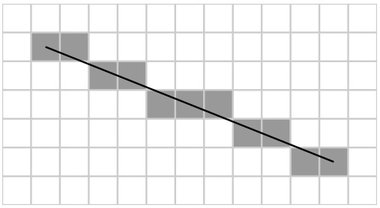

# 在通用渲染管线中添加抗锯齿

> 原文：[Add anti-aliasing in the Universal Render Pipeline](https://docs.unity3d.com/6000.7/Documentation/Manual/urp/anti-aliasing.html)

Aliasing 是数字采样器对现实世界的信息进行采样并尝试将其数字化时产生的副作用。例如，对音频或视频进行采样时，Aliasing 表示数字信号的形状与原始信号的形状不匹配。因此，当 Unity 渲染线条时，如果像素没有完全沿着线条在屏幕上的预期路径对齐，线条可能会呈现锯齿。

*光栅化过程产生锯齿的示例。*

为了防止 Aliasing，Universal Render Pipeline（URP）提供了多种 Anti-aliasing 方法，每种方法在效果和资源消耗方面各有不同。

可用的 Anti-aliasing 方法包括：

- Fast Approximate Anti-aliasing（FXAA）
- Subpixel Morphological Anti-aliasing（SMAA）
- Temporal Anti-aliasing（TAA）
- Multisample Anti-aliasing（MSAA）

## Fast Approximate Anti-aliasing（FXAA）

FXAA 使用全屏 Pass，逐像素平滑边缘。这是 URP 中资源消耗最低的 Anti-aliasing 技术。

要为 Camera 选择 FXAA：

1. 在 Scene 视图或 Hierarchy 窗口中选择 Camera，然后在 Inspector 中查看它。
2. 转到 **Rendering** > **Anti-aliasing**，然后选择 **Fast Approximate Anti-aliasing (FXAA)**。

> **注意：**对于移动平台上的 Anti-aliasing，Unity 建议使用 FXAA。

## Subpixel Morphological Anti-aliasing（SMAA）

SMAA 会查找图像边界中的图案，并根据找到的图案混合边界上的像素。这种 Anti-aliasing 方法的结果比 FXAA 清晰得多。

要为 Camera 选择 SMAA：

1. 在 Scene 视图或 Hierarchy 窗口中选择 Camera，然后在 Inspector 中查看它。
2. 转到 **Rendering** > **Anti-aliasing**，然后选择 **Subpixel Morphological Anti-aliasing (SMAA)**。

## Temporal Anti-aliasing（TAA）

TAA 使用 Color History Buffer 中的帧，在多个帧的时间范围内平滑边缘。由于 TAA 会随时间计算效果，在极端情况下可能产生 Ghosting Artifact，例如 GameObject 在与其形成明显对比的表面前快速移动时。TAA 使用 [Motion Vector](https://docs.unity3d.com/6000.7/Documentation/Manual/urp/features/motion-vectors.html)。

要为 Camera 选择 TAA：

1. 在 Scene 视图或 Hierarchy 窗口中选择 Camera，然后在 Inspector 中查看它。
2. 转到 **Rendering** > **Anti-aliasing**，然后选择 **Temporal Anti-aliasing (TAA)**。

以下功能不能与 TAA 一起使用：

- Multisample Anti-aliasing（MSAA）
- Camera Stacking
- [Dynamic Resolution](https://docs.unity3d.com/6000.7/Documentation/Manual/DynamicResolution.html)

## Multisample Anti-aliasing（MSAA）

MSAA 会采样每个像素的 Depth 和 Stencil 值，并组合这些采样结果来生成最终像素。重要的是，MSAA 可以解决 Spatial Aliasing，并且比其他技术更擅长解决三角形边缘的 Aliasing。但它不能解决 Shader Aliasing，例如 Specular Aliasing 或 Texture Aliasing。

在大多数硬件上，MSAA 比其他形式的 Anti-aliasing 更消耗资源。但是，在没有使用 Post-processing Anti-aliasing 或 Custom Render Feature 的 Tiled GPU 上运行时，MSAA 比其他 Anti-aliasing 类型更节省资源。

MSAA 是一种 Hardware Anti-aliasing 方法。因此，它可以与其他方法一起使用，因为其他方法属于 Post-processing Effect。但是，MSAA 不能与 TAA 一起使用。

要启用 MSAA：

1. 在 Inspector 中打开一个 [[08-通用渲染管线参考/01-URP 通用渲染管线资源参考]]。
2. 转到 **Quality** > **Anti Aliasing (MSAA)**，然后选择所需的 MSAA 级别。

有关可用设置的更多信息，请参阅 [[08-通用渲染管线参考/01-URP 通用渲染管线资源参考]] 中的 MSAA 设置。

> **注意：**在不支持 [StoreAndResolve](https://docs.unity3d.com/ScriptReference/Rendering.RenderBufferStoreAction.StoreAndResolve.html) Store Action 的移动平台上，如果在 **URP Asset** 中选择 **Opaque Texture**，Unity 会在运行时忽略 **MSAA** 属性（就像 **MSAA** 设置为 **Disabled** 一样）。

---

## 文档导航

- 上一页：[[05-URP 中的图形质量设置/06-使用 URP 配置包配置设置]]
- 目录：[[00-使用通用渲染管线]]
- 下一页：[[07-在 URP 中自定义渲染和后期处理/00-在 URP 中自定义渲染和后期处理]]
