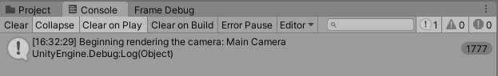
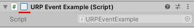

# 在 URP 中通过脚本注入渲染通道

> 原文：[Inject a render pass using the RenderPipelineManager API in URP](https://docs.unity3d.com/6000.7/Documentation/Manual/urp/customize/inject-render-pass-via-script.html)


Unity 在每一帧中渲染每个活动摄像机之前会引发一个 [beginCameraRendering](https://docs.unity3d.com/ScriptReference/Rendering.RenderPipelineManager-beginCameraRendering.html) 事件。如果摄像机处于非活动状态（例如，如果摄像机游戏对象上的 **Camera** 组件复选框被禁用），Unity 不会为该摄像机触发 `beginCameraRendering` 事件。

当您订阅此事件的方法时，您可以在 Unity 渲染摄像机之前执行自定义逻辑。自定义逻辑的示例包括渲染额外的摄像机到渲染纹理，并使用这些纹理实现平面反射或监控摄像机视图等效果。

[RenderPipelineManager](https://docs.unity3d.com/ScriptReference/Rendering.RenderPipelineManager.html) 类中的其他事件提供了更多自定义 URP 的方法。您也可以将本文介绍的原则应用于这些事件。

## 使用 RenderPipelineManager API

1. 订阅 [RenderPipelineManager](https://docs.unity3d.com/ScriptReference/Rendering.RenderPipelineManager.html) 类中的某个事件。
2. 在订阅的方法中，使用 `ScriptableRenderer` 实例的 `EnqueuePass` 方法将自定义渲染通道注入 URP 帧渲染。

代码示例：

```
public class EnqueuePass : MonoBehaviour
{
    [SerializeField] private BlurSettings settings;    
    private BlurRenderPass blurRenderPass;

    private void OnEnable()
    {
        ...
        blurRenderPass = new BlurRenderPass(settings);
        // Subscribe the OnBeginCamera method to the beginCameraRendering event.
        RenderPipelineManager.beginCameraRendering += OnBeginCamera;
    }

    private void OnDisable()
    {
        RenderPipelineManager.beginCameraRendering -= OnBeginCamera;
        blurRenderPass.Dispose();
        ...
    }

    private void OnBeginCamera(ScriptableRenderContext context, Camera cam)
    {
        ...
        // Use the EnqueuePass method to inject a custom render pass
        cam.GetUniversalAdditionalCameraData()
            .scriptableRenderer.EnqueuePass(blurRenderPass);
    }
}
```

## 示例

此示例演示了如何订阅 `beginCameraRendering` 事件的方法。

要遵循此示例中的步骤，请[[../../04-开始使用 URP/02-安装和升级 URP/01-创建 URP 项目/01-使用 URP 创建新项目]]

1. 在场景中，创建一个立方体。将其命名为 Example Cube。
2. 在项目中，创建一个 C# 脚本。并命名为 `URPCallbackExample`。
3. 将以下代码复制并粘贴到这个脚本中。 ```C# using UnityEngine; using UnityEngine.Rendering; public class URPCallbackExample : MonoBehaviour { // Unity calls this method automatically when it enables this component private void OnEnable() { // Add WriteLogMessage as a delegate of the RenderPipelineManager.beginCameraRendering event RenderPipelineManager.beginCameraRendering += WriteLogMessage; } `// Unity calls this method automatically when it disables this component private void OnDisable() { // Remove WriteLogMessage as a delegate of the RenderPipelineManager.beginCameraRendering event RenderPipelineManager.beginCameraRendering -= WriteLogMessage; } // When this method is a delegate of RenderPipeline.beginCameraRendering event, Unity calls this method every time it raises the beginCameraRendering event void WriteLogMessage(ScriptableRenderContext context, Camera camera) { // Write text to the console Debug.Log($"Beginning rendering the camera: {camera.name}"); }` } ```> **注意**：订阅事件时，处理程序方法（在本示例中为`WriteLogMessage`）必须接受事件委托中定义的参数。在此示例中，事件委托为`RenderPipeline.BeginCameraRendering`，需要以下参数：`<ScriptableRenderContext, Camera>`。
4. 将该 `URPCallbackExample` 脚本附加到 Example Cube。
5. 选择**播放 (Play)**。每次 Unity 触发 `beginCameraRendering` 事件时，Unity 都会在控制台窗口中打印来自脚本的消息。   Unity 在控制台中打印日志消息。
6. 要引发对 `OnDisable()` 方法的调用：在播放模式下，选择 Example Cube 并清除脚本组件标题旁边的复选框。Unity 会取消订阅 `RenderPipelineManager.beginCameraRendering` 事件中的 `WriteLogMessage`，并停止在控制台窗口中打印消息。   停用脚本组件。清除脚本组件标题旁边的复选框。

## 在 MonoBehaviour 中使用函数

您可以通过场景中的任何游戏对象将可编程渲染通道注入场景。这可以更精确地控制渲染通道的激活时机。但这也意味着您必须在每个需要使用该渲染通道的位置，通过游戏对象注入它。因此，建议通过可编程渲染器功能注入项目中的通用效果。

通过任何游戏对象将可编程渲染通道注入场景时，请注意 URP 对该脚本的使用方式。第一个渲染可编程渲染通道的摄像机会耗尽该渲染通道，并且是唯一应用该渲染通道的摄像机。任何在第一个摄像机之后渲染的摄像机都不会应用该渲染通道的效果。

例如，如果有两个摄像机，并在 `Update` 方法中添加了可编程渲染通道，则只有第一个渲染的摄像机会应用该渲染通道的效果。这是因为第一个摄像机已经使用了效果的实例。由于第二个摄像机在下一次调用 `Update` 方法之前已经渲染，因此无法使用可编程渲染通道的第二个实例。因此，第二个摄像机不会将其输出应用可编程渲染通道中的效果。


## 官方代码示例补充（Unity 6000.7）

### 官方代码片段 1

```csharp
public class InjectPass : MonoBehaviour
{
    // Declare a custom render pass
    private ExampleRenderPass exampleRenderPass;

    private void OnEnable()
    {
        // Create the custom render pass
        exampleRenderPass = new ExampleRenderPass(settings);
    }
}
```

### 官方代码片段 2

```csharp
private void OnEnable()
    {
        ...
        // Call the InjectRenderPass method when the beginCameraRendering event is raised.
        RenderPipelineManager.beginCameraRendering += InjectRenderPass;            
    }
```

### 官方代码片段 3

```csharp
public class InjectPass : MonoBehaviour
{
    ...

    // Add the method that Unity calls after the beginCameraRendering event is raised.
    // The method must accept the ScriptableRenderContext and Camera parameters the event delegate defines.
    private void InjectRenderPass(ScriptableRenderContext context, Camera cam)
    {
        ...
        // Use the EnqueuePass API to inject the custom render pass.
        cam.GetUniversalAdditionalCameraData().scriptableRenderer.EnqueuePass(exampleRenderPass);
    }
}
```

### 官方代码片段 4

```csharp
public class InjectPass : MonoBehaviour
{
    ...

    private void OnDisable()
    {
        RenderPipelineManager.beginCameraRendering -= InjectRenderPass;
    }
}
```

---

## 文档导航

- 上一页：[[01-在 URP 中创建可编程渲染器功能]]
- 目录：[[00-在 URP 中将可编程渲染通道添加到帧渲染循环]]
- 下一页：[[03-将渲染通道限制到 URP 场景区域]]
