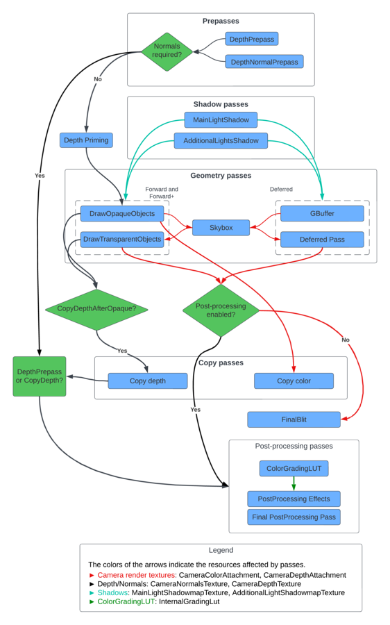

# URP 的注入点参考

> 原文：[Injection points reference for URP](https://docs.unity3d.com/6000.7/Documentation/Manual/urp/customize/custom-pass-injection-points.html)

URP 包含多个注入点，可让您将渲染通道注入帧渲染循环并在不同事件上执行。

注入点使自定义渲染通道可以访问 URP 缓冲区。渲染通道对每个注入点的所有缓冲区都有读取和写入访问权限。

Unity 在渲染循环中提供了以下事件。您可以使用这些事件注入自定义通道。

| **注入点** | **描述** |
| --- | --- |
| BeforeRendering | 在为当前摄像机渲染管线中的任何其他通道之前执行 `ScriptableRenderPass` 实例。此时，未设置摄像机矩阵和立体渲染。您可以使用此注入点来绘制稍后会在管线中使用的自定义输入纹理，例如 LUT 纹理。 |
| BeforeRenderingShadows | 在渲染阴影贴图（**MainLightShadow**、**AdditionalLightsShadow** 通道）之前执行 `ScriptableRenderPass` 实例。   此时，未设置摄像机矩阵和立体渲染。 &#124; |
| AfterRenderingShadows | 在渲染阴影贴图（**MainLightShadow**、**AdditionalLightsShadow** 通道）之后执行`ScriptableRenderPass`实例。   此时，未设置摄像机矩阵和立体渲染。 &#124; |
| BeforeRenderingPrePasses | 在渲染预通道（**DepthPrepass**、**DepthNormalPrepass** 通道）之前执行 `ScriptableRenderPass` 实例。   此时，摄像机矩阵和立体渲染已设置。 &#124; |
| AfterRenderingPrePasses | 在渲染预通道（**DepthPrepass**、**DepthNormalPrepass** 通道）之后执行 `ScriptableRenderPass` 实例。   此时，摄像机矩阵和立体渲染已设置。 &#124; |
| BeforeRenderingGbuffer | 在渲染 **GBuffer** 通道之前执行 `ScriptableRenderPass` 实例。 |
| AfterRenderingGbuffer | 在渲染 **GBuffer** 通道之后执行 `ScriptableRenderPass` 实例。 |
| BeforeRenderingDeferredLights | 在渲染 **Deferred** 通道之前执行 `ScriptableRenderPass` 实例。 |
| AfterRenderingDeferredLights | 在渲染 **Deferred** 通道之后执行 `ScriptableRenderPass` 实例。 |
| BeforeRenderingOpaques | 在渲染不透明对象（**DrawOpaqueObjects** 通道）之前执行 `ScriptableRenderPass` 实例。 |
| AfterRenderingOpaques | 在渲染不透明对象（**DrawOpaqueObjects** 通道）之后执行 `ScriptableRenderPass` 实例。 |
| BeforeRenderingSkybox | 在渲染天空盒（**Camera.RenderSkybox** 通道）之前执行 `ScriptableRenderPass` 实例。 |
| AfterRenderingSkybox | 在渲染天空盒（**Camera.RenderSkybox** 通道）之后执行 `ScriptableRenderPass` 实例。 |
| BeforeRenderingTransparents | 在渲染透明对象（**DrawTransparentObjects** 通道）之前执行 `ScriptableRenderPass` 实例。 |
| AfterRenderingTransparents | 在渲染透明对象（**DrawTransparentObjects** 通道）之后执行 `ScriptableRenderPass` 实例。 |
| BeforeRenderingPostProcessing | 在渲染后期处理效果（**Render PostProcessing Effects** 通道）之前执行 `ScriptableRenderPass` 实例。 |
| AfterRenderingPostProcessing | 在渲染后期处理效果之后、最终 Blit、后期处理抗锯齿效果和颜色分级之前执行 `ScriptableRenderPass` 实例。 |
| AfterRendering | 在渲染所有其他通道之后执行 `ScriptableRenderPass` 实例。 |

下图显示了 URP 帧中的通道和帧资源流程：

URP 帧渲染图和通道

---

## 文档导航

- 上一页：[[03-将渲染通道限制到 URP 场景区域]]
- 目录：[[00-在 URP 中将可编程渲染通道添加到帧渲染循环]]
- 下一页：[[../07-修改 URP 源代码]]
