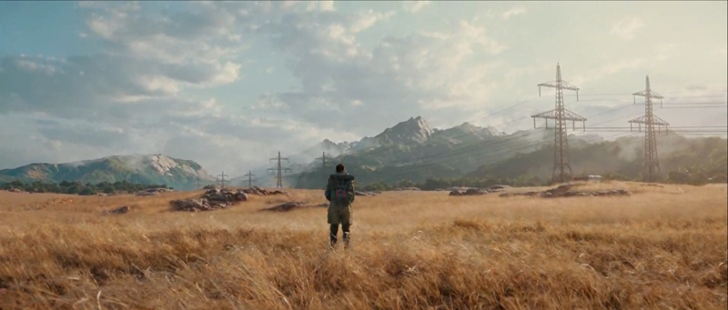

# 使用高清渲染管线资源

> 原文：[Using the High Definition Render Pipeline](https://docs.unity3d.com/6000.7/Documentation/Manual/high-definition-render-pipeline.html)

高清渲染管线（High Definition Render Pipeline，HDRP）是 Unity 构建的预先构建的[[02-可编程渲染管线基础知识|可编程渲染管线]]。HDRP 可让你为高端平台创建尖端的高保真图形。

*来自 [Time Ghost](https://unity.com/demos/time-ghost) 的场景。Time Ghost 是使用 Unity 6 制作的实时 HDRP 电影；人物背对摄像机站在开阔的田野中，远处是绵延的山脉。*

HDRP 适用于 AAA 级品质的游戏、汽车演示、建筑应用，以及任何需要高保真图形的场景。HDRP 使用基于物理的光照和材质，同时支持前向和延迟渲染。HDRP 使用计算着色器技术，因此需要兼容的 GPU 硬件。

有关如何使用 HDRP 的信息，请参阅 [HDRP 文档微网站](https://docs.unity3d.com/Packages/com.unity.render-pipelines.high-definition@latest)。

## 其他资源

- [[00-渲染管线]]
- [[03-选择渲染管线/00-选择渲染管线]]
- [在自定义渲染管线中执行渲染命令](https://docs.unity3d.com/Packages/com.unity.render-pipelines.core@17.0/manual/srp-using-scriptable-render-context.html)

---

## 文档导航

- 上一页：[[05-使用通用渲染管线/08-通用渲染管线参考/03-URP 的图形设置窗口参考]]
- 目录：[[00-渲染管线]]
- 下一页：[[07-使用内置渲染管线/00-使用内置渲染管线]]
