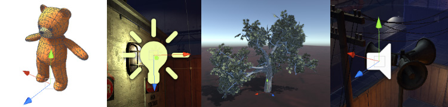
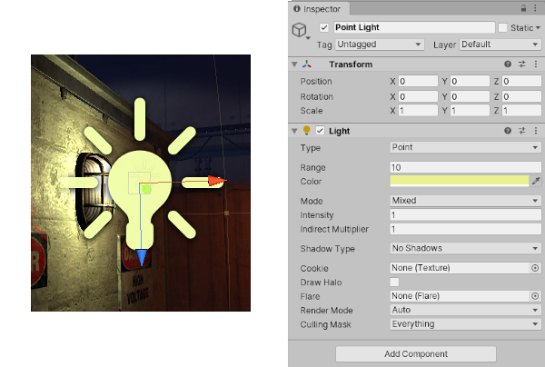
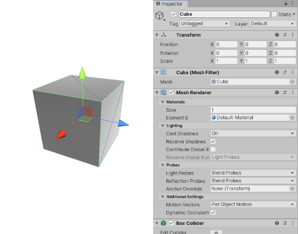

# 游戏对象简介

> 原文：[Introduction to GameObjects](https://docs.unity3d.com/6000.7/Documentation/Manual/GameObjects.html)

`GameObject` 是 Unity Editor 中最重要的概念。游戏中的每个对象都是 GameObject，从角色和可拾取物品，到 Light、Camera 和特效都不例外。但是，GameObject 不能独立完成任何工作；你需要为它赋予属性，它才能成为角色、环境或特效。

GameObject 是 Unity 中代表角色、道具和场景的基本对象。它们本身不能完成太多工作，而是作为容器来承载实现具体功能的 Components。

要使 GameObject 具备 Light、树木或 Camera 等对象所需的属性，需要向其中添加 Components。根据要创建的对象类型，需要为 GameObject 添加不同的 Component 组合。Unity 提供了许多不同的内置 Component 类型，你也可以使用 [Unity Scripting API](https://docs.unity3d.com/6000.7/Documentation/ScriptReference/index.html) 创建自己的 Components。

例如，将 `Light` Component 附加到 GameObject 可以创建 Light 对象。

实体 Cube 对象使用 `Mesh Filter` 和 `Mesh Renderer` Component 绘制 Cube 表面，并使用 `Box Collider` Component 在 Physics 中表示对象的实体体积。

## 详细内容

GameObject 始终附加有一个 `Transform` Component，用于表示位置和方向，而且无法移除。赋予对象具体功能的其他 Components 可以从 Editor 的 **Component** 菜单或通过脚本添加。Unity 还提供了许多实用的预先构建对象（例如原始体、Camera 等），可以从 **GameObject > 3D Object** 菜单中创建；请参阅[原始对象](https://docs.unity3d.com/6000.7/Documentation/Manual/PrimitiveObjects.html)。

由于 GameObject 是 Unity 的重要组成部分，Unity Manual 中有大量关于它们的详细内容。有关在 Unity 中使用 GameObject 的更多信息，请参阅以下部分：

- [[02-游戏对象基础/02-Transform组件|Transform]]
- [[03-向游戏对象添加组件/01-组件简介|组件简介]]
- [[03-向游戏对象添加组件/02-使用组件|使用组件]]
- [[02-游戏对象基础/05-原始体和占位对象|原始体和占位对象]]
- [[03-向游戏对象添加组件/03-使用脚本创建组件|使用脚本创建组件]]
- [[02-游戏对象基础/04-停用游戏对象|停用 GameObject]]
- [[05-将标签分配给游戏对象]]
- [[02-游戏对象基础/03-静态游戏对象|静态 GameObject]]
- [[06-预制件/00-预制件|Prefab]]
- [保存工作](https://docs.unity3d.com/6000.7/Documentation/Manual/Saving.html)

有关通过脚本控制 GameObject 的更多信息，请参阅 [GameObject 脚本参考](https://docs.unity3d.com/6000.7/Documentation/ScriptReference/GameObject.html)。

---

## 文档导航

- 上一页：[[00-游戏对象]]
- 目录：[[00-游戏对象]]
- 下一页：[[02-游戏对象基础/00-游戏对象基础]]
