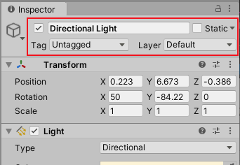
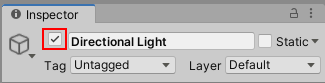
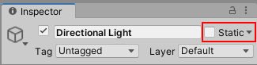
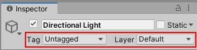
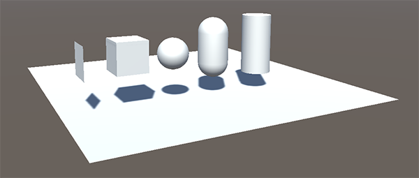

# GameObject 类

> 原文：[The GameObject class](https://docs.unity3d.com/6000.7/Documentation/Manual/class-GameObject.html)

Unity 的 `GameObject` 类表示任何可以存在于 Scene 中的对象。GameObject 是 Unity Scene 的构建块，也是功能 Component 的容器；这些 Component 决定 GameObject 的外观和行为。

`GameObject` 类提供了一组脚本方法，可以用来查找 GameObject、在 GameObject 之间建立连接、发送消息、添加或移除附加的 Component，以及设置与对象 Scene 状态相关的值。完整成员列表请参阅 [GameObject API 参考](https://docs.unity3d.com/6000.7/Documentation/ScriptReference/GameObject.html)。关于在 Unity Editor 的 Scene 和 Hierarchy 中使用 GameObject，请参阅 [[00-游戏对象基础]]。

## Scene 状态属性

所有 GameObject 的 Inspector 顶部都有一组与对象 Scene 状态相关的控制项，也可以通过 GameObject Scripting API 控制这些状态。

### Active 状态

GameObject 默认处于 Active 状态，但可以将其停用，从而关闭附加到该 GameObject 的所有 Component。通常这会使对象不可见，也不会再接收 `Update` 或 `FixedUpdate` 等常规回调和 Event。

GameObject 名称左侧的复选框表示 Active 状态，可以使用 `GameObject.SetActive` 控制它。

可以使用 `GameObject.activeSelf` 读取 GameObject 自身的 Active 状态；使用 `GameObject.activeInHierarchy` 读取它在 Scene 中是否实际处于 Active 状态。后者很重要，因为 GameObject 的最终状态由自身状态和所有父对象的状态共同决定。只要任意父对象未 Active，即使 GameObject 自身的 Active 设置为 true，它在层级中也不会 Active。

- **Active**：决定对象是否处于激活状态。
- **Static**：声明对象是否在运行时保持静止，以便参与静态批处理、光照烘焙等优化。
- **Tag**：为脚本和查询提供对象标识。
- **Layer**：控制渲染、物理和其他按层过滤的行为。





### Static 状态

Unity 的一些系统（例如 Global Illumination、Occlusion、Batching、Navigation 和 Reflection Probe）依赖 GameObject 的 Static 状态。可以使用 `GameObjectUtility.SetStaticEditorFlags` 控制 Unity 的哪些系统将 GameObject 视为 Static。更多信息请参阅 [[03-静态游戏对象]]。



### Tags 和 Layers

Tag 用于标记和识别 Scene 中的 GameObject；Layer 则以相似但不同的方式，将 GameObject 分组，并在渲染、Physics Collision 等内置操作中包含或排除这些分组。关于在 Editor 中使用 Tag 和 Layer，请参阅 [[../02-游戏对象基础/00-游戏对象基础]]。

可以通过脚本使用 `GameObject.tag` 和 `GameObject.layer` 修改 Tag 和 Layer。要高效检查 GameObject 的 Tag，可以使用 `CompareTag`；它还会验证 Tag 是否存在，并且不会产生内存分配。



## 添加和移除 Component

可以在 Runtime 添加或移除 Component，这对于程序化创建 GameObject，或修改 GameObject 的行为很有用。也可以通过脚本启用或停用脚本 Component 以及某些内置 Component，而无需销毁它们。

Runtime 添加 Component 的最佳方式是使用 `AddComponent<Type>`，在尖括号中指定 Component 类型。移除 Component 时，必须对 Component 本身调用 `Object.Destroy`。

## 访问 Component

脚本附加在某个 GameObject 上，需要访问同一 GameObject 上的另一个 Component 时，最简单的情况是使用 `GetComponent` 获取要操作的 Component 实例引用。请记住，附加在 GameObject 上的其他脚本本身也是 Components。通常会将 Component 对象赋给一个变量：

```csharp
void Start()
{
    Rigidbody rb = GetComponent<Rigidbody>();
}
```

获得引用后，就可以像在 Inspector 中一样设置 Component 的属性：

```csharp
void Start()
{
    Rigidbody rb = GetComponent<Rigidbody>();
    rb.mass = 10f;
}
```

也可以调用 Component 引用上的方法：

```csharp
void Start()
{
    Rigidbody rb = GetComponent<Rigidbody>();
    rb.AddForce(Vector3.up * 10f);
}
```

同一个 GameObject 可以附加多个自定义脚本。如果一个脚本需要访问另一个脚本，可以照常调用 `GetComponent`，并使用脚本类名（或文件名）指定要获取的 Component 类型。如果获取的 Component 类型实际上没有附加到 GameObject，`GetComponent` 会返回 `null`；尝试修改这个空对象的值，会在 Runtime 产生 Null Reference 错误。

## 访问其他 GameObject 上的 Component

脚本经常需要跟踪其他 GameObject，或者更常见地，跟踪其他 GameObject 上的 Component。例如，在烹饪游戏中，厨师可能需要知道炉灶的位置。Unity 提供了多种获取其他对象的方式，应根据具体情况选择。

### 通过 Inspector 中的变量连接 GameObject

最直接的方式是在脚本中添加 public `GameObject` 变量：

```csharp
public class Chef : MonoBehaviour
{
    public GameObject stove;
}
```

该变量会在 Inspector 中显示为 GameObject 字段。可以将 Scene 或 Hierarchy 中的对象拖到该变量上进行赋值。

也可以像访问其他对象一样使用 `GetComponent` 和 Component 访问变量：

```csharp
public class Chef : MonoBehaviour
{
    public GameObject stove;

    void Start()
    {
        // 从炉灶前方 2 个单位处开始厨师的位置。
        transform.position = stove.transform.position + Vector3.forward * 2f;
    }
}
```

此外，如果脚本中声明的是 Component 类型的 public 变量，可以将附加了该 Component 的任意 GameObject 拖入该字段，直接访问 Component，而不是访问 GameObject：

```csharp
public Transform playerTransform;
```

使用变量连接对象最适合处理具有固定连接关系的单个对象。也可以使用数组连接多个同类型对象，但这些连接仍然需要在 Unity Editor 中建立，而不是在 Runtime 建立。对于需要在 Runtime 定位的对象，可以使用下面的方式。

## 查找子 GameObject

有些 Scene 会使用多个同类型的 GameObject，例如 Collectible、Waypoint 和障碍物。某个负责管理或响应这些对象的脚本可能需要跟踪它们，例如路径查找脚本需要访问所有 Waypoint。使用变量连接这些 GameObject 是一种可行方式，但如果每增加一个 Waypoint 都要将它拖到脚本字段中，设计过程会变得烦琐；如果删除某个 Waypoint，还需要手动移除指向已不存在 GameObject 的变量引用。

在这种情况下，通常更适合将一组 GameObject 都设为同一个父 GameObject 的子对象，通过父对象的 `Transform` Component 获取它们。因为所有 GameObject 都隐式拥有 Transform，所以可以这样管理它们：

```csharp
using UnityEngine;

public class WaypointManager : MonoBehaviour
{
    public Transform[] waypoints;

    void Start()
    {
        waypoints = new Transform[transform.childCount];
        int i = 0;

        foreach (Transform t in transform)
        {
            waypoints[i++] = t;
        }
    }
}
```

也可以使用 `Transform.Find` 按名称定位特定子对象：

```csharp
transform.Find("Frying Pan");
```

当某个子 GameObject 会在游戏过程中动态添加和移除时，这种方法很有用，例如可以被拾取和放下的工具或餐具。

## 发送和广播消息

在编辑项目时，可以在 Inspector 中预先建立 GameObject 之间的引用。但有些引用无法提前建立，例如查找离角色最近的物品，或引用 Scene 加载后才实例化的 GameObject。这时可以在 Runtime 查找引用，并在 GameObject 之间发送消息。

- `BroadcastMessage` 可以按名称调用方法，而无需指定该方法实现在哪个脚本中。它可以调用指定 GameObject 及其所有子对象上的每个 `MonoBehaviour` 中的同名方法，也可以选择要求至少存在一个接收者，否则生成错误。
- `SendMessage` 的范围更具体，只会在 GameObject 自身上调用同名方法，不会调用子对象上的方法。
- `SendMessageUpwards` 会在 GameObject 自身以及所有父对象上调用同名方法。

## 按名称或 Tag 查找 GameObject

只要有能够识别对象的信息，就可以在 Scene 层级的任意位置定位 GameObject。可以使用 `GameObject.Find` 按名称获取单个对象：

```csharp
GameObject player;

void Start()
{
    player = GameObject.Find("MainHeroCharacter");
}
```

也可以使用 `GameObject.FindWithTag` 和 `GameObject.FindGameObjectsWithTag` 按 Tag 查找对象或对象集合。例如，在有一个厨师和多个标记为 `Stove` 的炉灶的烹饪游戏中：

```csharp
GameObject chef;
GameObject[] stoves;

void Start()
{
    chef = GameObject.FindWithTag("Chef");
    stoves = GameObject.FindGameObjectsWithTag("Stove");
}
```

## 创建和销毁 GameObject

可以在项目运行时创建和销毁 GameObject。Unity 使用 `Instantiate` 从现有对象创建副本。关于如何实例化 GameObject 的完整说明和示例，请参阅 [[../06-预制件/08-在运行时实例化预制件/00-在运行时实例化预制件]]。

`Destroy` 会在帧更新结束后销毁对象，也可以选择在短暂延迟后销毁：

```csharp
void OnCollisionEnter(Collision otherObj)
{
    if (otherObj.gameObject.tag == "Garbage can")
    {
        Destroy(gameObject, 0.5f);
    }
}
```

`Destroy` 可以销毁单独的 Component，而不会影响 GameObject 本身。常见错误是写出下面的代码，并误以为它会销毁脚本所在的 GameObject：

```csharp
Destroy(this);
```

这里的 `this` 表示脚本本身，而不是 GameObject。实际效果是销毁调用该方法的脚本 Component，GameObject 仍然存在，只是移除了该脚本 Component。

## Primitives

`GameObject` 类提供了通过脚本实现 Unity **GameObject** 菜单中创建 Primitive 对象等操作的方式。可以使用 `GameObject.CreatePrimitive` 创建 Unity 内置 Primitive 的实例。可用类型包括 `Sphere`、`Capsule`、`Cylinder`、`Cube`、`Plane` 和 `Quad`。



## 其他资源

- [[../01-游戏对象简介]]
- [GameObject API 参考](https://docs.unity3d.com/6000.7/Documentation/ScriptReference/GameObject.html)

---

## 文档导航

- 上一页：[[00-游戏对象基础]]
- 目录：[[00-游戏对象基础]]
- 下一页：[[02-Transform组件]]
