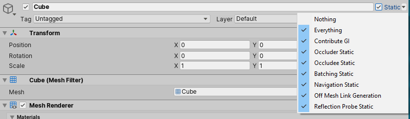

# 静态 GameObject

> 原文：[Static GameObjects](https://docs.unity3d.com/6000.7/Documentation/Manual/StaticObjects.html)

如果 GameObject 不会在 Runtime 移动，就称为 Static GameObject；如果会在 Runtime 移动，就称为 Dynamic GameObject。

Unity 的许多系统可以在 Editor 中预先计算 Static GameObject 的信息。由于这些 GameObject 不会移动，预计算结果在 Runtime 仍然有效，因此 Unity 可以减少 Runtime 计算，并可能提升性能。

## Static Editor Flags 属性

Static Editor Flags 属性列出了可以将 Static GameObject 纳入预计算的 Unity 系统。使用下拉菜单选择哪些系统将该 GameObject 纳入预计算。在 Runtime 设置 Static Editor Flags 不会影响这些系统。

只应将 GameObject 纳入确实需要了解它的系统的预计算。如果将对象纳入不需要它的系统，可能造成无效计算、数据文件不必要地变大或出现意外行为。

Static Editor Flags 位于 GameObject Inspector 的右上角。它包含一个复选框，可以将值设置为 **Everything** 或 **Nothing**；还包含一个下拉菜单，用于选择具体要包含的标记。可以在代码中使用 `GameObjectUtility.SetStaticEditorFlags` 和 `GameObject.isStatic` 设置，并使用 `GameObjectUtility.GetStaticEditorFlags` 读取。

## Static Editor Flags 值

| 属性 | 说明 |
| --- | --- |
| **Nothing** | 不将 GameObject 纳入任何系统的预计算。 |
| **Everything** | 将 GameObject 纳入下列所有系统的预计算。 |
| **Contribute GI** | 启用此属性后，Unity 会将目标 Mesh Renderer 纳入 Global Illumination 计算。计算发生在 Bake 阶段预计算 Lighting Data 时；`ContributeGI` 属性会公开 `ReceiveGI` 属性，且只有目标 Scene 启用了 Baked Global Illumination 或 Enlighten Realtime Global Illumination 等设置时才生效。 |
| **Occluder Static** | 将 GameObject 标记为 Occlusion Culling 系统中的 Static Occluder。 |
| **Occludee Static** | 将 GameObject 标记为 Occlusion Culling 系统中的 Static Occludee。 |
| **Batching Static** | 将 GameObject 的 Mesh 与其他符合条件的 Mesh 合并，以减少 Runtime Rendering 成本。 |
| **Navigation Static** | 在预计算 Navigation Data 时包含 GameObject。此工作流已弃用，不能再从此菜单设置；可在代码中设置 `StaticEditorFlags.NavigationStatic`。现在应使用 `NavMesh Modifier` Component 与 `NavMesh Surface`。 |
| **Off Mesh Link Generation** | 在预计算 Navigation Data 时，尝试从此 GameObject 开始生成 OffMesh Link。此工作流已弃用，不能再从此菜单设置；可在代码中设置 `StaticEditorFlags.OffMeshLinkGeneration`。现在应使用 `NavMesh Modifier` Component 与 `NavMesh Surface`。 |
| **Reflection Probe** | 在预计算 Type 为 **Baked** 的 Reflection Probe 数据时包含此 GameObject。 |

## 其他资源

- [GameObjectUtility.SetStaticEditorFlags API](https://docs.unity3d.com/6000.7/Documentation/ScriptReference/GameObjectUtility.SetStaticEditorFlags.html)
- [GameObjectUtility.GetStaticEditorFlags API](https://docs.unity3d.com/6000.7/Documentation/ScriptReference/GameObjectUtility.GetStaticEditorFlags.html)
- [StaticEditorFlags.NavigationStatic API](https://docs.unity3d.com/6000.7/Documentation/ScriptReference/StaticEditorFlags.NavigationStatic.html)
- [StaticEditorFlags.OffMeshLinkGeneration API](https://docs.unity3d.com/6000.7/Documentation/ScriptReference/StaticEditorFlags.OffMeshLinkGeneration.html)
- [StaticEditorFlags API](https://docs.unity3d.com/6000.7/Documentation/ScriptReference/StaticEditorFlags.html)
- [Draw call batching](https://docs.unity3d.com/6000.7/Documentation/Manual/DrawCallBatching.html)
- [Occlusion Culling](https://docs.unity3d.com/6000.7/Documentation/Manual/OcclusionCulling.html)
- [NavMesh Modifier Component](https://docs.unity3d.com/Packages/com.unity.ai.navigation@latest/index.html?subfolder=/manual/NavMeshModifier.html)
- [NavMesh Surface Component](https://docs.unity3d.com/Packages/com.unity.ai.navigation@latest/index.html?subfolder=/manual/NavMeshSurface.html)
- [Reflection Probes](https://docs.unity3d.com/6000.7/Documentation/Manual/ReflectionProbes.html)

只有确定 GameObject 在 Runtime 不会移动时，才应将其纳入对应系统的预计算。错误的 Static 标记可能导致不必要的计算、过大的数据文件或意外行为。

---

## 文档导航

- 上一页：[[02-Transform组件]]
- 目录：[[00-游戏对象基础]]
- 下一页：[[04-停用游戏对象]]
