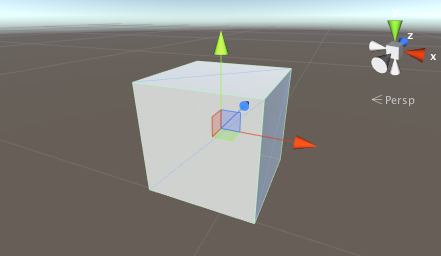
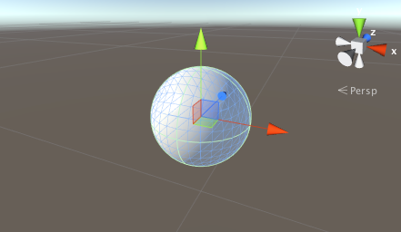
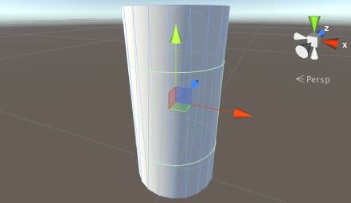
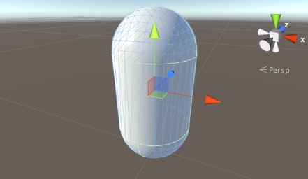
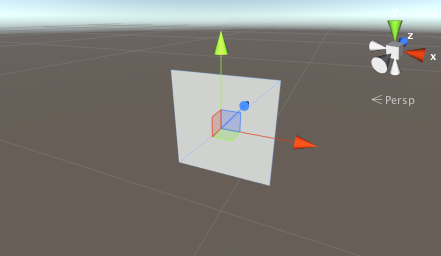
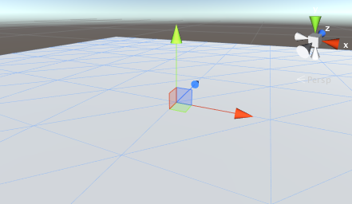

# 原始体和占位对象

> 原文：[Primitive and placeholder objects](https://docs.unity3d.com/6000.7/Documentation/Manual/PrimitiveObjects.html)

在 Unity Editor 中，可以使用建模软件创建任意形状的 3D 模型，也可以直接在 Editor 中创建以下对象类型：

- Cube
- Sphere
- Capsule
- Cylinder
- Plane
- Quad

要向 Scene 添加 Primitive，请选择 **GameObject > 3D Object**，然后选择所需的 Primitive。Unity 会将默认 Primitive 添加到本地坐标空间，你可以在 Inspector 窗口中通过 [Transform](https://docs.unity3d.com/6000.7/Documentation/Manual/class-Transform.html) 修改对象的大小和位置。

这些对象可以用来构建特定物品，也可以作为开发期间测试用的占位对象和原型。每种 Primitive 都有常见用途，但你可以根据项目需要自由使用它们。

## Cube

默认 Cube 是一个白色立方体，有 6 个面，每条边长 1 个单位。Cube 带有 Texture，并且图像会在每个面上重复。Cube 常用于构建墙、柱子、箱子和台阶，也常作为开发阶段的占位对象。由于边长为 1 个单位，可以在 Scene 中放置 Cube，与导入的 Mesh 对比，检查 Mesh 的比例。

*Cube Primitive。*

## Sphere

默认 Sphere 的直径为 1 个单位（也就是半径为 0.5 个单位）。它使用标准球形 UV Mapping，图像会包裹球体，并在两个极点处收拢。Sphere 适合表示球、行星和投射物。你可以使用半透明 Sphere 作为 GUI 可视化效果的影响半径。

*Sphere Primitive。*

## Cylinder

默认 Cylinder 高 2 个单位、直径 1 个单位。Texture 会在圆柱侧面完整包裹一次，并分别在两端的平面上重复。Cylinder 适合创建柱子、杆和轮子。它默认的 Collider 形状是 Capsule，因为 Unity 没有 Primitive Cylinder Collider；如果需要准确的圆柱 Physics Collider，应在建模软件中创建圆柱 Mesh，再附加 Mesh Collider。

*Cylinder Primitive。*

## Capsule

Capsule 是两端带半球形顶盖的 Cylinder。默认 Capsule 直径为 1 个单位、高 2 个单位（中间柱体高 1 个单位，每个顶盖高 0.5 个单位）。Texture 会在柱体部分包裹一次，并在每个半球顶点处收拢。由于圆形对象的 Physics 特性更适合某些任务，Capsule 是原型制作中很有用的占位对象。

*Capsule Primitive。*

## Quad

默认 Quad 是边长 1 个单位的正方形，由两个三角形组成，并位于本地坐标空间的 XY 平面。可以使用 Quad 显示图像或视频，也可以实现简单的 GUI、信息显示、Particle、Sprite 和远处实体对象的 Imposter Image。

*Quad Primitive。*

## Plane

默认 Plane 是边长 10 个单位的平面正方形，由 200 个三角形组成，并位于本地坐标空间的 XZ 平面。Texture 会在整个正方形上完整显示一次。

Plane 适合表示地面和墙等大多数平面表面。虽然也可以在 GUI 中使用 Plane 显示特殊效果、图像或视频，但使用 Quad 可能更方便。Plane 的 Texture 只会从上方渲染；从 Plane 下方观察时，Texture 是透明的。

*Plane Primitive。*

---

## 文档导航

- 上一页：[[04-停用游戏对象]]
- 目录：[[00-游戏对象基础]]
- 下一页：[[06-2D原始游戏对象]]
