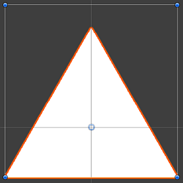
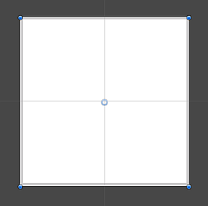
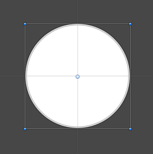
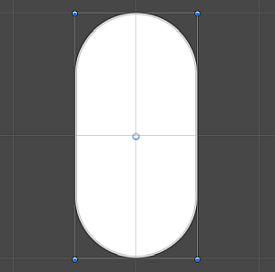
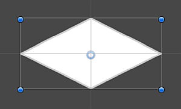
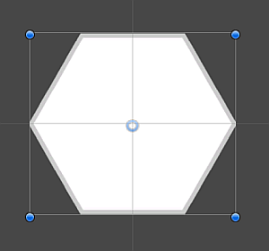
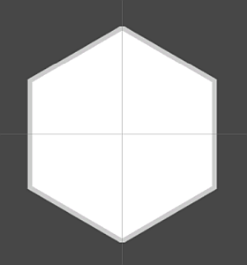
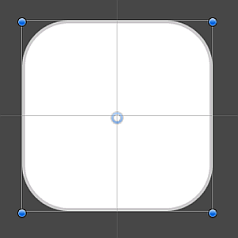

# 2D 原始 GameObject

> 原文：[Types of 2D primitive GameObjects](https://docs.unity3d.com/6000.7/Documentation/Manual/2DPrimitiveObjects.html)

Unity 支持导入 `.png`、Adobe `.psd` 等不同图像格式，为创建和准备 2D Asset 提供了更多选项。如果只是要快速制作原型，也可以使用 Unity 提供的 2D Primitive GameObject，无需准备和导入自己的 Asset。

本文介绍可用 2D Primitive 选项的尺寸和常见用途。

> [!IMPORTANT]
> 必须安装 **2D Sprite** Package，才能使用下面的 2D Primitive。选择 2D Project Template 创建项目时会自动安装该 Package；也可以通过 [Package Manager](https://docs.unity3d.com/6000.7/Documentation/Manual/Packages.html) 安装 [2D Sprite Package](https://docs.unity3d.com/Packages/com.unity.2d.sprite@1.0/manual/index.html)。

## 创建 2D 原始 GameObject

要创建预设 2D Primitive GameObject，请选择 **GameObject > 2D Object > Sprites**，或选择 **Create > 2D > Sprites**，然后从可用选项中选择：`Triangle`、`Square`、`Circle`、`Capsule`、`Isometric Diamond`、`Hexagon Flat-Top`、`Hexagon Point-Top` 和 `9-Sliced`。

## 默认 Sprite 尺寸

2D Primitive 的默认 Sprite 尺寸为 `256 × 256` Pixel，Pixels Per Unit（PPU）为 `256`。这个尺寸与 PPU 组合后，使 Sprite 在 Scene 中的大小等于 1 个 Unity Unit。

例外情况是：`Capsule` Primitive 的尺寸为 `256 × 512` Pixel（`1:2` Unity Unit），`Isometric Diamond` Primitive 的尺寸为 `256 × 128` Pixel（`1:0.5` Unity Unit）。

## Triangle

`Triangle` 2D Primitive 是一个白色等腰三角形，底边长 1 个 Unity Unit。它可以作为 Scene 元素的占位对象，例如障碍物或 UI 的一部分。可以添加 `Polygon Collider 2D`，让它与其他 GameObject 和 2D Physics 系统交互。

## Square

`Square` 2D Primitive 是边长为 1 个 Unity Unit 的白色正方形。它可以作为障碍物或平台等元素的占位对象。添加 `Box Collider 2D` 后，它可以与其他 GameObject 和 2D Physics 系统交互。还可以选择 `9-Sliced` 选项，获得能够动态缩放的 Sprite。

## Circle

`Circle` 2D Primitive 是直径为 1 个 Unity Unit 的白色圆形。它可以作为障碍物或道具等 Scene 元素的占位对象。添加 `Circle Collider 2D` 后，它可以与其他 GameObject 和 2D Physics 系统交互。

## Capsule

`Capsule` 2D Primitive 是尺寸为 `1 × 2` Unity Unit 的白色胶囊形。它可以作为障碍物、道具或角色替身的占位对象。添加 `Capsule Collider 2D` 后，它可以与其他 GameObject 和 2D Physics 系统交互。

## Isometric Diamond

`Isometric Diamond` 2D Primitive 是尺寸为 `1 × 0.5` Unity Unit 的白色菱形 Sprite，常作为放置在 Isometric Tilemap 上的 Tile 的占位对象。为改善 Tiling，该 Sprite 顶部和底部的 Pixel 会略微裁切。

## Hexagon Flat-Top

`Hexagon Flat-Top` 2D Primitive 是宽度为 1 个 Unity Unit 的正六边形，平行边朝向顶部和底部。它常作为放置在 Hexagonal Flat-Top Tilemap 上的 Tile 的占位对象。为改善 Tiling，该 Sprite 左右两侧的 Pixel 会略微裁切。

## Hexagon Point-Top

`Hexagon Point-Top` 2D Primitive 是高度为 1 个 Unity Unit 的正六边形，顶点朝向顶部和底部。它常作为放置在 Hexagonal Pointed-Top Tilemap 上的 Tile 的占位 Sprite。为改善 Tiling，该 Sprite 顶部和底部的 Pixel 会略微裁切。

## 9-Sliced

`9-Sliced` 2D Primitive 是尺寸为 `1 × 1` Unity Unit、带圆角的白色正方形 Sprite。它经过 9-slicing 处理，每边的 Border 为 64 Pixel，主要用于 [Sprite Renderer](https://docs.unity3d.com/6000.7/Documentation/Manual/sprite/renderer/sprite-renderer-reference.html) Component 的 **Sliced** 和 **Tiled** Draw Mode。你可以将 9-sliced Sprite 作为项目中各种元素的灵活占位对象；有关更多信息，请参阅 [9-slicing sprites](https://docs.unity3d.com/6000.7/Documentation/Manual/sprite/9-slice/9-slice-landing.html)。添加启用了 Auto Tiling 的 `Box Collider 2D` 后，它可以与其他对象和 2D Physics 系统交互。

## 其他资源

- 2D 游戏开发快速入门
- [[../../脚本/03-Unity基础类型/00-Unity基础类型]]
- Tilemap
- 2D Physics 参考

- [2D 游戏开发快速入门指南](https://docs.unity3d.com/6000.7/Documentation/Manual/2d-game-development-landing.html)
- [Sprites](https://docs.unity3d.com/6000.7/Documentation/Manual/sprite/sprite-landing.html)
- [Tilemap](https://docs.unity3d.com/6000.7/Documentation/Manual/tilemaps/work-with-tilemaps/tilemap-reference.html)
- [2D Physics 参考](https://docs.unity3d.com/6000.7/Documentation/Manual/2d-physics/2d-physics.html)

---

## 文档导航

- 上一页：[[05-原始体和占位对象]]
- 目录：[[00-游戏对象基础]]
- 下一页：[[../03-向游戏对象添加组件/00-向游戏对象添加组件]]
