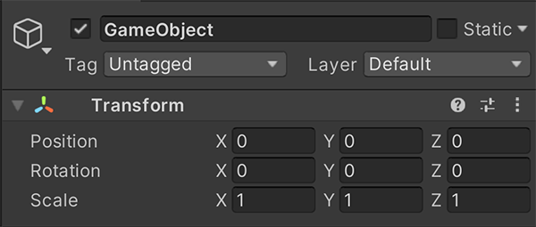

# 组件简介

> 原文：[Introduction to components](https://docs.unity3d.com/6000.7/Documentation/Manual/Components.html)

Component 是每个 `GameObject` 的功能组成部分。Component 包含可以编辑的属性，用来定义 `GameObject` 的行为。关于 Component 与 GameObject 的关系，请参阅 [[../02-游戏对象基础/00-游戏对象基础]]。

要查看附加到 `GameObject` 的 Component 列表，可以在 Hierarchy 窗口或 Scene 视图中选择一个 `GameObject`，然后查看 Inspector 窗口。

可以向一个 `GameObject` 附加许多 Component，但每个 `GameObject` 必须有且只能有一个 `Transform` Component。这是因为 `Transform` 决定 `GameObject` 的位置、旋转和缩放。要创建空 GameObject，请选择 **GameObject > Create Empty**。选中新 GameObject 后，Inspector 会显示带有默认值的 `Transform` Component。

Component 必须与要附加它的 `GameObject` 位于同一个项目中。Component 可能来自 Package，也可能由脚本创建。Unity Editor 无法搜索以下来源中的 Component：

- 其他项目。
- 尚未附加到该项目的脚本。
- 尚未添加到项目中的 Package。

*空 GameObject 包含一个 Transform Component。*

可以在 Inspector 中查看、添加、移除和编辑 Component。Component 的具体行为由其类型决定。

## 其他资源

- [[04-管理组件及其值/00-管理组件及其值]]
- [Inspector 窗口](https://docs.unity3d.com/6000.7/Documentation/Manual/UsingTheInspector.html)

---

## 文档导航

- 上一页：[[00-向游戏对象添加组件]]
- 目录：[[00-向游戏对象添加组件]]
- 下一页：[[02-使用组件]]
