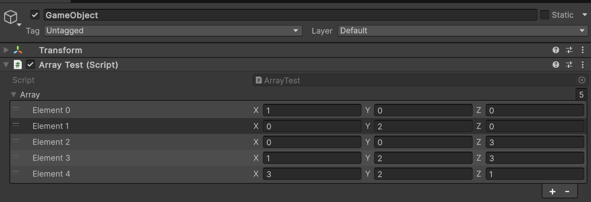

# 使用数组

> 原文：[Use arrays](https://docs.unity3d.com/6000.7/Documentation/Manual/InspectorArray.html)

Array 是同一类型的值或引用的集合。你可以在 Inspector 中添加、删除和重新排列数组元素，并编辑它们的值。

数组旁的 **+** 和 **-** 按钮可以一次添加或删除一个元素。

某些数组包含 **Size** 字段。你可以使用这个字段一次添加或删除多个元素：

- 增加 **Size** 值，可以在数组末尾添加与最后一个元素具有相同值的元素。
- 减少 **Size** 值，可以从数组末尾移除元素。

> [!TIP]
> 向数组添加元素时，Unity Editor 会复用前一个元素的值。要创建具有相似值的数组，可以先添加并设置第一个元素，然后增大数组的 Size，将该值复制到后续元素。之后只需编辑值不同的元素。

要重新排列元素，请将元素标题向上或向下拖动。

## 其他资源

- [检查脚本](https://docs.unity3d.com/6000.7/Documentation/Manual/inspecting-scripts.html)
- [ArrayUtility](https://docs.unity3d.com/6000.7/Documentation/ScriptReference/ArrayUtility.html)

---

## 文档导航

- 上一页：[[00-管理组件及其值]]
- 所属目录：[[00-管理组件及其值]]
- 下一页：[[02-使用数值字段表达式]]
