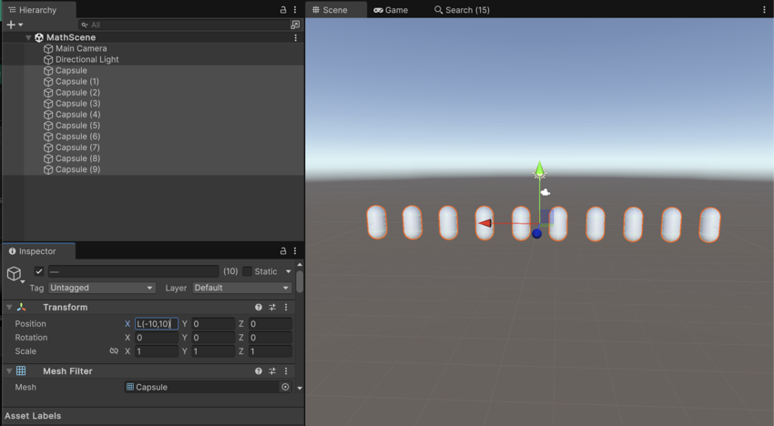
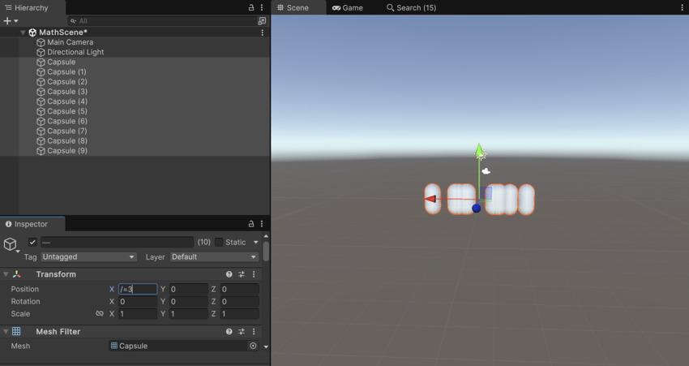
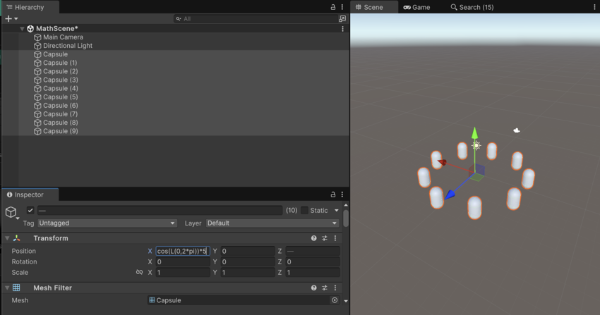

# 使用数值字段表达式

> 原文：[Use numeric field expressions](https://docs.unity3d.com/6000.7/Documentation/Manual/InspectorNumericFields.html)

Numeric Field 输入支持：

- 正数和负数。某些属性可能会限制取值范围，例如 RGB 值不能为负数。
- Mathematical Expression。
- 用于多选对象的特殊函数。

## 使用数学表达式

你可以使用数学表达式计算 Numeric Field 的值。

例如，输入 `2+3` 后，字段会计算出值 `5` 并使用该值。当焦点离开字段后，字段会刷新并显示计算结果。有关支持的表达式，请参阅 [ExpressionEvaluator](https://docs.unity3d.com/6000.7/Documentation/ScriptReference/ExpressionEvaluator.html)。

## 使用特殊函数

你可以使用特殊函数一次编辑多个选中对象。例如，Linear Ramp 可以沿某个轴分布选中的对象。

> [!NOTE]
> **Constrain Proportions Scale** 不支持多选时的 Mathematical Expression。

### Linear

要在 a 和 b 之间创建 Linear Ramp，请使用 `L(a,b)`。

### Random

要在 a 和 b 之间生成 Random 值，请使用 `R(a,b)`。

### Assign

要修改当前值，请使用 `+=`、`-=`、`*=` 和 `/=` 表达式。例如，要将所有选中对象的字段值加倍，请输入 `*=2`。

## 组合表达式

你可以在函数中使用 Mathematical Expression。例如，表达式 `L(0,2*pi)` 会在 `0` 和 `2pi` 之间生成 Linear 分布的值。

下面的示例在 X 和 Z 字段中使用 Linear Ramp 函数作为正弦和余弦函数的参数，从而将对象分布成圆形：

## 在自定义 Editor 中使用表达式

当你创建[自定义 Editor](https://docs.unity3d.com/6000.7/Documentation/Manual/editor-CustomEditors.html) 时，所有具有数值的 [EditorGUI.PropertyField](https://docs.unity3d.com/6000.7/Documentation/ScriptReference/EditorGUI.PropertyField.html) 和 [EditorGUILayout.PropertyField](https://docs.unity3d.com/6000.7/Documentation/ScriptReference/EditorGUILayout.PropertyField.html) 属性都会自动支持 Numeric Expression。

## 其他资源

- [检查脚本](https://docs.unity3d.com/6000.7/Documentation/Manual/inspecting-scripts.html)
- [自定义 Editor](https://docs.unity3d.com/6000.7/Documentation/Manual/editor-CustomEditors.html)
- [ExpressionEvaluator 参考](https://docs.unity3d.com/6000.7/Documentation/ScriptReference/ExpressionEvaluator.html)
- [EditorGUI.PropertyField 参考](https://docs.unity3d.com/6000.7/Documentation/ScriptReference/EditorGUI.PropertyField.html)
- [EditorGUILayout.PropertyField 参考](https://docs.unity3d.com/6000.7/Documentation/ScriptReference/EditorGUILayout.PropertyField.html)

---

## 文档导航

- 上一页：[[01-使用数组]]
- 所属目录：[[00-管理组件及其值]]
- 下一页：[[03-使用条形滑块]]
