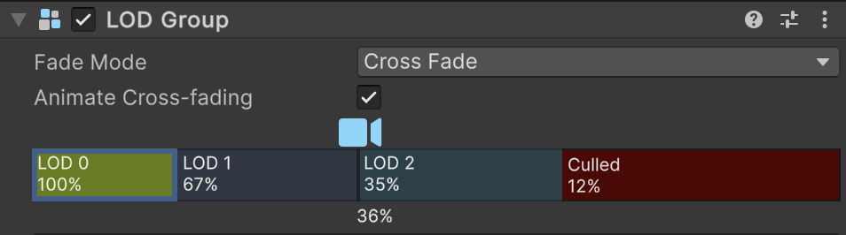

# 使用条形滑块

> 原文：[Use bar sliders](https://docs.unity3d.com/6000.7/Documentation/Manual/InspectorBarSliders.html)

Bar Slider 可以将一个整体分配成多个区间。例如，Level of Detail（LOD）Group Component 使用 Bar Slider 定义不同 Level 之间的切换位置。所有 Level 合计构成 100%。

要更改分配比例，请将两个区间之间的分隔线向左或向右拖动。这样会同时改变相邻的两个区间，但不会改变其他区间。

Bar Slider 中的每个区间都会显示它在整体中延伸到的位置，以百分比表示。该百分比表示区间的结束位置，而不是该区间自身的总占比。最后一个区间始终为 100%。

## 其他资源

- [LOD Group Component](https://docs.unity3d.com/6000.7/Documentation/Manual/class-LODGroup.html)
- [LODGroup](https://docs.unity3d.com/6000.7/Documentation/ScriptReference/LODGroup.html)
- [[../02-使用组件]]
- [[../03-使用脚本创建组件]]

---

## 文档导航

- 上一页：[[02-使用数值字段表达式]]
- 所属目录：[[00-管理组件及其值]]
- 下一页：[[04-选择颜色和颜色渐变]]
