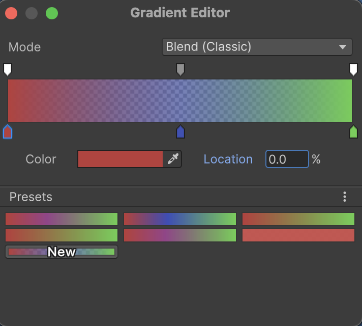
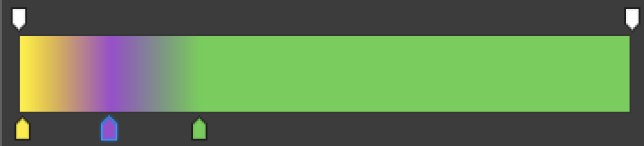
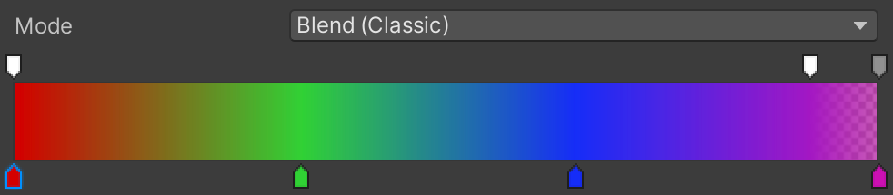
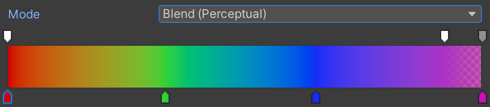
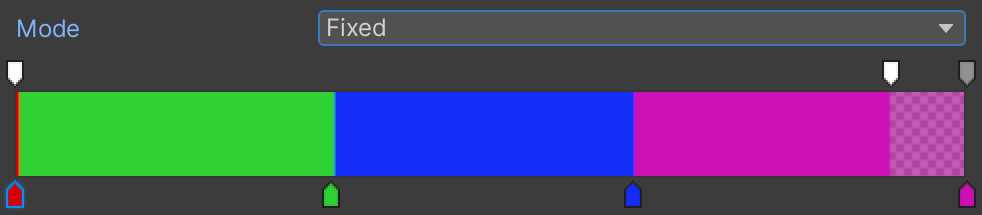

# 选择颜色和颜色渐变

> 原文：[Select colors and color gradients](https://docs.unity3d.com/6000.7/Documentation/Manual/InspectorColorPicker.html)

Inspector 窗口会将颜色属性显示为色块（swatch）。色块具有以下作用：

- 显示当前颜色。
- 在色块下方用 Slider 显示透明度。
- 作为按钮，单击后打开 Color 窗口。

## Color 窗口类型

Unity Editor 会根据正在编辑的属性，打开相应类型的 Color 窗口：

- `Single color`：大多数颜色属性使用的单色窗口。
- `High Dynamic Range (HDR) color`：例如 [Standard Shader](https://docs.unity3d.com/6000.7/Documentation/Manual/shader-StandardShader.html) 的 Emission 颜色。有关内容请参阅 [HDR Color Picker 参考](https://docs.unity3d.com/6000.7/Documentation/Manual/hdr-landing.html)。
- `Gradient`：例如 Particle System 的 Color over Lifetime 属性。

## 选择颜色

可以使用 Color Wheel、Slider、文本字段或 Eyedropper 工具选择颜色。

### 从 Color Wheel 选择颜色

Color Wheel 表示完整的色谱。单击圆环上的任意位置即可选择颜色。

圆环中央的方形区域是 Color Wheel 的放大视图，可以用来微调从色环中选出的颜色。

要设置透明度，也就是 Alpha 值，请使用 `A` Slider。

### 输入数值或使用 Slider

Color Picker 窗口中的 Slider 和输入字段支持以下格式：

- RGB：`0-255`
- RGB：`0-1.0`
- HSV

这三种格式都提供 `A` Slider，用于设置透明度。可以在字段中输入精确值，也可以拖动 Slider 修改数值。还可以在 `Hexadecimal` 字段中输入十六进制颜色值。

### 使用 Eyedropper 获取已有颜色

要使用已经存在于屏幕上的颜色，请用 Eyedropper 采样：

1. 单击 Eyedropper。
2. 单击一个 Pixel 以选择它的颜色。可以选择 Unity Editor 内部或外部的任意 Pixel。

Eyedropper 也可以直接在 Inspector 窗口中使用，不必先打开 Color 窗口。

### 恢复上一个颜色

Color 窗口包含两个色块：一个显示编辑前的颜色，另一个显示当前选择的颜色。要恢复原始颜色，请单击代表原始颜色的色块。

## 创建色块预设和色块库

可以将颜色色块保存为 Preset，并将这些 Preset 组织到一个或多个 Library 中。

### 保存色块 Preset

在 `Swatches` 区域中，列表最后一个色块表示当前编辑中的颜色。保存颜色 Preset 的步骤如下：

1. 单击列表中的最后一个色块。
2. 为 Preset 输入名称。

### 管理色块 Preset

- 删除 Preset：右键单击它，然后选择 `Delete`。
- 替换 Preset：右键单击它，然后选择 `Replace`。这会将当前颜色选择保存到该 Preset。
- 调整顺序：将色块拖动到列表中的新位置。

### 创建和管理色块库

可以将色块 Preset 保存到一个或多个 Library，并在自定义 Library 与默认 Library 之间切换。使用 `More`（⋮）菜单创建 Library 或在 Library 之间切换。

## 使用 Gradient

Gradient 会在时间或空间上从一种颜色变化到另一种颜色。变化可以是平滑的颜色混合，也可以表现为多个色块之间的阶梯变化。

只有设置为使用 Gradient 的属性才会显示 Gradient Editor，而不是单色属性。例如：

- [Particle System](https://docs.unity3d.com/6000.7/Documentation/Manual/PartSysColorOverLifeModule.html) 使用 Gradient 改变粒子在生命周期内的颜色。
- [Line Renderer](https://docs.unity3d.com/6000.7/Documentation/Manual/class-LineRenderer.html) 使用 Gradient 改变线段沿长度方向的颜色。

不能在 Inspector 窗口中将单色属性直接改成 Gradient 属性，但可以使用脚本覆盖该属性。有关内容请参阅 [Gradient 类](https://docs.unity3d.com/6000.7/Documentation/ScriptReference/Gradient.html)。

## 使用 Gradient Editor

要打开 Gradient Editor，请在 Inspector 窗口中单击颜色色块。

Gradient Editor 同时控制 Gradient 的颜色和透明度。Gradient bar 显示颜色以及颜色按照插值模式进行混合后的效果。颜色停止点是向上指的标记，透明度停止点是向下指的标记。

### Gradient 类型

每个 Gradient 同时包含颜色设置和透明度设置。通过这两组设置，可以创建四种 Gradient：

- 两种或更多颜色，并使用透明度 Gradient。
- 两种或更多颜色，并使用固定透明度。
- 单一颜色，并使用透明度 Gradient。
- 单一颜色，并使用固定透明度。如果不想改变颜色，又不想通过脚本覆盖 Gradient 属性，可以使用这种类型。

### 选择颜色

Gradient 默认包含两个颜色停止点，但还可以：

- 添加停止点以制作更复杂的 Gradient。
- 将两个停止点设置为相同颜色，从而避免颜色之间发生混合。

颜色停止点是 Gradient bar 底部向上指的标记。单击停止点可以选中它，也可以单击色条下方的位置添加停止点。选中后可以执行以下操作：

- 更改颜色：单击颜色色块，用标准 Color 窗口编辑颜色。Gradient 停止点的 Color 窗口没有 Alpha Slider，因为透明度由 Gradient 自身处理。
- 采样颜色：单击 Eyedropper，然后单击屏幕上的任意位置。Unity 会将颜色属性设置为所单击 Pixel 的颜色。
- 移动停止点：沿 Gradient bar 拖动，或在 `Location` 字段中输入新值。
- 删除停止点：将停止点拖出 Gradient bar。

颜色插值只发生在停止点之间。若要让 Gradient 以纯色开始或结束，可以将第一个或最后一个停止点从 Gradient bar 的边缘移开。

可以逐项撤销修改，也可以在编辑前将起始 Gradient 保存为 Preset。

### 设置透明度

透明度停止点是 Gradient bar 顶部向下指的标记。停止点的颜色从白色到黑色变化，用来表示透明度级别。

默认 Gradient 有两个透明度停止点，二者的 Alpha 都是 100%，因此整个 Gradient 完全不透明。可以编辑停止点来调整透明度，也可以添加停止点，让 Gradient 在不同位置使用不同的透明度。

编辑和添加透明度停止点的方式与颜色停止点相同。选中透明度停止点后，颜色色块会变成透明度 Slider。

在固定模式下，透明度不会在停止点之间进行插值。每个停止点左侧形成一块固定透明度区域，停止点右侧不会应用该区域的透明度。不过，透明度区域不必与 Gradient 中的颜色区域对齐：可以在一个颜色区域内多次改变透明度，也可以让多个颜色区域共享一种透明度。

### 选择插值模式

Gradient 支持三种颜色插值模式：

- `Classic blend`：在停止点之间执行[线性插值](https://docs.unity3d.com/6000.7/Documentation/Manual/linear-color-space-landing.html)。
- `Perceptual blend`：在感知均匀的 [Oklab](https://bottosson.github.io/posts/oklab/) 颜色空间中进行插值。与 Classic 模式相比，它能在颜色之间产生更平滑的过渡，并减小亮度差异。
- `Fixed`：停止点之间不进行插值，生成一组颜色块。仍然可以在颜色块内部和颜色块之间改变透明度。

Classic 模式中的颜色过渡比 Perceptual 模式更锐利。

### 创建 Gradient Preset 和 Library

Gradient Preset 同时保存颜色值和透明度值。保存的 Preset 可以在项目中任何 Gradient 属性的 Gradient Editor 中使用。

`Presets` 区域会预览列表中的下一个 Preset；编辑 Gradient 时，预览也会随之变化。要将当前编辑结果保存为 Preset，请单击预览 Preset 上的 `New`。

要使用 Preset，请单击它。之后的修改会形成一个新的 Preset，可以再次保存。要将修改保存回原始 Preset，请右键单击该 Preset，然后选择 `Replace`。

可以从默认 Gradient 创建一个 Preset，这样就始终可以恢复到默认状态。还可以将 Preset 保存到一个或多个 Library，并使用 `More`（⋮）菜单创建 Library 或在 Library 之间切换。

## 其他资源

- [HDR Color Picker 参考](https://docs.unity3d.com/6000.7/Documentation/Manual/hdr-landing.html)
- [线性插值](https://docs.unity3d.com/6000.7/Documentation/Manual/linear-color-space-landing.html)
- [Oklab Perceptual blend](https://bottosson.github.io/posts/oklab/)

---

## 文档导航

- 上一页：[[03-使用条形滑块]]
- 目录：[[00-管理组件及其值]]
- 下一页：[[05-使用曲线]]
