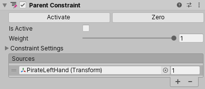

# Parent Constraint

> 原文：[Parent Constraint component](https://docs.unity3d.com/6000.7/Documentation/Manual/class-ParentConstraint.html)

Parent Constraint 会移动和旋转 GameObject，使其表现得像是 Hierarchy 窗口中另一个 GameObject 的子对象。与直接将一个 GameObject 设为另一个 GameObject 的子对象相比，它具有以下优势：

- Parent Constraint 不会影响缩放。
- Parent Constraint 可以关联多个 GameObject。
- GameObject 不必是 Parent Constraint 所关联 GameObject 的子对象。
- 可以通过指定 Constraint 的 Weight 以及每个 Source GameObject 的 Weight 来调整 Constraint 的影响程度。

例如，要将剑放到角色手中，请为剑 GameObject 添加 Parent Constraint Component，然后在 Parent Constraint 的 **Sources** 列表中关联角色的手。这样，剑的移动就会受到手的位置和旋转的约束。

## Properties

| 属性 | 说明 |
| --- | --- |
| **Activate** | 移动和旋转受到约束的 GameObject 及其 Source GameObject 后，单击 **Activate** 保存这些信息。**Activate** 会将当前相对于 Source GameObject 的偏移保存到 **Rotation At Rest**、**Position At Rest**、**Position Offset** 和 **Rotation Offset**，然后启用 **Is Active** 和 **Lock**。 |
| **Zero** | 将受到约束的 GameObject 的位置和旋转设置为 Source GameObject 的位置和旋转。**Zero** 会重置 **Rotation At Rest**、**Position At Rest**、**Position Offset** 和 **Rotation Offset** 字段，然后启用 **Is Active** 和 **Lock**。 |
| **Is Active** | 切换是否评估 Constraint。要应用 Constraint，请同时确保 **Lock** 已启用。 |
| **Weight** | Constraint 的强度。Weight 为 `1` 时，Constraint 会使此 GameObject 以与 Source GameObject 相同的速率移动和旋转；Weight 为 `0` 时，Constraint 完全不起作用。此 Weight 会影响所有 Source GameObject；**Sources** 列表中的每个 GameObject 也有独立的 Weight。 |

## Constraint Settings

| 属性 | 说明 |
| --- | --- |
| **Lock** | 切换是否允许 Constraint 移动和旋转 GameObject。禁用后，可以编辑此 GameObject 的位置和旋转，也可以编辑 **Rotation At Rest**、**Position At Rest**、**Position Offset** 和 **Rotation Offset** 属性。如果 **Is Active** 已启用，当你移动或旋转 GameObject 或其 Source GameObject 时，Constraint 会为你更新这些属性。完成修改后，启用 **Lock**，让 Constraint 控制此 GameObject。此属性在 Play Mode 中不起作用。 |
| **Position At Rest** | 当 Weight 为 `0`，或对应的 **Freeze Position Axes** 未启用时使用的 X、Y、Z 值。要编辑这些字段，请禁用 **Lock**。 |
| **Rotation At Rest** | 当 Weight 为 `0`，或对应的 **Freeze Rotation Axes** 未启用时使用的 X、Y、Z 值。要编辑这些字段，请禁用 **Lock**。 |
| **Position Offset** | Constraint 施加的 Transform 位置偏移的 X、Y、Z 值。要编辑这些字段，请禁用 **Lock**。 |
| **Rotation Offset** | Constraint 施加的 Transform 旋转偏移的 X、Y、Z 值。要编辑这些字段，请禁用 **Lock**。 |
| **Freeze Position Axes** | 启用 X、Y 或 Z 后，Constraint 可以控制对应的位置轴；禁用某个轴后，Constraint 不再控制该轴，因此可以编辑、制作动画或通过脚本控制它。 |
| **Freeze Rotation Axes** | 启用 X、Y 或 Z 后，Constraint 可以控制对应的旋转轴；禁用某个轴后，Constraint 不再控制该轴，因此可以编辑、制作动画或通过脚本控制它。 |

## Sources

这是约束此 GameObject 的 GameObject 列表。Unity 会按照 Source GameObject 在列表中的顺序对其进行评估。此顺序会影响 Constraint 移动和旋转受到约束的 GameObject 的方式。要得到预期结果，请拖动列表中的项目重新排列。每个 Source 的 Weight 范围为 `0` 到 `1`。

---

## 文档导航

- 上一页：[[03-Look At Constraint]]
- 目录：[[00-约束组件]]
- 下一页：[[05-Position Constraint]]
