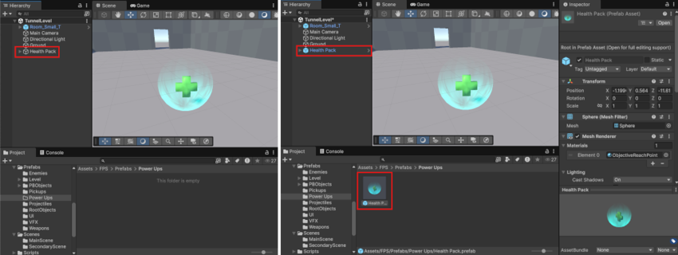

# 创建预制件

> 原文：[Create prefabs](https://docs.unity3d.com/6000.7/Documentation/Manual/CreatingPrefabs.html)

要在项目中创建和使用 Prefab，必须完成以下操作：

1. 创建 Prefab Asset。
2. 创建 Prefab Asset 的 Instance。

## 创建 Prefab Asset

要创建 Prefab Asset：

1. 创建 GameObject，并根据需要配置其位置、缩放、旋转、Component 和其他属性。
2. 将 GameObject 拖入 Project 窗口中的 `Assets` 文件夹。也可以选择多个 GameObject，一次创建多个 Prefab Asset。

Unity 会根据 GameObject、它的所有 Component 以及子 GameObject 创建 Prefab Asset。原始 GameObject 会变成新创建 Prefab Asset 的 Instance。

如果将多个尚未成为 Prefab 的 GameObject 拖入 Project 窗口，Unity 会为每个 GameObject 创建新的 Prefab Asset，无需其他操作。如果其中有现有 Prefab 或 Prefab Variant，Unity 会显示对话框，让你确认是要创建新的 Prefab Asset，还是从这些 GameObject 创建新的 Variant。

## 替换 Prefab Asset

可以使用 Hierarchy 窗口中的 GameObject 或 Prefab Instance 替换 Prefab Asset。要替换 Prefab Asset：

1. 在 Hierarchy 窗口中选择 GameObject 或 Prefab。
2. 将它拖到 Project 窗口中现有的 Prefab Asset 上。

如果 GameObject 或 Prefab Instance 的内容与 Prefab Asset 不同，Unity 会显示对话框，确认你确实要替换 Prefab Asset。

Unity 会尝试保留对 Prefab 及其各个部分（例如子 GameObject 和 Component）的引用。为此，它会匹配新 Prefab 与被替换现有 Prefab 中 GameObject 的名称。

由于 Unity 只根据名称执行匹配，如果 Prefab Asset 层级中存在多个同名 GameObject，匹配结果将不可预测。因此，为确保覆盖现有 Prefab 时 Unity 能保留引用，请确保 Prefab 中所有 GameObject 都具有唯一名称。

如果一个 GameObject 上附加了多个相同类型的 Component，Unity 也会以类似方式处理。

## 创建 Prefab Instance

要创建 Prefab Asset 的 Instance：

1. 在 Project 窗口中选择 Prefab Asset。
2. 将 Prefab Asset 拖入 Hierarchy 或 Scene 视图。

默认情况下，将 Prefab 拖入 Hierarchy 窗口时，它会按照 **3D Placement Mode** 设置放置。若要将 Prefab 放置到其根 Transform 中保存的位置，请在 **Edit > Preferences > Scene View**（macOS：**Unity > Settings > Scene View**）中启用 **Use prefab asset position when dropping on the Hierarchy window**。

也可以通过脚本在运行时创建 Prefab Instance。有关更多信息，请参阅[在运行时实例化预制件](https://docs.unity3d.com/6000.7/Documentation/Manual/instantiating-prefabs.html)。

## 替换 Prefab Instance 的 Prefab Asset

可以替换 Prefab Instance 的 Parent Prefab Asset，同时保留 Instance 的位置、旋转和缩放。Unity 会合并新 Prefab Asset 的内容，并通过基于名称的匹配保留 Override 和引用。

可以通过以下方式替换 Prefab Asset：

### 在 Prefab Instance 的 Inspector 中替换

将 Project 窗口中的 Prefab Asset 拖入 Inspector 中的 **Prefab** 字段。

如果 Prefab 存在 Override，Unity 会显示上下文菜单。你可以选择 **Replace and Keep Overrides** 以保留 Override，或选择 **Replace** 丢弃 Override。

### 在 Hierarchy 窗口中替换

右键单击 Prefab Instance 或 GameObject，然后选择 **Prefab > Replace**，或选择 **Replace and Keep Overrides** 以保留 Override。此时会出现 **Select GameObject** 窗口，你可以选择要用于替换的 Prefab Asset。

### 在 Project 窗口中替换

按住 Ctrl（macOS：Command），将 Prefab Asset 拖到 Hierarchy 中的 Prefab Instance 或 GameObject 上。在上下文菜单中选择 **Replace**，或选择 **Replace and Keep Overrides** 以保留 Override。

也可以在脚本中使用 [`PrefabUtility.ReplacePrefabAssetOfPrefabInstance`](https://docs.unity3d.com/6000.7/Documentation/ScriptReference/PrefabUtility.ReplacePrefabAssetOfPrefabInstance.html) 方法控制此行为。

## 其他资源

- [[03-编辑预制件资源|编辑预制件资源]]
- [[04-嵌套预制件|嵌套预制件]]
- [[05-创建预制件变体|创建预制件变体]]
- [Prefab 的 YAML 序列化](https://docs.unity3d.com/6000.7/Documentation/Manual/yaml-prefab-serialization.html)

---

## 文档导航

- 上一页：[[01-预制件简介]]
- 目录：[[00-预制件]]
- 下一页：[[03-编辑预制件资源]]
