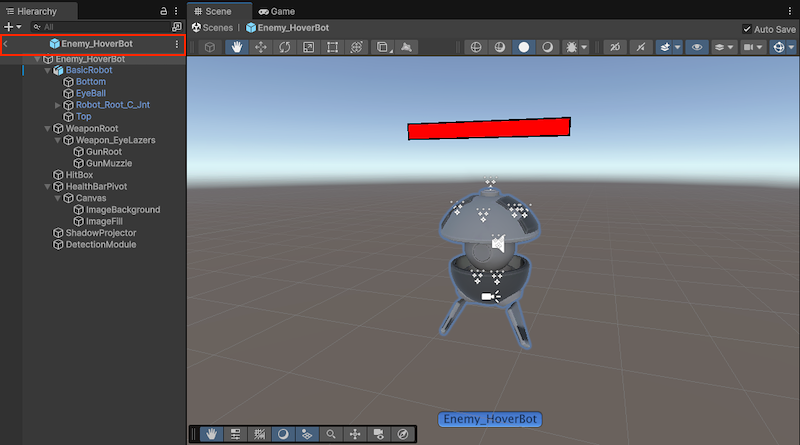
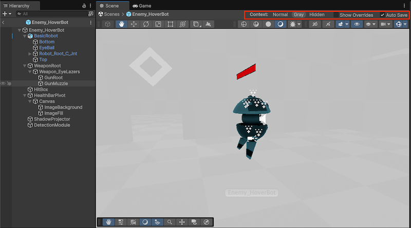

# 编辑预制件资源

> 原文：[Edit prefab assets](https://docs.unity3d.com/6000.7/Documentation/Manual/EditingInPrefabMode.html)

要编辑 Prefab Asset，可以在隔离的编辑模式中打开它，在不受 Scene 中其他 GameObject 干扰的情况下查看和编辑 Prefab Asset 的内容。在 Prefab Editing Mode 中进行的修改会影响该 Prefab 的所有 Instance。

## 在 Prefab Editing Mode 中打开 Prefab Asset

可以通过以下两种模式打开 Prefab Asset：

- **Isolation**：Unity 隐藏当前工作 Scene 的其余部分，只在 Hierarchy 中显示与 Prefab Asset 相关的 GameObject。
- **Context**：当前工作 Scene 的其余部分保持可见，但处于锁定状态，无法编辑。Hierarchy 只显示与 Prefab Asset 相关的 GameObject。

无论以 Context 还是 Isolation 打开 Prefab Editing Mode，Scene 视图都只显示该 Prefab 的内容。Scene 视图顶部的 Breadcrumb Bar 会显示当前打开 Prefab Asset 的名称。你可以使用此 Bar 返回主 Scene 或其他已打开的 Prefab Asset。

Hierarchy 窗口顶部也会显示当前打开的 Prefab。你可以单击 Header Bar 中的返回箭头后退一步，这与单击 Scene 视图 Breadcrumb Bar 中的上一个 Breadcrumb 相同。

### Open in Isolation

要以 Isolation 模式打开 Prefab Asset 并进行编辑，可以执行以下任一操作：

- 在 Project 窗口中双击 Prefab Asset。
- 在 Project 窗口中选择 Prefab Asset，然后单击 Inspector 窗口右上角的 **Open**。

Unity 随即以 Isolation 模式在 Prefab Editing Mode 中打开 Prefab Asset。

### Open in Context

要以 Context 模式打开 Prefab Asset 并进行编辑，可以执行以下任一操作：

- 在 Hierarchy 窗口中选择 Prefab Instance，然后单击 Inspector 窗口右上角的 **Open**。
- 在 Hierarchy 窗口中选择 Prefab Instance，然后按键盘上的 `P`。这是默认键位绑定。
- 在 Hierarchy 窗口中选择 Prefab Instance 旁边的箭头。

Unity 默认会在你从 Inspector 中选择 **Open** 时，以 Context 模式打开 Prefab Instance。要以 Isolation 模式打开 Prefab Instance，请按住 Alt（macOS：Option）并选择 **Open**。

要更改默认行为：

1. 打开 Preferences 窗口：**Edit > Preferences**（macOS：**Unity > Settings**）。
2. 进入 **General > Hierarchy window > Default Prefab Mode**，并将设置改为 **In Isolation**。

更改默认行为后，要以 Context 模式打开 Prefab Asset，请选择 Prefab Instance 并按 `P`。也可以在 Shortcuts 窗口中为编辑 Prefab 设置自定义快捷键。

## 在 Isolation 模式中编辑 Prefab Asset

默认情况下，在 Isolation 模式中编辑 Prefab Asset 时，Unity 会在默认 Skybox 中显示它，此时它不处于项目 Scene 的上下文中。若希望在与项目相关的背景下编辑 Prefab Asset，可以将 Scene 指定为编辑环境。

要更改默认环境：

1. 打开 Editor Project Settings：**Edit > Project Settings > Editor**。
2. 在 **Prefab Mode > Editing Environments** 下，为普通 Prefab 和 UI Prefab 选择 Scene。UI Prefab 指根对象包含 Rect Transform Component，而不是普通 Transform Component 的 Prefab。

Unity 只会在以 Isolation 模式打开 Prefab Editing Mode 时使用此编辑环境。

## 在 Context 模式中编辑 Prefab Asset

以 Context 模式打开 Prefab Editing Mode 时，Unity 默认会将 Scene 上下文的其余部分显示为灰色。

要更改此视图，请在 Scene 视图顶部的 Bar 中选择一个 Context 选项：

- **Normal**：以正常颜色显示 Prefab 及 Scene 的其余部分。
- **Gray**：以灰色显示 Prefab 及 Scene 的其余部分。
- **Hidden**：显示 Prefab，但隐藏 Scene 的其余部分。

无法选择 Scene 其余部分中的其他 GameObject，因此可以专注于编辑 Prefab。当 Context 设置为 **Hidden** 以外的选项时，仍然可以使用 Unity 的 Snapping 功能，将 Prefab 中的 GameObject 对齐到 Scene。

## 编辑 Prefab 属性

Unity 会在打开 Prefab Instance 的位置显示 Prefab 内容。这意味着，你看到的 Prefab 内容根 Transform 可能使用与 Prefab Asset 实际值不同的位置和旋转值进行预览。

> **重要：** Prefab Editing Mode 处于 Context 模式时，不能编辑 Transform 值。必须以 Isolation 模式打开 Prefab，才能编辑这些值。

要在主 Prefab Asset 上显示 Override，请选择 Scene 视图顶部 Bar 中的 **Show Overrides** 设置。禁用此选项可以查看 Prefab Asset 的默认属性。

## 自动保存 Prefab Asset 的编辑

要自动保存对 Prefab Asset 所做的修改，请在 Prefab Editing Mode 中单击 Scene 视图右上角的 **Auto Save**。如果编辑复杂 Prefab 时速度较慢，可以禁用此选项。之后，Unity 会在退出 Prefab Editing Mode 时显示对话框，询问是否保存 Prefab Asset。

也可以完全禁用 Auto Save，并从 Prefab Editing Mode 中移除该选项：

1. 打开 Editor Project Settings：**Edit > Project Settings > Editor**。
2. 在 **Prefab Mode** 下，禁用 **Allow Auto Save** 设置。

## 其他资源

- [[02-创建预制件|创建预制件]]
- [[05-创建预制件变体|创建预制件变体]]
- [[06-覆盖预制件实例数据/01-覆盖预制件实例|覆盖预制件实例]]

---

## 文档导航

- 上一页：[[02-创建预制件]]
- 目录：[[00-预制件]]
- 下一页：[[04-嵌套预制件]]
