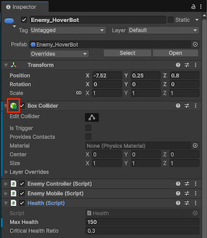
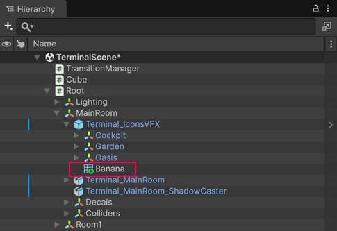
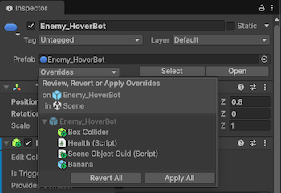

# 覆盖预制件实例

> 原文：[Override prefab instances](https://docs.unity3d.com/6000.7/Documentation/Manual/PrefabInstanceOverrides.html)

你可以覆盖 Prefab Instance 的属性和 Component，在保持这些 Instance 与同一个 Prefab Asset 连接的同时，创建 Instance 之间的差异。例如，可以创建多个相同角色的 Instance，但为每个 Instance 覆盖速度值并分配不同的 Audio Clip。

在 Prefab Instance 上修改以下任一内容时，Unity 会将其视为 Override：

- 属性值。
- 添加或移除 Component。
- 添加或移除子 GameObject。

如果修改或删除声明 Instance Override 值的脚本，Override 就会变成未使用数据。有关如何移除未使用 Override 数据的信息，请参阅[移除未使用的覆盖数据](https://docs.unity3d.com/6000.7/Documentation/Manual/UnusedOverrides.html)。

## Editor 中 Override 的外观

Unity 会在 Inspector 窗口左侧用蓝线标示 Override。添加或移除的 Component，其图标上会显示加号或减号徽标。

在 Hierarchy 中，添加的对象也会在其图标上显示加号徽标。

## Override 的行为

Prefab Instance 上被覆盖的属性值始终优先于 Prefab Asset 中的值。因此，如果修改 Prefab Asset 的某个属性，已覆盖该属性的 Instance 不会受到影响。

如果编辑 Prefab Asset 后某些 Instance 没有按预期更新，请检查这些 Instance 上的该属性是否已被覆盖。如果项目中有许多 Instance Override，跟踪哪些更改真正生效会变得困难，此时可以考虑使用 Prefab Variant 管理不同变体。

## Transform Override

Prefab Instance 的 **Position** 和 **Rotation** 属性始终与根 Prefab Asset 的属性不同，但不属于显式 Override。这是因为在大多数项目中，不同 Prefab Instance 需要位于与原始 Prefab Asset 不同的位置和旋转角度，因此 Unity 不会将其视为 Override。

对于 Rect Transform，**Width**、**Height**、**Margins**、**Anchors** 和 **Pivot** 属性也不被视为 Override。

## Array、List 和 Dictionary 上的 Override

当你在 Prefab Instance 上覆盖 Array、List 或 Dictionary 字段中的单个条目时，Unity 会按照该条目在序列化集合中的位置记录 Override。

如果之后通过在 Prefab Asset 上添加或移除条目来更改集合结构，Override 仍然会保留在原位置。根据修改方式，Override 可能会应用到与你最初想覆盖的条目不同的条目。

例如，假设一个 Prefab 有名为 `scores`、值为 `10`、`20`、`30` 的 `int[]` 字段。以下情形说明 Override 如何最终应用到非预期的条目：

1. 在 Prefab Instance 上将第二个值覆盖为 `99`。Inspector 显示 `10`、`99`、`30`，第二行带有 Override 标记。
2. 在 Prefab Asset 上删除值为 `10` 的第一个条目。Asset 中的 Array 变为 `20`、`30`。
3. 在 Instance 上，Override 仍然记录在相同位置。Inspector 现在显示 `20`、`99`，第二行带有 Override 标记。该 Override 原本替换的是 `20`，现在却替换了 `30`。

对于 Dictionary 字段，也遵循相同逻辑，但还需要考虑一个因素：Inspector 按排序后的顺序显示 Dictionary 条目，而不是按添加或存储顺序显示。因此，你看到的行位置不对应存储位置。如果在 Prefab Asset 上删除条目，就无法根据 Inspector 预测哪些 Override 会转而应用到其他条目。有关更多信息，请参阅[Prefab 中的 Dictionary](https://docs.unity3d.com/6000.7/Documentation/Manual/script-serialization-dictionaries.html#dictionaries-in-prefabs)。

对 Prefab Asset 中的集合进行任何结构更改后，尤其是删除条目后，都应检查 Prefab Instance，确认 Override 仍然应用于你预期的条目。

## 将 Override 应用到 Prefab Asset

可以使用 **Override** 下拉菜单，将 Override 数据永久应用到该 Instance 的根 Prefab Asset，并丢弃 Override。也可以将 Instance 恢复为 Prefab Asset 的原始设置。

要将修改应用到 Prefab Asset，或从 Prefab Asset 还原修改：

1. 在 Hierarchy 中选择 Prefab Instance。
2. 在 Inspector 中选择 **Override**。
3. 使用以下任一方式应用或还原 Override：
   - 选择 **Apply All** 或 **Revert All**，将所有 Override 应用到 Prefab Asset，或还原所有 Override。
   - 单击某个 Override，然后按住 Ctrl（macOS：Command）或 Shift 选择多个 Override，再选择 **Apply Selected** 或 **Revert Selected**。
   - 选择单个 Override，然后选择 **Revert** 或 **Apply**。根据上下文，可以选择将 Override 应用到 Prefab Asset 或 Prefab Variant。

如果选中的对象存在未使用的 Override，**Overrides** 下拉菜单会显示允许你移除这些数据的选项。

## 使用上下文菜单应用单个 Override

也可以使用 Inspector 或 Hierarchy 中的上下文菜单，将单个 Override 还原或应用到 Prefab Asset：

- 对于添加、移除或修改的 Component，选择 **More** 菜单（三点图标），然后选择 **Added Component**、**Removed Component** 或 **Modified Component**，再选择 **Revert** 或 **Apply**。
- 对于单个属性，右键单击该属性，然后选择 **Apply** 或 **Revert**。
- 对于添加的 GameObject，右键单击 Hierarchy 中的对象，然后选择 **Added GameObject > Apply** 或 **Revert**。

上下文菜单中的可用选项取决于 Prefab 的类型。例如，如果 Prefab Instance 包含 Nested Prefab，可以使用上下文菜单将 Override 应用到 Nested Prefab 的 Prefab Asset，或根 Prefab Instance 的 Prefab Asset。同样，如果创建了 Prefab Variant，可以选择将 Override 应用到 Prefab Variant，或原始 Prefab Asset。

## 其他资源

- [[02-移除未使用的覆盖数据|移除未使用的 Override 数据]]
- [[../02-创建预制件|创建预制件]]
- [[../05-创建预制件变体|创建预制件变体]]

---

## 文档导航

- 上一页：[[00-覆盖预制件实例数据]]
- 目录：[[../00-预制件]]
- 下一页：[[02-移除未使用的覆盖数据]]
