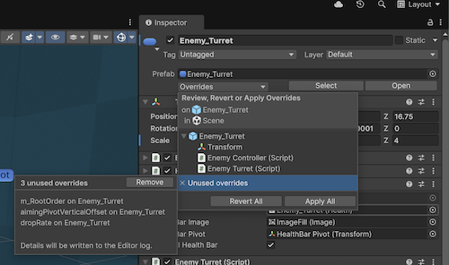

# 移除未使用的覆盖数据

> 原文：[Removing unused override data](https://docs.unity3d.com/6000.7/Documentation/Manual/UnusedOverrides.html)

Prefab 上的 Override 可能在以下情况下变成未使用数据：

- Override 的目标对象无效。
- Override 的属性路径未知。这可能发生在删除或重命名 public 字段定义时。要在重命名字段时保留 Override，可以使用 [`FormerlySerializedAsAttribute`](https://docs.unity3d.com/6000.7/Documentation/ScriptReference/Serialization.FormerlySerializedAsAttribute.html)。

Unity 会将未使用的 Override 数据保存在 Scene 文件中。这意味着，如果你恢复了被删除的脚本或字段定义，Unity 会重新应用 Override 数据。Unity 不会自动清理未使用数据，因为你可能只是暂时移动了数据所引用的对象或属性，或者是不小心进行了移动。最佳实践是清理未使用的 Override 数据，确保 Scene 文件只包含相关数据，从而使 Version Control 和协作更容易。

## 移除未使用的 Override

要检查并移除未使用的 Override：

1. 在 Prefab Instance 的 Inspector 中选择 **Overrides**。
2. 选择 **Unused overrides**。如果 Prefab Instance 没有未使用的 Override，则此部分不可用。
3. **Unused overrides** Panel 会列出所有未使用的 Override。选择 **Remove** 将其移除。

Unity 会将被移除的 Override 详细信息写入 Editor Log。

也可以从 Hierarchy 中移除未使用的 Override：

- 右键单击 Prefab Instance，选择 **Prefab > Remove Unused Overrides**。
- 右键单击 Scene 名称，选择 **Prefab > Remove Unused Overrides**，移除整个 Scene 中的所有未使用 Override。

随后会出现对话框确认是否移除 Override。

## 其他资源

- [[01-覆盖预制件实例|覆盖预制件实例]]
- [[../09-预制件实例 Inspector 参考|预制件实例参考]]
- [清理过时的序列化数据](https://docs.unity3d.com/6000.7/Documentation/Manual/script-serialization-best-practices.html#stale-serialized-data)

---

## 文档导航

- 上一页：[[01-覆盖预制件实例]]
- 目录：[[../00-预制件]]
- 下一页：[[../07-将预制件实例还原为游戏对象]]
