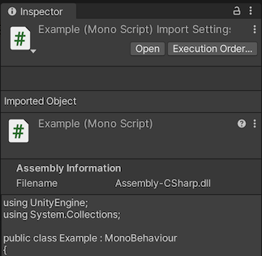
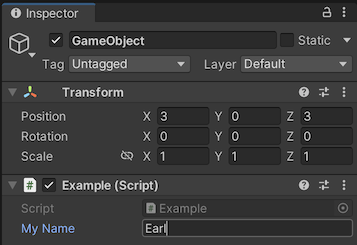
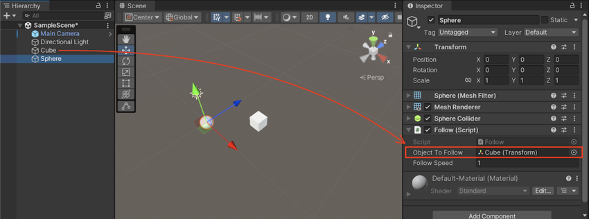
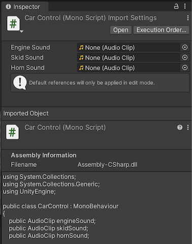

# 检查脚本

> 原文：[Inspecting scripts](https://docs.unity3d.com/6000.7/Documentation/Manual/inspecting-scripts.html)

当你在 Project 窗口中选择脚本 Asset 时，Inspector 会显示脚本的基本信息，包括它所属的程序集名称和脚本内容预览。

> [!NOTE]
> 虽然 Inspector 会显示脚本内容，但不能直接在 Inspector 窗口中编辑脚本。

脚本 Inspector 还会显示两个按钮：**Open** 和 **Execution Order**。

- **Open** 的作用与在 Project 窗口中双击脚本相同，会使用当前配置的 External Script Editor 打开脚本。可以在 Preferences 窗口的 **External Tools** 部分配置 Unity 打开脚本时使用的编辑器。
- **Execution Order** 会打开 Project Settings 窗口中的 **Script Execution Order** 部分，你可以在那里配置 Unity 执行脚本的顺序。





## Inspector 窗口中的脚本 Component

任何 `MonoBehaviour` 脚本都可以作为 Component 使用，这意味着你可以：

- 将脚本附加到 `GameObject` 上。
- 在 Inspector 窗口中编辑脚本的属性和值。

下面的示例代码声明了一个名为 `myName` 的 public 字段：

```csharp
using UnityEngine;

public class MainPlayer : MonoBehaviour
{
    public string myName = "none";

    void Start()
    {
        Debug.Log("I am alive and my name is " + myName);
    }
}
```

将此脚本添加到 Scene 中的 `GameObject` 后，字段会在 Inspector 中显示为 **My Name**。脚本中声明的默认值 `none` 会成为 Inspector 中的默认值，你可以直接在字段中输入新值。每个附加了该脚本 Component 的 `GameObject` 都可以拥有自己的字段值。

Unity 会按照特定规则将字段名转换为 Inspector 标签，具体规则见下文。但这些变化只用于显示；代码中始终应该使用字段名本身。

在 Inspector 中修改 **My Name** 的值并按下 Play 后，Console 消息会包含你输入的文本。

## Public 与 private 字段

默认情况下，所有 public 字段都可以在 Inspector 窗口中编辑。要阻止 public 变量显示在 Inspector 中，可以为它添加 `HideInInspector` Attribute；要让 private 字段可以在 Inspector 中编辑，可以为它添加 `SerializeField` Attribute。

> [!NOTE]
> 在 Play Mode 运行期间，可以在 Editor 中修改脚本字段的值，从而直接观察修改效果，无需停止并重新启动。但退出 Play Mode 后，字段值会重置为进入 Play Mode 前的值。

## Object 引用字段

除了 `bool`、`string` 和 `int` 等简单的内置 C# 类型外，任何继承自 `UnityEngine.Object` 的类型都可以作为可在 Inspector 中编辑的字段类型。这包括所有内置 Component 类型（例如 `Transform`、`AudioSource`、`Camera` 和 `Light`）、自定义 `MonoBehaviour` 脚本类型以及许多 Asset 类型。

这使你可以在自己的脚本 Component 中使用 Unity Editor 的拖放系统。例如，如果在脚本中创建 public `Transform` 字段并将脚本添加到一个 `GameObject`，就可以在 Inspector 中将另一个 `GameObject` 拖入该字段，从而建立对该 `GameObject` 的 `Transform` Component 的引用，并在 Runtime 中访问它。

下面的 `Follow` 脚本会让一个 `GameObject` 跟随另一个 `GameObject`：

```csharp
using UnityEngine;

public class Follow : MonoBehaviour
{
    public Transform objectToFollow;
    public float followSpeed = 1;

    void Update()
    {
        // 计算当前对象与目标对象之间的距离，
        // 并在每一帧移动这段距离的一小部分。
        var delta = objectToFollow.position - transform.position;
        transform.position += delta * Time.deltaTime * followSpeed;
    }
}
```

脚本有一个 `Transform` 类型的 public 字段，Editor 会将它显示为可分配字段。你可以从 Hierarchy 窗口中拖入另一个 `GameObject`，Editor 会将被拖入对象的 `Transform` Component 引用赋给该字段。

在官方示例截图中，脚本被放置在 `Sphere` GameObject 上，`Cube` 则从 Hierarchy 拖入 **Object To Follow** 字段。

## 默认 Object 引用

如果在 `MonoBehaviour` 脚本中定义了可以在 Editor 中分配的 public Object 字段，就可以为这些字段设置默认引用。当你在 Project 窗口中选择脚本 Asset 时，Inspector 会显示默认引用字段。

上面的示例包含三个没有设置默认引用的 public `AudioClip` 字段。你可以为每个 `AudioClip` 默认引用字段分配音频片段。

设置默认引用后，在以下情况下会应用这些引用：

- 将 `MonoBehaviour` 作为 Component 添加到 `GameObject` 时。
- 将 `GameObject` 上已有的 `MonoBehaviour` 实例重置为默认值时。

> [!NOTE]
> `GameObject` 上 `MonoBehaviour` 实例的引用与脚本 Asset 中的默认引用之间不存在持续的关联。因此，如果修改默认引用，已有 `GameObject` 不会自动更新。

其他不继承 `UnityEngine.Object`、但可以在 Inspector 中编辑的字段类型（例如 public `string` 或 `int`）没有默认字段。它们直接使用脚本中声明的默认值。

## Null 引用异常

如果忘记在 Inspector 中初始化一个需要初始化的变量，Unity 会抛出 `NullReferenceException`。可以使用 `try` / `catch` 代码块处理这种情况：

```csharp
using UnityEngine;
using System;

public class Example2 : MonoBehaviour
{
    public Light myLight; // 在 Inspector 中设置

    void Start()
    {
        try
        {
            myLight.color = Color.yellow;
        }
        catch (NullReferenceException)
        {
            Debug.Log("myLight was not set in the inspector");
        }
    }
}
```

示例中的 `myLight` 是一个 `Light`，需要在 Inspector 窗口中设置。如果没有设置，它的默认值就是 `null`。在 `try` 代码块中尝试更改光源颜色会触发 `NullReferenceException`；发生异常后，`catch` 代码块会显示消息，提醒你在 Inspector 中设置 `Light`。

## 字段名到 Inspector 标签的转换

Unity 会按照一组规则，将 C# 字段名转换为 Inspector 窗口中的标签。例如，上面的变量名会从 `myName` 转换为 **My Name**，从 `objectToFollow` 转换为 **Object To Follow**。规则如下：

- 将第一个字母大写。
- 在小写字母与大写字母之间添加空格。
- 当下一个单词以大写字母开头时，在缩写词与该大写字母之间添加空格。
- 移除 `m_` 前缀。
- 移除 `k` 前缀。
- 移除 `_` 前缀。

某些特殊情况（例如 `iPad` 或 `x64`）不遵循这些规则。

## 其他资源

- [[../../游戏对象/02-游戏对象基础/01-GameObject类]]
- [Inspector 窗口](https://docs.unity3d.com/6000.7/Documentation/Manual/UsingTheInspector.html)





---

## 文档导航

- 上一页：[[03-命名脚本]]
- 目录：[[00-开始使用Unity编程]]
- 下一页：[[../02-环境与工具/00-环境与工具]]
