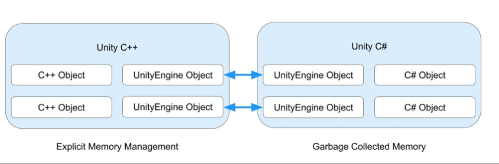

# Object 类

> 原文：[Object](https://docs.unity3d.com/6000.7/Documentation/Manual/class-Object.html)

`UnityEngine.Object` 类是 Unity Editor 可以引用的所有对象的基类。你可以将继承自 `UnityEngine.Object` 的类拖放到 Inspector 中的字段里，也可以使用 Object Picker（对象选择器）来选择它们。

*Inspector 窗口中的 Object 字段示例。字段右侧的圆形图标是 Object Picker。*

如果要为自己的项目编写自定义类，通常不建议直接继承 `Object`，而应该根据目标选择更具体的基类。例如：

- 如果要编写可以添加到 `GameObject` 上的自定义 Component，用来控制 `GameObject` 的行为或提供相关功能，请继承 `MonoBehaviour`。
- 如果要创建能够存储序列化数据的自定义 Asset，请继承 `ScriptableObject`。

这两个类都继承自 `UnityEngine.Object`，同时针对各自的用途提供了额外功能。

> [!NOTE]
> `UnityEngine.Object` 与 .NET 的基类 `System.Object` 不同。为了避免名称冲突，Unity 默认脚本模板中不会包含 `System.Object`。如果要创建不需要在 Inspector 中分配的普通 C# 类，仍然可以继承 .NET 的 `System.Object`。

`Object` 类提供了实例化和销毁 Object，以及查找特定类型 Object 引用的方法。关于 `Object` 类的 API，参阅 Unity Scripting API 中的 [Object API 参考](https://docs.unity3d.com/6000.7/Documentation/ScriptReference/Object.html)。

## UnityEngine.Object 的特殊行为

`UnityEngine.Object` 是 Unity 中一种特殊的 C# 对象，因为它与一个非托管的 C++ 对应对象相关联。例如，当你使用 `Camera` Component 时，Unity 会将 Object 的状态存储在该 Object 的 C++ 对应对象上，而不是存储在 C# Object 本身。

*左侧和右侧的容器分别表示 Unity Engine 的非托管层和托管层。每个容器都有一个 `UnityEngine.Object` 表示，连接线表示托管 Object 实例与其非托管对应对象之间的关联。*

Unity 目前不支持将 C# 的 `WeakReference` 类用于 `UnityEngine.Object` 实例。因此，不应该使用 `WeakReference` 引用已加载的 Asset。关于 `WeakReference` 类的更多信息，参阅 Microsoft 的 [WeakReference 文档](https://learn.microsoft.com/en-us/dotnet/api/system.weakreference)。

### Unity C# 与 Unity C++ 共享 UnityEngine Object

当你使用 `Object.Destroy` 或 `Object.DestroyImmediate` 等方法销毁派生自 `UnityEngine.Object` 的对象时，Unity 会销毁（卸载）其 C++ 对应对象。你不能通过显式调用来销毁 C# 对象，因为内存由 Garbage Collector 管理。当不再有任何引用指向托管对象时，Garbage Collector 会回收并销毁它。

如果应用程序再次尝试访问已销毁的 `UnityEngine.Object`，Unity 会为大多数类型重新创建其原生对应对象。`MonoBehaviour` 和 `ScriptableObject` 是两个例外：它们被销毁后，Unity 永远不会重新加载它们。

### 自定义相等运算符

对于继承自 `UnityEngine.Object` 的类型，Unity 使用 C# 相等和不等运算符的自定义版本。这意味着，即使 `myGameObject` 实际上仍然持有有效的 C# 对象引用，空值检查 `myGameObject == null` 也可能求值为 `true`；相应地，`myGameObject != null` 可能求值为 `false`。这种情况有两种原因：

1. 对象可能是所谓的 fake null（假 null）或占位对象。Unity 只在 Editor 中使用这类对象来填充尚未初始化的 `MonoBehaviour` 字段。如果你尝试引用这些字段，它们会保存有用的调试信息，帮助你定位字段的来源。
2. 对象可能是尚未被 Garbage Collector 回收的托管（C#）对象，但由于其非托管（C++）对应对象已被销毁，因此应当被视为 null。

由于 C# 无法重载 `??` 和 `?.` 运算符，因此它们与派生自 `UnityEngine.Object` 的对象不兼容。当托管对象仍然存在、但其对应的 `MonoBehaviour` 或 `ScriptableObject` 已被销毁时，这些运算符返回的结果可能与相等和不等运算符不同。

> [!NOTE] 对比表
> |写法|检查什么|对已销毁对象的结果|
|---|---|---|
|`go == null`|Unity 重载，检查引擎对象是否存活|`true`|
|`go != null`|Unity 重载，检查引擎对象是否存活|`false`|
|`go is null`|只看 C# 引用|`false`|
|`ReferenceEquals(go, null)`|只看 C# 引用|`false`|
|`go?.name`|只看 C# 引用，非 null 就访问|可能报错|
|`go ?? fallback`|只看 C# 引用|返回 `go`，不是 `fallback`|

## 其他资源

- `UnityEngine.Object` [API 参考](https://docs.unity3d.com/6000.7/Documentation/ScriptReference/Object.html)

---

## 文档导航

- 上一页：[[00-Unity基础类型]]
- 目录：[[00-Unity基础类型]]
- 下一页：[[02-MonoBehaviour类]]
