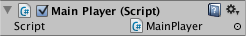

# MonoBehaviour 类

> 原文：[MonoBehaviour](https://docs.unity3d.com/6000.7/Documentation/Manual/class-MonoBehaviour.html)

`MonoBehaviour` 类提供了在 Editor 中将脚本附加到 `GameObject` 的框架，也提供了 `Start`、`Update` 等常用 Event Function 的入口。

你可以按照 [[../01-开始使用Unity编程/02-创建脚本]] 中的说明，在 Editor 中创建新的 `MonoBehaviour` 脚本。`MonoBehaviour` 的所有成员及其技术细节，请参阅 Unity Scripting API 中的 `MonoBehaviour` 参考。

## MonoBehaviour 脚本文件的内容

在 Unity 中双击脚本 Asset，可以在文本编辑器中打开它。默认情况下 Unity 使用 Visual Studio，但你可以在 Unity Preferences 的 **External Tools** 面板中选择其他编辑器。

如果创建的是 `MonoBehaviour` 脚本，文件初始内容大致如下：

```csharp
using UnityEngine;

public class NewMonoBehaviourScript : MonoBehaviour
{
    // MonoBehaviour 创建后，在第一次执行 Update 之前调用一次
    void Start() { }

    // 每帧调用一次
    void Update() { }
}
```

这个脚本定义了一个继承 Unity 内置 `MonoBehaviour` 类的类，从而与 Unity 的内部工作机制建立联系。可以把类理解为创建新 Component 类型的蓝图；每次将脚本 Component 附加到 `GameObject` 时，Unity 都会创建一个由这份蓝图定义的对象实例。类名取自创建文件时输入的名称。最佳实践是让类名和文件名保持一致，参阅 [[../01-开始使用Unity编程/03-命名脚本]]。

示例中需要注意的是类内部定义的两个函数：

- `Update` 用于编写处理 `GameObject` 帧更新的代码，例如移动、触发动作和响应用户输入，也就是游戏运行期间需要随时间处理的内容。
- `Start` 会在游戏开始、第一次调用 `Update` 之前由 Unity 调用，适合进行初始化。在游戏动作开始前，可以在这里设置变量、读取配置以及建立与其他 `GameObject` 的连接。

> [!NOTE]
> 有经验的程序员可能会疑惑，为什么对象初始化不是通过构造函数完成的。这是因为对象的构造由 Unity Editor 处理，并不会像普通 C# 对象那样在游戏开始时发生。如果为 `MonoBehaviour` 定义构造函数，会干扰 Unity 的正常运行，并可能给项目带来严重问题。

## 控制 GameObject

脚本只定义 Component 的蓝图。只有当脚本的实例附加到 `GameObject` 后，其中的代码才会运行。可以将脚本 Asset 拖到 Hierarchy 面板中的 `GameObject` 上，也可以拖到当前选中的 `GameObject` 的 Inspector 上。Component 菜单中还有一个 **Scripts** 子菜单，其中包含项目中所有可用脚本，包括你自己创建的脚本。



附加脚本后，按下 Play 运行游戏，脚本就会开始工作。可以把下面的代码添加到 `Start` 函数中进行验证：

```csharp
void Start()
{
    Debug.Log("Hello world!");
}
```

`Debug.Log` 是一个简单命令，会将消息输出到 Unity Console。按下 Play 后，你应该能在主 Editor 窗口底部和 Console 窗口（**Window > General > Console**）中看到这条消息。

## Coroutine

`MonoBehaviour` 类允许你启动、停止和管理 Coroutine。关于 Coroutine 的更多信息，请参阅 [[../06-使用协程跨帧分配任务/00-使用协程跨帧分配任务]] 以及 `StartCoroutine` 的 Scripting API 参考。

## Event

`MonoBehaviour` 类可以访问大量 Event Function，让你根据项目当前发生的事情执行代码。常见示例包括 `Start` 和 `Update`；完整列表请参阅 `MonoBehaviour` Scripting API 页面中的 **Messages** 部分。

## 其他资源

- [[../04-管理更新和执行顺序/02-事件函数]]
- [MonoBehaviour API 参考](https://docs.unity3d.com/6000.7/Documentation/ScriptReference/MonoBehaviour.html)

---

## 文档导航

- 上一页：[[01-Object类]]
- 目录：[[00-Unity基础类型]]
- 下一页：[[03-ScriptableObject类]]
