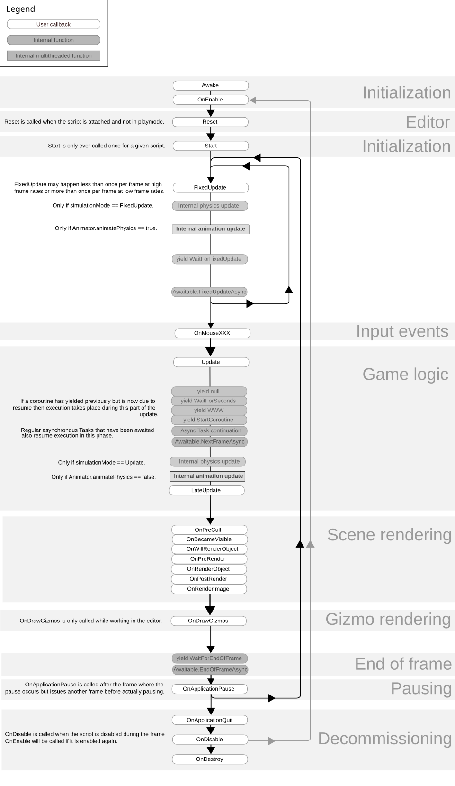
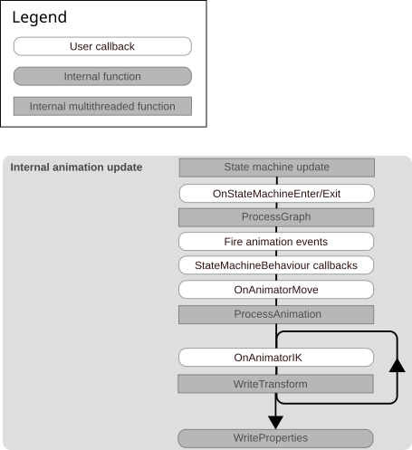

# 事件函数执行顺序

> 原文：[Event function execution order](https://docs.unity3d.com/6000.7/Documentation/Manual/execution-order.html)

下面的流程图从较高层次概览 MonoBehaviour 脚本 Component 生命周期中事件函数的执行顺序。为了便于阅读，图表只包含脚本生命周期的关键部分，并加入了一些内部 Subsystem 更新作为上下文。

完整的 Player Loop 更长，也更复杂，其中包含按确定的默认顺序依次运行的多个系统和子系统。可以使用 `PlayerLoop` API 获取完整 Player Loop 及其所有系统，也可以使用该 API 删除系统、添加自定义系统或更改更新顺序。

有关每个回调的含义和限制，请参阅 MonoBehaviour API 参考中的 `Messages` 部分。

## Internal physics update

流程图中标记为 `Internal physics update` 的节点代表 Physics Simulation。根据项目中的 Physics 配置，Physics Simulation 可能在 MonoBehaviour 执行顺序的不同位置发生：

- 如果 `Physics.simulationMode` 设置为 `SimulationMode.FixedUpdate`，或 `Physics2D.simulationMode` 设置为 `SimulationMode2D.FixedUpdate`，Physics Simulation 会紧接在 `MonoBehaviour.FixedUpdate` 之后执行。
- 如果 `Physics.simulationMode` 设置为 `SimulationMode.Update`，或 `Physics2D.simulationMode` 设置为 `SimulationMode2D.Update`，Physics Simulation 会紧接在 `MonoBehaviour.Update` 之后执行。
- 如果 `Physics.simulationMode` 设置为 `SimulationMode.Script`，或 `Physics2D.simulationMode` 设置为 `SimulationMode2D.Script`，则需要从脚本中手动模拟 Physics，模拟时机取决于传给 `Physics.Simulate` 或 `Physics2D.Simulate` 的 step 参数。

Physics Simulation 包括：

- Collision Detection 的全部阶段。
- Rigidbody 和 Joint Integration。
- 将 Body Pose 写回 Transform。
- 调用相关的 Physics MonoBehaviour 回调，包括：
  - `OnTriggerEnter`、`OnTriggerStay`、`OnTriggerExit`。
  - `OnTriggerEnter2D`、`OnTriggerStay2D`、`OnTriggerExit2D`。
  - `OnCollisionEnter`、`OnCollisionStay`、`OnCollisionExit`。
  - `OnCollisionEnter2D`、`OnCollisionStay2D`、`OnCollisionExit2D`。
  - `OnJointBreak`、`OnJointBreak2D`。
  - `OnParticleCollision`、`OnParticleTrigger`。

## Internal animation update

下面的动画流程图展示常规 Animation Update Loop 的执行顺序，并展开了上一张图中的 `Internal animation update` 节点。

图中以下 Animation Loop 回调会在继承自 MonoBehaviour 的脚本上调用：

- `MonoBehaviour.OnAnimatorMove`
- `MonoBehaviour.OnAnimatorIK`

以下与 Animation 相关的 Event Function 会在继承自 `StateMachineBehaviour` 的脚本上调用：

- `StateMachineBehaviour.OnStateMachineEnter`
- `StateMachineBehaviour.OnStateMachineExit`
- `StateMachineBehaviour.OnStateEnter`
- `StateMachineBehaviour.OnStateUpdate`
- `StateMachineBehaviour.OnStateExit`
- `StateMachineBehaviour.OnStateMove`
- `StateMachineBehaviour.OnStateIK`

图中其他 Animation Function 属于 Animation System 内部实现，仅作为上下文显示。这些函数都有对应的 Profiler Marker，因此可以在 Profiler 中查看 Unity 在帧中的调用时机。了解这些调用时机，有助于准确理解自己调用的 Event Function 何时执行。有关 Animation Function 的完整执行顺序和 Profiler Marker，请参阅 Profiler Marker 文档。

## Rendering

> [!IMPORTANT]
> Built-In Render Pipeline 已被弃用，并将在未来版本中移除。它仍会在 Unity 6.7 LTS 的完整生命周期内获得支持，包括 Bug Fix 和维护。有关迁移，请参阅从 Built-In Render Pipeline 迁移到 Universal Render Pipeline，以及 Render Pipeline 功能对比。

下面的执行顺序只适用于 Built-In Render Pipeline。对于基于 Scriptable Render Pipeline 的 Render Pipeline，请参阅 Universal Render Pipeline 或 High Definition Render Pipeline 文档中的对应章节。如果需要在 Rendering 之前立即执行代码，请参阅 `Application.onBeforeRender`。

- `OnPreCull`：在 Camera 对 Scene 执行 Culling 前调用。Culling 决定 Camera 可见的对象。
- `OnBecameVisible` / `OnBecameInvisible`：对象对任意 Camera 变为可见或不可见时调用。`OnBecameInvisible` 没有显示在流程图中，因为对象可能在任意时刻变为不可见。
- `OnWillRenderObject`：对象可见时，每台 Camera 调用一次。
- `OnPreRender`：Camera 开始渲染 Scene 前调用。
- `OnRenderObject`：常规 Scene Rendering 完成后调用。此时可以使用 `GL` 类或 `Graphics.DrawMeshNow` 绘制自定义几何体。
- `OnPostRender`：Camera 完成 Scene Rendering 后调用。
- `OnRenderImage`：Scene Rendering 完成后调用，用于对图像执行 Post-processing。
- `OnGUI`：响应 GUI 事件，每帧调用多次。Layout 和 Repaint 事件先处理，然后针对每个 Input Event 处理一次 Layout 和键盘/鼠标事件。
- `OnDrawGizmos`：用于在 Scene 视图中绘制 Gizmos，以便可视化。

`OnPreCull`、`OnPreRender`、`OnPostRender` 和 `OnRenderImage` 是内置 Unity Event Function，但只有在脚本附加到同一个带有启用 Camera Component 的对象上时才会调用。如果希望挂在其他对象上的 MonoBehaviour 接收 `OnPreCull`、`OnPreRender` 和 `OnPostRender` 的等效回调，应使用名称中 `on` 为小写的对应 Delegate：`Camera.onPreCull`、`Camera.onPreRender` 和 `Camera.onPostRender`。

## Coroutine 和异步任务的恢复

暂停的 Coroutine 会根据使用的 yield instruction，在执行顺序的不同位置恢复。例如，使用 `WaitForEndOfFrame` 的 Coroutine 会在帧末恢复，使用 `WaitForFixedUpdate` 的 Coroutine 会在 Fixed Update 阶段结束时恢复。

普通 .NET `Task` 和异步方法会在 Update 阶段恢复。Unity 自定义的 `Awaitable` 类与 Coroutine 类似，会根据等待时使用的方法在不同位置恢复。

Coroutine 与异步任务恢复的精确先后顺序不受保证。Awaitable 会分组处理，并按照它们进入等待状态的顺序执行。

## 将 MonoBehaviour 与 Entities 组合使用

使用 Entity Component System（ECS）时，Unity 会将 ECS System Group 的更新合并到 Player Update Loop 中。

可以使用 Entities Systems 窗口查看 ECS System Group 相对于完整 Player Loop 的更新顺序。有关信息请参阅 Entities Package 文档中的系统更新顺序。

## 在 MonoBehaviour 生命周期外执行代码

流程图中的事件函数都属于 MonoBehaviour 脚本生命周期，但 Unity 还会在该生命周期之外调用许多其他事件和回调。例如，可以使用 `Unity.Scripting.LifecycleManagement` Namespace 中的代码生命周期回调，在脚本加载前或卸载后执行自定义初始化和清理代码；也可以使用 `UnityEngine` 和 `UnityEditor.Scripting.LifecycleManagement` Namespace 中的生命周期 Attribute，在进入和退出 Play Mode 时执行代码。

## 限制

通常不能依赖不同 GameObject 上同一种 Event Function 的调用顺序，除非该顺序有明确文档说明或可以配置。

不能指定同一个 MonoBehaviour 脚本不同实例之间 Event Function 的调用顺序。例如，一个 GameObject 上 MonoBehaviour 的 `Update` 可能在另一个 GameObject（包括它的 Parent 或 Child）上同一脚本的 `Update` 之前或之后调用。

要配置不同 MonoBehaviour 脚本之间的执行顺序，请参阅 [[01-脚本执行顺序]]。

---

## 其他资源

- [[02-事件函数]]
- [[../03-Unity基础类型/02-MonoBehaviour类]]
- [PlayerLoop API 参考](https://docs.unity3d.com/6000.7/Documentation/ScriptReference/LowLevel.PlayerLoop.html)
- [[01-脚本执行顺序]]
- [[../10-编译和代码重载/07-代码和场景重载/00-代码和场景重载]]

---

## 文档导航

- 上一页：[[02-事件函数]]
- 目录：[[00-管理更新和执行顺序]]
- 下一页：[[04-自定义Player Loop]]
