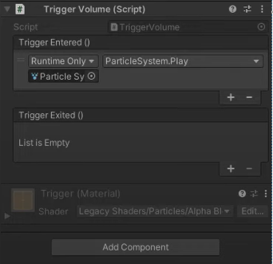
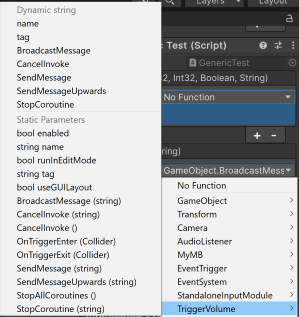

# Inspector 可配置的自定义事件

> 原文：[Inspector-configurable custom events](https://docs.unity3d.com/6000.7/Documentation/Manual/unity-events.html)

Unity 提供了 [UnityEvent](https://docs.unity3d.com/6000.7/Documentation/ScriptReference/Events.UnityEvent.html) API，作为标准 C# [events and delegates](https://learn.microsoft.com/en-us/dotnet/standard/events/) 的 Unity 专用替代方案。与标准 C# 事件相比，Unity 事件的主要优势是它们支持序列化，这意味着你可以在 [Inspector 窗口](https://docs.unity3d.com/6000.7/Documentation/Manual/UsingTheInspector.html)中配置它们。

任何 `MonoBehaviour` 都可以添加一个 `UnityEvent`，它会像标准 C# 委托一样在运行时执行。当在 `MonoBehaviour` 中声明 `UnityEvent` 时，它会显示在 **Inspector** 窗口中，你可以在其中定义能够在 Edit Mode 和运行时之间持久保存的回调。

Unity 事件与标准 C# 委托具有类似的限制：

- Unity 事件会持有目标对象的引用，这会阻止目标对象被垃圾回收。
- 如果目标是托管的（C#）`UnityEngine.Object`，而其非托管的（C++）对应对象已经被销毁，则不会调用该回调。更多信息请参阅 [Object](https://docs.unity3d.com/6000.7/Documentation/Manual/class-Object.html)。

## 配置 Unity 事件

### 前提条件

- 创建一个包含 `using UnityEngine.Events` 的 MonoBehaviour 脚本。
- 声明至少一个 `UnityEvent` 类型的字段。

### 在 Inspector 窗口中配置回调

1. 选择包含已声明 `UnityEvent` 字段的脚本 Component 的 GameObject。
2. 点击事件名称下方的 **+** 按钮，为回调添加一个插槽。
3. 选择要接收回调的 [UnityEngine.Object](https://docs.unity3d.com/6000.7/Documentation/Manual/class-Object.html)。你可以使用对象选择器，或将对象拖放到字段中。
4. 选择事件发生时要调用的函数。下拉选择器会列出 GameObject 及其 Components 上符合筛选条件的[适用方法](#静态调用和动态调用)。
5. 根据需要重复步骤 1–4，为同一个事件添加其他回调。



*在 Inspector 窗口中为名为 Trigger Entered 和 Trigger Exited 的事件配置回调。*

### 静态调用和动态调用

在 **Inspector** 窗口中配置 `UnityEvent` 时，支持以下两种函数调用类型：

- **Static** 调用完全在创作时预先配置，其目标和参数值在 Inspector 窗口中定义。调用回调时，会使用 Inspector 中定义的参数值调用目标函数。这适用于运行时不会变化的值，例如每次发生特定碰撞时都希望将生命值减少固定数值。静态绑定的函数会显示在函数选择列表的 **Static Parameters** 下。
- **Dynamic** 调用由代码以编程方式调用，其参数与被调用的 `UnityEvent` 类型相匹配。这适用于运行时会变化的值，例如用 `float` 表示角色每次受到攻击时承受的可变伤害值。UI 会筛选回调，只显示与 `UnityEvent` 类型签名匹配的动态函数。例如，如果有一个 `UnityEvent<string>`，函数选择器会在 **Dynamic string** 标题下列出接受 `string` 参数的函数。



*在 Inspector 窗口中选择与事件类型签名匹配的静态或动态函数。*

## UnityEvent 中的泛型支持

默认情况下，`MonoBehaviour` 中的 `UnityEvent` 会动态绑定到一个 `void` 函数。但你可以创建带有最多四个泛型类型参数的 `UnityEvent`，如下例所示：

```csharp
using UnityEngine;
using UnityEngine.Events;

public class GenericTest : MonoBehaviour
{
    public UnityEvent<int, int, bool, string> myEvent;
    // Start is called once before the first execution of Update after the MonoBehaviour is created
    void Start()
    {
        if (myEvent == null)
        {
            myEvent = new UnityEvent<int, int, bool, string>();
        }
        myEvent.AddListener(Ping);
    }

    // Update is called once per frame
    void Update()
    {
        if (Input.anyKeyDown && myEvent != null)
        {
            myEvent.Invoke(5, 6, true, "Hello");
        }
    }
    void Ping(int i, int j, bool print, string text)
    {
        if (print)
        {
            Debug.Log("Ping: " + text + i + j);
        }
    }
}
```

## 其他资源

- [使用拖放事件设置门、触发器等](https://youtu.be/tmmvhxQcbJk)
- [UnityEvent API 参考](https://docs.unity3d.com/6000.7/Documentation/ScriptReference/Events.UnityEvent.html)

---

## 文档导航

- 上一篇：[[05-使用自定义更新管理器]]
- 所属目录：[[00-管理更新和执行顺序]]
- 下一篇：[[../05-管理时间和帧率/00-管理时间和帧率]]
