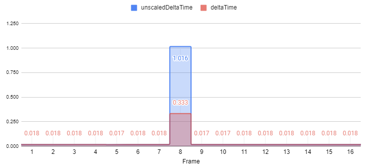
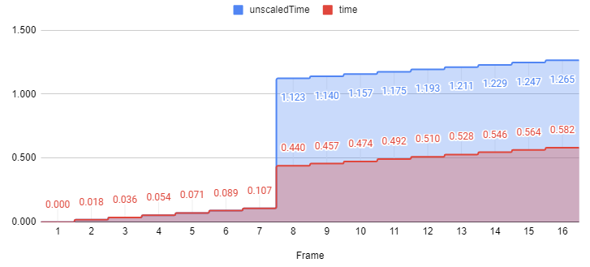
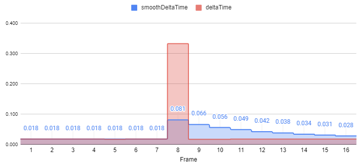

# 处理时间变化

> 原文：[Handling variation in time](https://docs.unity3d.com/6000.7/Documentation/Manual/time-handling-variations.html)

对于给定的 Frames Per Second（FPS），每帧的持续时间通常会变化。变化可能很小，例如运行在 60 FPS 的游戏，每帧实际可能持续 0.016 到 0.018 秒；当应用执行繁重计算、进行 Garbage Collection，或与其他应用竞争资源时，变化也可能很大。

## 记录经过的时间

[`Time.time`](https://docs.unity3d.com/6000.7/Documentation/ScriptReference/Time-time.html) 表示从应用程序启动以来经过的时间，因此通常会持续、稳定地增加。[`Time.deltaTime`](https://docs.unity3d.com/6000.7/Documentation/ScriptReference/Time-deltaTime.html) 表示从上一帧开始经过的时间，因此理想情况下应该保持相对稳定。这两个值都基于游戏时间而不是 Real Time，也就是说会考虑你设置的时间缩放。

例如，将 `Time.timeScale` 设置为 `0.1` 来实现慢动作时，`Time.time` 会以真实时间 10% 的速度增加；真实时间经过 10 秒后，`Time.time` 只会增加 1 秒。

除了加快或减慢游戏时间，还可以将 `Time.timeScale` 设置为 `0` 来暂停游戏。此时 Unity 仍然调用 `Update`，但 `Time.time` 不会增加，`Time.deltaTime` 为 `0`。

## 限制记录的时间变化

这些值还会受到 [`Time.maximumDeltaTime`](https://docs.unity3d.com/6000.7/Documentation/ScriptReference/Time-maximumDeltaTime.html) 的限制。通过这些属性报告的暂停时长或 Frame Rate 变化，永远不会超过 `Time.maximumDeltaTime`。

例如，某次延迟持续 1 秒，而 `maximumDeltaTime` 使用默认值 `0.333`，则即使真实世界经过了 1 秒，`Time.time` 也只会增加 `0.333`，`Time.deltaTime` 也等于 `0.333`。

每个属性的 Unscaled 版本（`Time.unscaledTime` 和 `Time.unscaledDeltaTime`）会忽略这个限制，报告实际经过的时间。这对于即使游戏处于慢动作也应以固定速度响应的内容很有用，例如 UI Interaction Animation。

下表展示连续经过 16 帧，并在中途某一帧发生较大延迟时，各个 `Time` 属性报告的值：

| Frame | `unscaledTime` | `time` | `unscaledDeltaTime` | `deltaTime` | `smoothDeltaTime` |
| ---: | ---: | ---: | ---: | ---: | ---: |
| 1 | 0.000 | 0.000 | 0.018 | 0.018 | 0.018 |
| 2 | 0.018 | 0.018 | 0.018 | 0.018 | 0.018 |
| 3 | 0.036 | 0.036 | 0.018 | 0.018 | 0.018 |
| 4 | 0.054 | 0.054 | 0.018 | 0.018 | 0.018 |
| 5 | 0.071 | 0.071 | 0.017 | 0.017 | 0.018 |
| 6 | 0.089 | 0.089 | 0.018 | 0.018 | 0.018 |
| 7 | 0.107 | 0.107 | 0.018 | 0.018 | 0.018 |
| 8 (**a**) | 1.123 (**b**) | 0.440 (**c**) | 1.016 (**d**) | 0.333 (**e**) | 0.081 (**f**) |
| 9 | 1.140 | 0.457 | 0.017 | 0.017 | 0.066 |
| 10 | 1.157 | 0.474 | 0.017 | 0.017 | 0.056 |
| 11 | 1.175 | 0.492 | 0.018 | 0.018 | 0.049 |
| 12 | 1.193 | 0.510 | 0.018 | 0.018 | 0.042 |
| 13 | 1.211 | 0.528 | 0.018 | 0.018 | 0.038 |
| 14 | 1.229 | 0.546 | 0.018 | 0.018 | 0.034 |
| 15 | 1.247 | 0.564 | 0.018 | 0.018 | 0.031 |
| 16 | 1.265 | 0.582 | 0.018 | 0.018 | 0.028 |

前 7 帧大约以 60 FPS 稳定运行。`Time.time` 和 `Time.unscaledTime` 一起稳定增加，说明 `Time.timeScale` 为 `1`。

第 8 帧发生了超过 1 秒的延迟，可能是其他资源竞争导致的，例如某个操作阻塞主进程并从磁盘加载大量数据。

当帧延迟超过 `Time.maximumDeltaTime` 时，Unity 会限制 `Time.deltaTime` 和增加到 `Time.time` 的数值，以避免时间步过大造成不良影响。否则，使用 `Time.deltaTime` 缩放移动的对象理论上可能在一帧内移动无限远，从而穿过墙壁等障碍物。

可以在 Time 窗口中修改 **Maximum allowed timestep**，也可以在代码中设置 `Time.maximumDeltaTime`。默认值是三分之一秒（`0.3333333`）。因此，使用 `Time.deltaTime` 控制移动时，对象每帧移动的距离最多相当于三分之一秒能够移动的距离，与上一帧实际经过了多少时间无关。

在上表中，第 8 帧的 `Time.unscaledDeltaTime`（`1.016`）与 `Time.deltaTime`（`0.333`）报告的经过时间不同。虽然第 7 帧到第 8 帧之间真实经过了约 1 秒，但 `Time.deltaTime` 被 `Time.maximumDeltaTime` 截断。

同理，`Time.unscaledTime` 因为加入了未截断的值而增加了约 1 秒，而 `Time.time` 只增加了被截断的值。`Time.time` 不会追上真实时间，而是表现得像延迟只持续了 `Time.maximumDeltaTime`。

将上一表格中的数据以图形形式查看，有助于直观理解这些时间属性之间的行为关系：

在第 8 帧，`Time.unscaledDeltaTime`（**d**）和 `Time.deltaTime`（**e**）报告的经过时间不同。虽然第 7 帧到第 8 帧之间真实经过了约 1 秒，但 `Time.deltaTime` 只报告 0.333 秒，因为它被 `Time.maximumDeltaTime` 限制。

同理，`Time.unscaledTime`（**b**）因为加入了未截断的值而增加了约 1 秒，而 `Time.time`（**c**）只增加了被截断的值。`Time.time` 不会追上真实时间，而是表现得像延迟只持续了 `Time.maximumDeltaTime`。

[`Time.smoothDeltaTime`](https://docs.unity3d.com/6000.7/Documentation/ScriptReference/Time-smoothDeltaTime.html) 会根据算法，对最近的 `Time.deltaTime` 值进行近似并平滑所有变化。这也是避免移动或其他基于时间的计算出现不良波动的一种方式，尤其能平滑低于 `Time.maximumDeltaTime` 阈值的变化。该算法不能预测未来变化，但会逐渐调整报告值，使最近 `Time.deltaTime` 的平均报告时间大致等于实际经过的时间。

## 时间变化与 Fixed Update 循环

`maximumDeltaTime` 同样会影响 Fixed Update 循环。Physics 系统使用 [`Time.fixedDeltaTime`](https://docs.unity3d.com/6000.7/Documentation/ScriptReference/Time-fixedDeltaTime.html) 定义的固定时间间隔，决定每一步模拟多少时间。Unity 会尝试让 Physics Simulation 跟上已经经过的时间，因此有时会在一帧中执行多次 Physics Update。

但是，如果 Physics Simulation 落后太多，Physics 系统可能需要大量步骤才能追上当前时间，而这些追赶步骤又可能造成额外变慢。为了避免这种反馈循环，`Time.maximumDeltaTime` 也会限制任意两帧之间 Physics 系统模拟的时间量。

如果一帧的处理时间超过 `Time.maximumDeltaTime`，Physics Engine 不会尝试模拟额外的时间，而是让帧处理追上进度。帧更新结束后，Physics 会像中间没有经过时间一样继续运行。

结果是 Physics 对象不会像平时那样完全按照 Real Time 移动，而是会略微变慢；但 Physics 系统仍会像对象正常移动一样跟踪它们。这种 Physics 时间减慢通常不明显，是换取 Gameplay 性能时可以接受的结果。

## Unity 的时间逻辑

下面的流程图展示 Unity 如何在单帧中计算时间，以及 `time`、`deltaTime`、`fixedDeltaTime` 和 `maximumDeltaTime` 属性之间的关系。

---

## 文档导航

- 上一页：[[03-游戏时间和实时]]
- 目录：[[00-管理时间和帧率]]
- 下一页：[[05-捕获帧率]]
