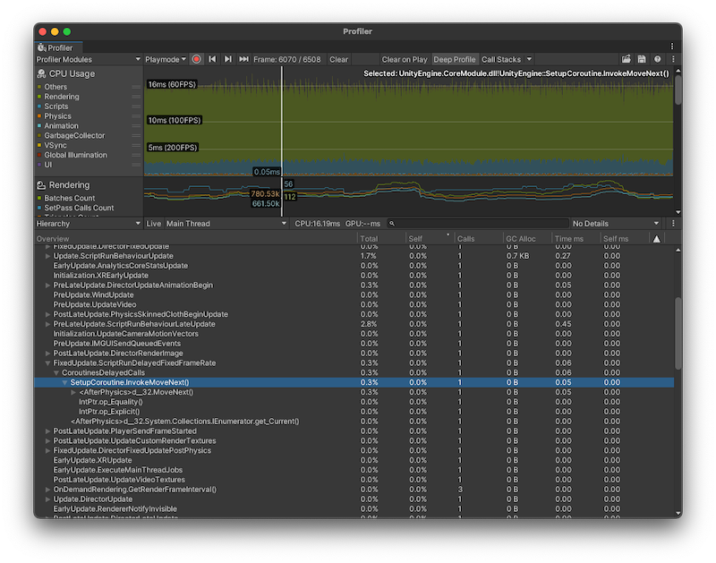

# 分析 Coroutine

> 原文：[Analyzing coroutines](https://docs.unity3d.com/6000.7/Documentation/Manual/coroutines-analyzing.html)

Coroutine 的执行方式不同于其他脚本代码。Unity 中的大多数脚本代码会在性能追踪中显示于单个位置，并位于某个特定回调调用的下方。但是，Coroutine 的 CPU 代码总会在追踪中出现在两个位置：

- Coroutine 中从方法开始执行到第一个 `yield` 语句之前的所有初始代码，会在 Unity 启动 Coroutine 时显示在追踪中。初始代码通常会在调用 [`StartCoroutine`](https://docs.unity3d.com/6000.7/Documentation/ScriptReference/MonoBehaviour.StartCoroutine.html) 方法时显示。如果是由 Unity 回调生成的 Coroutine（例如返回 `IEnumerator` 的 `Start` 回调），初始代码会首先显示在对应的 Unity 回调中。
- Coroutine 从第一次恢复执行到执行结束的其余代码，会显示在 Unity 主循环中的 `DelayedCallManager` 行内。这是 Unity 执行 Coroutine 的方式所导致的。C# 编译器会自动生成一个支持 Coroutine 的类实例，Unity 使用该对象在同一个方法的多次调用之间跟踪 Coroutine 的状态。由于 Coroutine 中的局部作用域变量必须跨越 `yield` 调用持续存在，Unity 会将这些局部变量的作用域提升到生成的类中；在 Coroutine 运行期间，这些变量会一直作为堆上的对象分配。该对象还会跟踪 Coroutine 的内部状态，记录满足 `yield` 条件后代码应从哪个位置恢复执行。

因此，启动 Coroutine 时分配的内存等于固定的额外开销，加上其局部作用域变量所占的大小。

启动 Coroutine 的代码会构造并调用一个对象；之后，每当 Coroutine 的 `yield` 条件得到满足，Unity 的 `DelayedCallManager` 就会再次调用该对象。由于 Coroutine 通常在其他 Coroutine 之外启动，其执行开销会分摊到 `yield` 调用和 `DelayedCallManager` 两处。

## 监测和改进 Coroutine 性能

可以使用 Unity Profiler 检查并理解应用程序中 Coroutine 的执行位置。为此，请启用 [Deep Profiling](https://docs.unity3d.com/6000.7/Documentation/Manual/profiler-deep-profiling.html) 对应用程序进行性能分析。Deep Profiling 会分析脚本代码的每个部分，并记录所有函数调用。然后，可以使用 [CPU Usage Profiler 模块](https://docs.unity3d.com/6000.7/Documentation/Manual/ProfilerCPU.html) 调查应用程序中的 Coroutine。

> [!NOTE]
> 上图展示了一个 Coroutine 位于 `DelayedCall` 中的 Profiler 会话。

最佳实践是将一系列操作压缩到尽可能少的独立 Coroutine 中。嵌套 Coroutine 有助于提高代码的清晰度和可维护性，但会带来更高的内存开销，因为每个 Coroutine 都需要跟踪相应的对象。

如果 Coroutine 每帧运行一次，并且不会在长时间运行的操作上执行 `yield`，那么用 `Update` 或 `LateUpdate` 回调替代它可以获得更好的性能。这对于长时间运行或无限循环的 Coroutine 很有用。

## 其他资源

- [Coroutine API 参考](https://docs.unity3d.com/6000.7/Documentation/ScriptReference/Coroutine.html)
- [Unity Profiler](https://docs.unity3d.com/6000.7/Documentation/Manual/Profiler.html)

---

## 文档导航

- 上一页：[[01-编写和运行Coroutine]]
- 目录：[[00-使用协程跨帧分配任务]]
- 下一页：[[03-Yield指令参考]]
