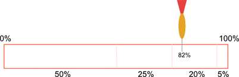
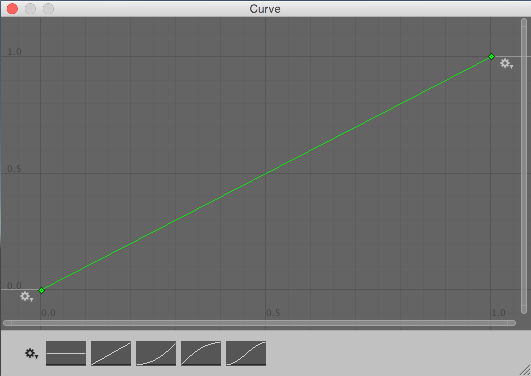
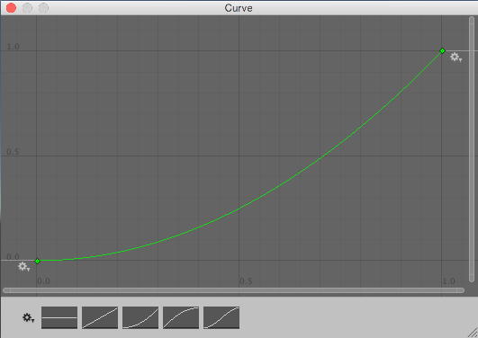
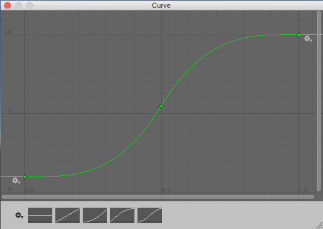

# 使用 Random 类生成随机数

> 原文：[Generating random numbers with the Random class](https://docs.unity3d.com/6000.7/Documentation/Manual/class-Random.html)

[Random](https://docs.unity3d.com/6000.7/Documentation/ScriptReference/Random.html) 类提供了生成各种常用随机值的方法。

本文概述 `Random` 类，以及在脚本中使用它时的常见用法。如需查看 `Random` 类每个成员的完整参考，请参阅 [Random API reference](https://docs.unity3d.com/6000.7/Documentation/ScriptReference/Random.html)。

## 简单随机数

[Random.value](https://docs.unity3d.com/6000.7/Documentation/ScriptReference/Random-value.html) 返回一个介于 0.0 和 1.0 之间的随机浮点数。通常可以将返回值作为乘数，从而得到介于 0 和被乘数之间的数值。

[Random.Range](https://docs.unity3d.com/6000.7/Documentation/ScriptReference/Random.Range.html) 返回指定最小值和最大值之间的随机数。根据提供的最小值和最大值是整数还是浮点数，它返回整数或浮点数。

## 圆形或球体内的随机点

[Random.insideUnitCircle](https://docs.unity3d.com/6000.7/Documentation/ScriptReference/Random-insideUnitCircle.html) 返回半径为 1 的圆内随机选择的点。可以将结果乘以所需大小，从而得到任意大小圆内的随机点。

[Random.insideUnitSphere](https://docs.unity3d.com/6000.7/Documentation/ScriptReference/Random-insideUnitSphere.html) 返回半径为 1 的球体内随机选择的点。

[Random.onUnitSphere](https://docs.unity3d.com/6000.7/Documentation/ScriptReference/Random-onUnitSphere.html) 返回半径为 1 的球体表面上随机选择的点。

[Random.onUnitCircle](https://docs.unity3d.com/6000.7/Documentation/ScriptReference/Random-onUnitCircle.html) 返回半径为 1 的圆周上随机选择的点。

## 其他类型的随机值

`Random` 类还提供一些其他类型的随机值：

- 要生成随机旋转，请使用 [Random.rotation](https://docs.unity3d.com/6000.7/Documentation/ScriptReference/Random-rotation.html)。
- 要生成随机颜色，请使用 [Random.ColorHSV](https://docs.unity3d.com/6000.7/Documentation/ScriptReference/Random.ColorHSV.html)。

## 从数组中选择随机项

随机选择数组元素，需要在 0 和数组最大索引值之间选择一个随机整数。数组最大索引值等于数组长度减一。可以使用内置的 `Random.Range` 函数完成此操作：

```csharp
var element = myArray[Random.Range(0, myArray.Length)];
```

请注意，`Random.Range` 返回的范围包含第一个参数但不包含第二个参数，因此在此处使用 `myArray.Length` 可以得到正确结果。

## 选择具有不同概率的项

有时需要随机选择项目，但某些项目被选中的可能性更高。例如，游戏角色遇到玩家控制的角色时，可能以以下方式之一作出反应：

- 50% 的概率友好地打招呼。
- 25% 的概率逃跑。
- 20% 的概率立即攻击。
- 5% 的概率赠送金钱。

可以将这些不同结果想象成一条纸带，纸带被划分为多个区段，每个区段占纸带总长度的一定比例。该比例等于选择对应结果的概率。做出选择相当于沿纸带长度随机选择一个点（例如投掷飞镖），然后观察它落在哪个区段中：



表示概率空间的纸带从 0% 到 100%，被分成代表纸带总长度 50%、25%、20% 和 5% 的四个区段。飞镖落在纸带 82% 的位置，即 20% 区段内。

在下面的脚本中，这条纸带实际上是一个浮点数数组，其中按顺序存储各个项目的不同概率。通过将 `Random.value` 乘以数组中所有浮点数的总和，可以得到一个随机点。这些浮点数不必加起来等于 1；重要的是不同数值之间的相对大小。

要确定随机点位于哪个数组元素中，首先检查它是否小于第一个元素的值。如果是，则选中第一个元素。否则，从点值中减去第一个元素的值，然后将结果与第二个元素比较，以此类推，直到找到正确的元素。

代码如下：

```csharp
float Choose (float[] probs) {

    float total = 0;

    foreach (float elem in probs) {
        total += elem;
    }

    float randomPoint = Random.value * total;

    for (int i= 0; i < probs.Length; i++) {
        if (randomPoint < probs[i]) {
            return i;
        }
        else {
            randomPoint -= probs[i];
        }
    }
    return probs.Length - 1;
}
```

请注意，最后一条 `return` 语句是必要的，因为 `Random.value` 可能返回 1。在这种情况下，搜索不会在任何位置找到随机点。将下一行改为小于或等于的判断，可以避免额外的 `return` 语句，但这样也会导致概率为零的项目偶尔被选中：

```csharp
if (randomPoint < probs[i])
```

## 为连续随机值加权

如果结果是离散的，浮点数组方法非常有效；但有时需要生成更加连续的结果。例如，随机化宝箱中发现的金币数量时，可能希望结果为 1 到 100 之间的任意数字，同时让较小的数字更容易出现。

使用浮点数组方法实现这一点，需要创建一个包含 100 个浮点数的数组。这种方式管理起来比较麻烦；如果不受限于整数，而是希望结果可以是范围内的任意数字，这种方法也无法实现目标。

对于连续结果，更好的方法是使用 `AnimationCurve` 将原始随机值转换为加权值。通过绘制不同的曲线形状，可以生成不同的权重。代码也更加简单：

```csharp
float CurveWeightedRandom(AnimationCurve curve) {
    return curve.Evaluate(Random.value);
}
```

通过读取 `Random.value`，得到一个介于 0 和 1 之间的原始随机值。然后将它传递给 `curve.Evaluate()`，后者将该值视为水平坐标，并返回曲线在该水平位置对应的垂直坐标。曲线较平缓的部分更容易被选中，而曲线较陡峭的部分被选中的概率更低。



线性曲线不会对值进行加权；曲线上每个点的水平坐标都等于垂直坐标。



该曲线起始部分较平缓，末尾部分较陡峭，因此较低值出现的概率更高，而较高值出现的概率降低。x=0.5 的直线与曲线相交位置的高度约为 0.25，表示得到 0 到 0.25 之间值的概率为 50%。



该曲线起始和末尾部分都较平缓，因此接近两端的值更常见；中间部分较陡峭，因此这些值较少出现。曲线的高度值还向上移动：曲线底部为 1，顶部为 10，因此曲线生成的值范围为 1 到 10，而不是前面曲线的 0 到 1。

请注意，这些曲线不是概率论指南中常见的概率分布曲线，而更接近逆累积概率曲线。

在脚本中定义一个公开的 `AnimationCurve` 变量后，可以在 Inspector 窗口中直接以可视化方式查看和编辑曲线，而不必手动计算数值。

该技术生成浮点数。如果希望得到整数结果（例如希望得到 82 枚金币，而不是 82.1214 枚金币），可以将计算出的值传递给 [`Mathf.RoundToInt()`](https://docs.unity3d.com/6000.7/Documentation/ScriptReference/Mathf.RoundToInt.html) 等函数。

## 打乱列表

一种常见的游戏机制是从已知项目集合中选择项目，但让项目以随机顺序出现。例如，纸牌通常会被洗牌，以避免按照可预测的顺序抽取。可以遍历数组中的每个元素，并将其与数组中随机索引处的另一个元素交换，从而打乱数组中的项目：

```csharp
void Shuffle (int[] deck) {
    for (int i = 0; i < deck.Length; i++) {
        int temp = deck[i];
        int randomIndex = Random.Range(i, deck.Length);
        deck[i] = deck[randomIndex];
        deck[randomIndex] = temp;
    }
}
```

## 从项目集合中选择且不重复

一个常见任务是从一个项目集合中随机选择若干项目，同时不重复选择同一个项目。例如，可能需要在随机生成点生成若干角色，并确保每个生成点只生成一个角色。可以按顺序遍历项目，并为每个项目随机决定是否将其添加到选中集合中。

遍历每个项目时，选择该项目的概率等于仍需选择的项目数量除以仍可选择的项目数量。

例如，假设有 10 个生成点，但只需要选择其中 5 个。第一个项目被选中的概率为 5 / 10，即 0.5。如果第一个项目被选中，第二个项目的概率为 4 / 9，即 0.44（仍需选择 4 个项目，还剩 9 个项目可选）。但是，如果第一个项目没有被选中，则第二个项目的概率为 5 / 9，即 0.56（仍需选择 5 个项目，还剩 9 个项目可选）。这个过程会持续到集合中包含所需的 5 个项目。

可以使用以下代码实现：

```csharp
Transform[] spawnPoints;

Transform[] ChooseSet (int numRequired) {
    Transform[] result = new Transform[numRequired];

    int numToChoose = numRequired;

    for (int numLeft = spawnPoints.Length; numLeft > 0; numLeft--) {

        float prob = (float)numToChoose/(float)numLeft;

        if (Random.value <= prob) {
            numToChoose--;
            result[numToChoose] = spawnPoints[numLeft - 1];

            if (numToChoose == 0) {
                break;
            }
        }
    }
    return result;
}
```

请注意，虽然选择过程是随机的，但选中集合中的项目顺序仍与它们在原始数组中的顺序相同。如果项目要按顺序逐个使用，这种排序可能使结果部分可预测，因此可能需要在使用前先打乱数组。

## 空间中的随机点

可以通过将 [Vector3](https://docs.unity3d.com/6000.7/Documentation/ScriptReference/Vector3.html) 的每个分量设置为 `Random.value` 返回的值，在立方体体积中选择一个随机点：

```csharp
var randVec = Vector3(Random.value, Random.value, Random.value);
```

这会得到一个位于边长为 1 个单位的立方体内的点。只需将向量的 X、Y 和 Z 分量分别乘以所需边长，就可以缩放该立方体。如果将其中一个轴设置为 0，得到的点将始终位于单个平面内。例如，要在地面上选择随机点，通常只需随机设置 X 和 Z 分量，并将 Y 分量设为 0。

当体积为球体时（也就是希望得到距原点给定半径范围内的随机点），可以将 `Random.insideUnitSphere` 乘以所需半径：

```csharp
var randWithinRadius = Random.insideUnitSphere * radius;
```

请注意，如果将结果向量的某个分量设为 0，将无法得到圆内正确的随机点。虽然该点是随机的，并且位于正确半径内，但其概率会严重偏向圆心，导致点分布不均匀。此时应使用 `Random.insideUnitCircle`：

```csharp
var randWithinCircle = Random.insideUnitCircle * radius;
```

## 其他资源

- [[01-使用Mathf进行常见数学运算|使用 Mathf 类执行常见数学运算]]
- [[02-使用Vector类移动对象|使用 Vector 类移动对象]]

---

## 文档导航

- 上一页：[[02-使用Vector类移动对象]]
- 目录：[[00-Unity Engine数学API]]
- 下一页：[[04-使用Quaternion控制旋转]]
