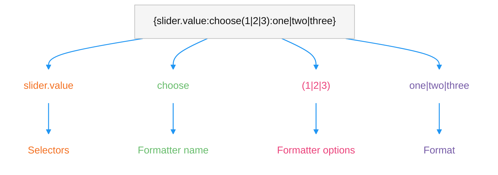
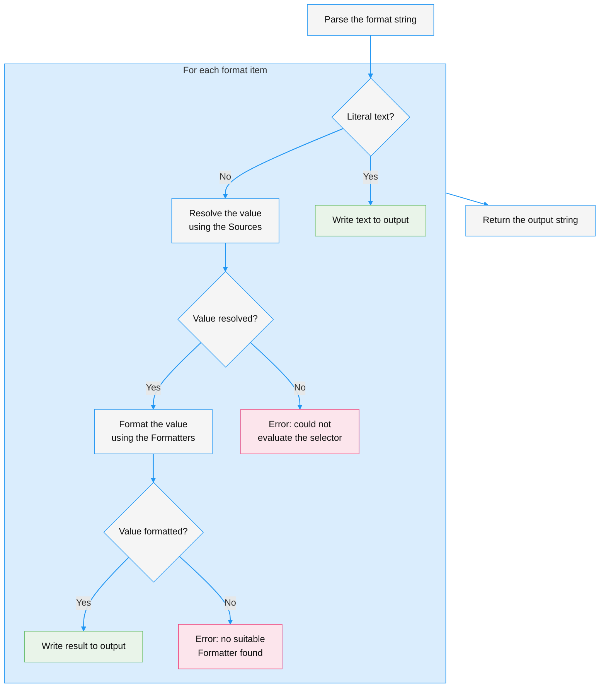

# 生成动态文本

> 原文：[Generate dynamic text with Smart Strings](https://docs.unity3d.com/6000.7/Documentation/Manual/smart-strings/smart-strings.html)

了解 Smart Strings 如何使用命名 Placeholder、Source 和 Formatter 格式化动态文本。

Smart Strings 是 Unity 对 [SmartFormat](https://github.com/axuno/SmartFormat) 库的移植，由 `Unity.SmartStrings` 模块提供。它是生成动态文本的 [`String.Format`](https://learn.microsoft.com/en-us/dotnet/api/system.string.format) 替代方案。

可以创建由数据驱动的模板，支持单复数、性别变化、列表和条件逻辑。命名 Placeholder 可以为翻译人员提供更多上下文，使变量比数字索引更易读，也更不容易出错。

使用 [`Smart.Format`](xref:Unity.SmartStrings.Smart.Format) 格式化 Smart String：

```csharp
// "The name is Lara."
Smart.Format("The name is {Name}.", new Character { Name = "Lara" });
```

## 本地专题目录

| 页面 | 说明 |
| --- | --- |
| [[01-生成动态文本]] | 使用 Smart Strings 通过命名 Placeholder、Source 和 Formatter 格式化动态文本。 |
| [[02-配置Smart Strings]] | 为项目设置默认 Formatter，或在代码中自定义 SmartFormatter。 |
| [[03-Smart Strings设置参考]] | 配置默认 Formatter、大小写、错误处理、Source 和 Formatter 列表。 |
| [[04-处理格式化错误]] | 处理 Selector 无法解析或 Formatter 无法处理值时产生的格式化错误。 |
| [[05-Default Source]] | 使用 Default Source 处理 Smart String 的默认值。 |
| [[06-Properties Source]] | 使用 Properties Source 从当前对象的属性或字段读取值。 |
| [[07-Dictionary Source]] | 使用 Dictionary Source 从字典中读取 Smart String 的数据。 |
| [[08-String Source]] | 使用 String Source 在 Smart String 中执行字符串操作。 |
| [[09-Choose Formatter]] | 根据值选择多个格式选项中的一个。 |
| [[10-Conditional Formatter]] | 根据条件表达式选择不同的文本格式。 |
| [[11-Plural Formatter]] | 根据数值生成单数、复数或其他数量形式的文本。 |
| [[12-List Formatter]] | 格式化列表和集合中的元素。 |
| [[13-Sub String Formatter]] | 从字符串中截取指定范围的文本。 |
| [[14-创建自定义Formatter]] | 继承 `FormatterBase` 创建自定义 Formatter。 |

## Placeholder

Smart String 是由 Placeholder 穿插在其中的字面文本。Placeholder 使用花括号（`{` 和 `}`）包围，并按顺序最多包含四个部分：Selector、Formatter 名称、Formatter 选项和 Format。





例如，在 Smart String `{player.score:choose(1|2|3):one|two|three}` 中，各部分可以拆分如下：

| 部分 | 示例 | 描述 |
| --- | --- | --- |
| Selector | `player.score` | 提取要格式化的值。由 Source 计算 Selector。 |
| Formatter 名称 | `choose` | 要应用的 Formatter。可选；省略后会应用隐式 Formatter。 |
| Formatter 选项 | `(1&#124;2&#124;3)` | 传给 Formatter 的选项，放在圆括号内。 |
| Format | `one&#124;two&#124;three` | Formatter 使用的输出模板。 |

要转义字面花括号，请使用反斜杠：`\{` 和 `\}`。

> [!NOTE]
> 默认情况下，Smart Strings 使用 `{` 和 `}` 作为 Placeholder 字符，并使用反斜杠转义它们（`\{` 和 `\}`）。Parser 还会在 Format 字符串中解析 `\n` 和 `\t` 等字符转义。不同设置以及启用方式请参阅[[03-Smart Strings设置参考]]。

## Smart String 的格式化方式

为了格式化 Placeholder，Smart Strings 会计算 Source 以提取值，然后应用 Formatter 将该值转换为文本。





> [!NOTE]
> 默认情况下，如果没有 Source 能够计算某个 Selector，或没有 Formatter 能够处理某个值，就会产生格式化错误。可以在 Smart Strings 设置中更改 Parser 和 Formatter 的错误行为，使其忽略错误、将错误输出到结果中，或保持 Placeholder 不变。不同设置以及启用方式请参阅[[03-Smart Strings设置参考]]。

## Selector 和 Source

Selector 通常从参数中提取要格式化的对象。Source 负责计算 Selector。系统会按顺序尝试每个 Source，直到找到能够处理该 Selector 的 Source。例如，[[06-Properties Source]] 会从当前对象中按名称读取成员。

Selector 语法与 C# [插值字符串](https://learn.microsoft.com/en-us/dotnet/csharp/language-reference/tokens/interpolated)类似：

- 使用点号表示法深入访问值，例如 `{1.gameObject.name}`。如果没有提供索引，则使用索引 `0` 的参数。
- 使用空值条件运算符 `?.` 安全访问，例如 `{gameObject?.transform?.parent}`。如果 `?.` 之前的 Selector 为 null，则 Placeholder 的结果为 null，而不会产生错误。
- 使用方括号按索引访问列表元素，例如 `{items[0]}`。

由于 Source 会按顺序尝试，顺序可能改变结果。有关如何配置 Source 尝试顺序，请参阅[[03-Smart Strings设置参考]]。

避免创建在不同 Source 之间发生冲突的命名 Placeholder。有关可用 Source，请参阅 [[05-Default Source]]、[[06-Properties Source]]、[[07-Dictionary Source]] 和 [[08-String Source]]。

### 多个参数

传入多个参数，并按索引选择它们：

```csharp
var person = new Character { Name = "John" };
var location = new Place { City = "Washington" };

// "First: John, second: Washington"
Smart.Format("First: {0.Name}, second: {1.City}", person, location);
```

### 嵌套和作用域

嵌套 Placeholder 可以避免重复 Selector。以下两种写法等效：

```text
{User.Name} ({User.Age}) {User.Address.City}
{User:{Name} ({Age})} {User.Address:{City}}
```

在嵌套作用域中，仍然可以访问外层作用域。空 Placeholder `{}` 表示当前作用域中的值。

## Formatter

Formatter 将 Selector 返回的值转换为文本。可以格式化日期和时间、列表、单复数或条件逻辑。

每个 Formatter 都有一个名称。可以按名称显式应用 Formatter，也可以省略名称，让支持自动检测的 Formatter 隐式应用：

| 使用方式 | 示例 |
| --- | --- |
| 显式 | `I have {0:plural:1 apple&#124;{} apples}` |
| 隐式 | `I have {0:1 apple&#124;{} apples}` |

> [!NOTE]
> 每个 Formatter 都有一个名称（例如 `plural`）和一个 `CanAutoDetect` 标志，用于控制是否可以隐式使用。

隐式 Formatter 会按顺序尝试，因此最好使用显式名称以避免冲突。有些 Formatter 接受放在圆括号中的选项，例如 `{0:choose(1|2|3):one|two|three}` 中的 `1`、`2` 和 `3`。

有关如何配置 Formatter 尝试顺序的信息，请参阅[[03-Smart Strings设置参考]]。

有关可用 Formatter，请参阅 [[09-Choose Formatter]]、[[10-Conditional Formatter]]、[[11-Plural Formatter]]、[[12-List Formatter]] 和 [[13-Sub String Formatter]]。如果要添加自定义 Formatter，请继承 [`FormatterBase`](xref:Unity.SmartStrings.Core.Extensions.FormatterBase)。更多信息请参阅[[14-创建自定义Formatter]]。

## 对齐

在 Selector 后添加对齐值，并使用逗号分隔，可以将结果填充到固定宽度，类似于 [`String.Format`](https://learn.microsoft.com/en-us/dotnet/api/system.string.format) 的对齐方式。正值使值右对齐，负值使值左对齐：

```csharp
Smart.Format("[{Name,10}]", new Character { Name = "Joe" });   // "[       Joe]"
Smart.Format("[{Name,-10}]", new Character { Name = "Joe" });  // "[Joe       ]"
```

对齐适用于每个 Formatter，而不仅是默认 Formatter。

## 其他资源

- [[09-Choose Formatter]]
- [[11-Plural Formatter]]
- [[14-创建自定义Formatter]]
- [[05-Default Source]]
- [SmartFormat 库](https://github.com/axuno/SmartFormat)


---

## 文档导航

- 上一页：[[../03-Unity Mathematics API]]
- 目录：[[00-智能字符串]]
- 下一页：[[01-生成动态文本]]
