# Choose Formatter

> 原文：[Choose Formatter](https://docs.unity3d.com/6000.7/Documentation/Manual/smart-strings/choose-formatter.html)

根据 Placeholder 的值从多个输出中选择一个。

Choose Formatter 为 Smart String 添加分支逻辑：它将 Placeholder 的值与一组选项匹配，并输出相应的选择。使用名称 `choose` 显式应用。

```text
{value:choose(1|2|3):one|two|three|default}
```

其中 `value` 可以是任意值，`choose` 是 Formatter 名称，括号中的内容是使用 `|` 分隔的 Choices，后面的内容是对应的 Outputs；最后可以提供一个没有匹配项时使用的可选输出。



值会先使用 `ToString` 转换为字符串，再与选项匹配，因此可用于数字、布尔值、字符串和枚举等任意类型，也支持 `null`。如需为不匹配任何选项的值提供回退输出，请在 Outputs 段末尾添加额外选项。默认情况下 Choices 区分大小写，可通过大小写敏感设置修改此行为，详见[[03-Smart Strings设置参考]]。

| Smart String | 参数 | 结果 |
| --- | --- | --- |
| `{0:choose(1&#124;2&#124;3):one&#124;two&#124;three&#124;other}` | `2` | two |
| `{0:choose(1&#124;2&#124;3):one&#124;two&#124;three&#124;other}` | `5` | other |
| `{0:choose(True&#124;False):yes&#124;no}` | `true` | yes |
| `{0:choose(null):NULL&#124;{}}` | `null` | NULL |
| `How {0:choose(Male&#124;Female):is he&#124;is she&#124;are they}?` | `"Male"` | How is he? |
| `It is {day:choose(1&#124;2&#124;3&#124;4&#124;5):Mon&#124;Tue&#124;Wed&#124;Thur&#124;Fri&#124;the weekend}.` | `7` | It is the weekend. |

## 其他资源

- [[10-Conditional Formatter]]
- [Null Formatter](https://docs.unity3d.com/6000.7/Documentation/Manual/smart-strings/null-formatter.html)
- [[00-智能字符串]]

---

## 文档导航

- 上一页：[[08-String Source]]
- 目录：[[00-智能字符串]]
- 下一页：[[10-Conditional Formatter]]
