# Plural Formatter

> 原文：[Plural Formatter](https://docs.unity3d.com/6000.7/Documentation/Manual/smart-strings/plural-formatter.html)

根据数量并遵循当前 Culture 的复数规则选择词形。

不同语言处理复数的方式不同：英语有两种形式，一些语言只有一种形式，另一些语言有多种形式。Plural Formatter 遵循 Unicode **Common Locale Data Repository（CLDR）** 的复数规则选择正确词形。可以使用名称 `plural` 显式应用，也可以对数字或集合隐式应用。

```text
{value:plural:zero|one|two|few|many|other}
```



CLDR 定义 `zero`、`one`、`two`、`few`、`many` 和 `other` 六个复数类别。按 CLDR 顺序，为当前 Culture 使用的每种形式提供一个格式。Plural Formatter 支持基数规则。

Formatter 根据活动 Culture 决定使用哪些规则：使用传递给 `Smart.Format` 的 `CultureInfo`，如果未提供，则使用 `CultureInfo.CurrentUICulture`。可以使用括号中的选项覆盖 Culture，例如 `(en)` 强制使用英语复数规则。

```csharp
// "I have 10 apples"
Smart.Format(new CultureInfo("en"), "I have {0:plural:an apple|{} apples}", 10);

// "1 банан"
Smart.Format(new CultureInfo("ru"), "{0} {0:plural:банан|{} банана|{} бананов}", 1);
```

空 Placeholder `{}` 会重新使用当前值，因此可以在词形中重复数量。显式应用时至少需要两种形式；提供的形式数量必须与所选规则要求的数量一致，否则会产生格式化错误。

| Smart String | 参数 | 结果 |
| --- | --- | --- |
| `I have {0:plural:an apple&#124;{} apples}` | `1`（English） | I have an apple |
| `I have {0:plural:an apple&#124;{} apples}` | `10`（English） | I have 10 apples |
| `{0:plural(en):{} apple&#124;{} apples}` | `2` | 2 apples |

也可以传递 `IEnumerable`：Formatter 使用其中的项目数量作为复数值。这使一个参数可以同时驱动复数和列表：

```csharp
// "The following people are impressed: bob, and alice."
Smart.Format("The following {0:plural:person is|people are} impressed: {0:list:{}|, |, and}.", new[] { "bob", "alice" });
```

## 自定义复数规则

将 `CustomPluralRuleProvider` 作为 Format Provider 传入，可以只为一次调用替换规则，而不改变其他位置的默认值。当某个场景需要比 Culture 标准规则更少或不同的形式时，这很有用。

## 其他资源

- [[12-List Formatter]]
- [[10-Conditional Formatter]]
- [[00-智能字符串]]

---

## 文档导航

- 上一页：[[10-Conditional Formatter]]
- 目录：[[00-智能字符串]]
- 下一页：[[12-List Formatter]]
