# List Formatter

> 原文：[List Formatter](https://docs.unity3d.com/6000.7/Documentation/Manual/smart-strings/list-formatter.html)

格式化集合中的项目并使用分隔符连接，或使用 Selector 按索引访问列表。

List Formatter 同时是 Formatter 和 Source。作为 Formatter，它会为任意 `IEnumerable`（例如数组或 `List<T>`）中的每个项目重复应用格式，并使用分隔符连接项目。作为 Source，它提供列表项目 Selector，因此可以按索引或当前迭代索引读取项目。可以使用名称 `list` 显式应用，也可以对集合隐式应用。

```text
{value:list:template|spacer|final spacer}
```



格式最多包含四个部分，使用分隔字符分开：

| 部分 | 描述 |
| --- | --- |
| Item format | 应用于每个项目的格式。空 Placeholder `{}` 输出项目本身。 |
| Spacer | 写在项目之间的分隔符。 |
| Last spacer | 可选；替换最后一个项目之前的分隔符。 |
| Two spacer | 可选；列表恰好有两个项目时，作为唯一分隔符。 |

Item format 可以包含嵌套 Placeholder，例如 `{Sizes:list:{Width}x{Height}|, }`。Spacer 可以包含字符字面量，例如 `\n` 使每个项目各占一行。包含嵌套 Placeholder 的 Spacer 针对集合的父值格式化，而不是针对单个项目格式化。

## 格式化列表

| Smart String | 参数 | 结果 |
| --- | --- | --- |
| `{0:list:{}&#124;, &#124;, and }` | `["one", "two", "three"]` | one, two, and three |
| `{0:list:{}&#124; and }` | `["one", "two"]` | one and two |
| `{0:list:{:0.00}&#124;, }` | `[1, 2, 3]` | 1.00, 2.00, 3.00 |

## 列表项目 Selector

作为 Source，List Formatter 允许 Selector 按索引访问 `IList`。使用数字 Selector 读取指定项目，使用 `index` Selector 在迭代期间读取当前项目的位置。虽然字符串是 `IEnumerable`，但 Formatter 不会将字符串或 `IFormattable` 值视为列表。

| Smart String | 参数 | 结果 |
| --- | --- | --- |
| `The value at index 1 is {0.1}` | `[1, 2, 3]` | The value at index 1 is 2 |
| `{0.0} {0.1} {0.2}` | `[1, "Hello", "World"]` | 1 Hello World |

使用 `index` Selector，可以在遍历一个列表时以相同位置访问另一个列表，从而同步两个列表：

| Smart String | 参数 | 结果 |
| --- | --- | --- |
| `{0:{} = {1.index}&#124;, }` | `[1, 2, 3, 4]` 和 `["one", "two", "three", "four"]` | 1 = one, 2 = two, 3 = three, 4 = four |

## 其他资源

- [[11-Plural Formatter]]
- [[07-Dictionary Source]]
- [[00-智能字符串]]

---

## 文档导航

- 上一页：[[11-Plural Formatter]]
- 目录：[[00-智能字符串]]
- 下一页：[[13-Sub String Formatter]]
