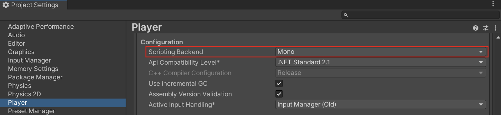

# 脚本后端简介

> 原文：[Introduction to scripting back ends](https://docs.unity3d.com/6000.7/Documentation/Manual/scripting-backends-intro.html)

脚本后端是 Unity 对用于编译和执行 C# Script 的 Runtime 技术的称呼。它决定代码如何转换为可执行指令，以及目标平台使用哪个 Runtime 管理代码。

选择脚本后端会影响项目的多个方面：

- 构建时间和迭代速度。
- Runtime 性能和内存。
- 平台支持与要求。
- 对 Reflection 和动态代码生成等部分 .NET 功能的支持。
- 调试和性能分析体验。

Unity 支持以下脚本后端：

- **Mono**：基于 ECMA 标准实现的开源 .NET Framework，使用 JIT 编译在 Runtime 将 C# 代码转换为机器码。
- **IL2CPP**：Unity 开发的脚本后端，将 C# 代码和程序集转换为 C++，再使用平台原生 C++ 编译器生成目标平台的二进制文件；使用 AOT 在 Runtime 之前转换代码。
- **CoreCLR（Experimental）**：由 .NET Foundation 维护的开源跨平台 .NET Runtime，提供执行引擎、垃圾回收器和 JIT 编译器。

## 平台支持

Mono 支持 Windows x86/x64/Arm64、macOS x64/Arm64、Linux x64 和 Android Armv7。CoreCLR 以实验性方式支持 Windows x86/x64/Arm64、macOS Arm64 和 Linux x64。IL2CPP 支持所有平台。

Mono 或 CoreCLR 列表中未提及的平台仅支持 IL2CPP。在支持多个后端的平台上，Mono 是默认后端。

> [!NOTE]
> 脚本后端支持可能随 Unity 版本变化。最新信息请参阅目标平台和 Unity 版本对应的 [平台专用 Player 设置](https://docs.unity3d.com/6000.7/Documentation/Manual/PlatformSpecific.html)。

## 更改脚本后端

可以通过以下两种方式更改 Unity 构建应用时使用的脚本后端：

1. 在 Editor 中打开 **Edit > Project Settings**，点击 **Player Settings**，在当前平台的 **Player** 设置中进入 **Other Settings > Configuration**，从 **Scripting Backend** 下拉菜单选择 **Mono**、**IL2CPP** 或 **CoreCLR (Experimental)**。也可以在 **File > Build Profiles** 中打开 **Player Settings** 标签。
2. 通过 Editor scripting API 使用 `PlayerSettings.SetScriptingBackend` 更改脚本后端。

## 脚本后端比较

Mono 和 IL2CPP 可用的 C#/.NET API 基本相同，并使用同一基础类库和 API 兼容级别；但 IL2CPP 和某些 AOT 平台存在特定限制。CoreCLR 使用自己的基础类库和垃圾回收器，目前只支持 .NET Standard API 兼容级别。

| 特性 | Mono | IL2CPP |
| --- | --- | --- |
| 执行模型 | JIT。 | AOT：C# → IL → C++ → 原生代码。 |
| 平台 | Desktop 和 Android。 | 支持范围最广，iOS 和大多数主机平台必须使用。 |
| 交叉编译工具链 | 较小；按需 JIT 编译托管程序集。 | 需要 C++ 工具链、平台 SDK，构建和链接时间更长。 |
| 构建时间 | 迭代更快，链接步骤更小。 | 更慢，涉及 C++ 代码生成、编译和链接。 |
| 启动时间 | 通常更慢，包含 JIT 预热成本。 | 通常更快，不需要 JIT 预热。 |
| 内存使用 | JIT 下代码体积较小。 | 原生二进制文件及生成的 C++ 和元数据更大。 |
| 异常处理 | 通过 Mono Runtime 处理托管异常。 | 通过 IL2CPP Runtime 支持将托管语义映射到原生代码。 |
| Reflection | 完整支持，并支持动态代码生成。 | 支持已有元数据的 Reflection，但动态代码生成受限；不支持 `System.Reflection.Emit` 和 `dynamic` 方法。 |
| Generics | 完整支持，JIT 可在 Runtime 特化。 | AOT 使用 Generic Sharing，可能需要额外 AOT 提示。 |
| Code Stripping/Linker | 托管 Linker；由于 JIT 更容易保留符号。 | Stripping 更激进，需要使用 `link.xml` 或 `[Preserve]` 保留通过 Reflection 或动态加载的成员。 |
| Interop (`P/Invoke`) | 标准 `P/Invoke`，Runtime 在加载时解析。 | 标准 `P/Invoke`，名称必须匹配，原生链接更严格。 |
| C# 调试 | Domain Reload 快；允许 JIT 的平台支持 Edit and Continue。 | 支持托管调试，可选增强 Stack Trace。 |

> [!NOTE]
> CoreCLR 在此表中被省略，因为此 Unity 版本中它仍处于实验阶段，并非面向生产的 Mono 或 IL2CPP 替代方案。

在 IL2CPP 和 Mono 均可用的平台上，如果 Player 构建需要更快启动、更严格的平台合规性和更可预测的性能，优先选择 IL2CPP。Mono 则提供更快的 Editor 迭代和构建速度；如果需要使用 IL2CPP 不支持的 API，Mono 是唯一选择。

无论选择哪个脚本后端，都可以使用 Burst compiler 将部分代码编译为高度优化的原生代码。

---

## 文档导航

- 上一页：[[00-脚本后端]]
- 目录：[[00-脚本后端]]
- 下一页：[[02-Mono脚本后端]]
