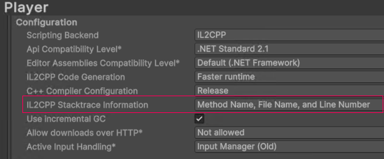

# IL2CPP 托管堆栈跟踪

> 原文：[IL2CPP managed stack traces](https://docs.unity3d.com/6000.7/Documentation/Manual/il2cpp-managed-stack-traces.html)

当托管代码中发生异常时，异常的[堆栈跟踪](https://docs.unity3d.com/6000.7/Documentation/Manual/stack-trace.html)可以帮助你了解异常原因。不过，在某些情况下，托管堆栈跟踪可能不会按预期显示。堆栈跟踪会根据构建配置而有所不同。

## C++ 编译器配置

你可以通过以下任一方式设置 IL2CPP 构建的 C++ 编译器配置：

- 通过 Editor 中的 **Player Settings** 菜单设置。按以下步骤通过 **Player Settings** 菜单更改脚本后端：
  1. 转到 **Edit > Project Settings**。
  2. 点击 **Player Settings** 按钮，在 **Inspector** 中打开当前平台的 [**Player**](https://docs.unity3d.com/6000.7/Documentation/Manual/class-PlayerSettings.html) 设置。
  3. 在 **Other Settings** 子菜单下，找到 **Configuration** 部分。
  4. 将 **C++ Compiler Configuration** 属性设置为 **Debug**、**Release** 或 **Master**。
- 在代码中调用 [`PlayerSettings.SetIl2CppCompilerConfiguration`](https://docs.unity3d.com/6000.7/Documentation/ScriptReference/PlayerSettings.SetIl2CppCompilerConfiguration.html)，并传入 [`Il2CppCompilerConfiguration`](https://docs.unity3d.com/6000.7/Documentation/ScriptReference/Il2CppCompilerConfiguration.html) 枚举中的值。

这些设置对托管堆栈跟踪的影响如下：

- **Debug**：IL2CPP 会报告可靠的托管堆栈跟踪，并在调用堆栈中包含每个托管方法。该堆栈跟踪不包含原始 C# 源代码中的行号。
- **Release** 或 **Master**：IL2CPP 可能会生成缺少一个或多个托管方法的调用堆栈。这是因为 C++ 编译器将缺失的方法内联了。方法内联通常可以提升运行时性能，但会使调用堆栈更难理解。

IL2CPP 始终会在调用堆栈中提供至少一个托管方法。对于由托管异常创建的堆栈跟踪，该方法就是发生异常的方法。如果其他方法没有被内联，堆栈跟踪也会包含它们。

## IL2CPP 堆栈跟踪信息

你可以通过以下任一方式配置 IL2CPP，使托管堆栈跟踪包含文件名和行号信息：

- 通过 Editor 中的 Player 设置：转到 **Edit > Project Settings > Player > Other Settings**，然后在 **Configuration** 部分将 **IL2CPP Stacktrace Information** 属性设置为 **Method Name, File Name, and Line Number**。
- 在代码中调用 [`PlayerSettings.Il2CppStacktraceInformation`](https://docs.unity3d.com/6000.7/Documentation/ScriptReference/PlayerSettings.SetIl2CppStacktraceInformation.html)，并将 [`Il2CppStacktraceInformation.MethodFileLineNumber`](https://docs.unity3d.com/6000.7/Documentation/ScriptReference/Il2CppStacktraceInformation.html) 作为参数值。

*IL2CPP Stacktrace Information 属性设置为 Method Name、File Name 和 Line Number。*

此设置会指示 IL2CPP 在调用堆栈中包含所有托管堆栈帧。只要包含相关代码的托管程序集（`.dll`）提供了托管符号文件（`.pdb`），每个堆栈帧还会包含正确的 C# 行号。

启用此功能会略微增加构建时间和构建后程序的最终大小。Player 构建过程会增加一个额外步骤，用于处理调试符号文件并生成包含必要符号信息的新数据文件。Unity 会将此数据文件随构建后的 Player 一起提供，并在运行时使用它来确定调用堆栈中的 C# 行信息。

启用此功能后，即使启用了方法内联，Unity 也会在 **Release** 或 **Master** 配置下生成正确的调用堆栈。

## 脚本调试

要启用 **Script Debugging**，请转到 **File > Build Profiles**，然后启用 **Script Debugging** 复选框。启用脚本调试后，IL2CPP 会报告包含方法、文件和行号的正确托管堆栈跟踪，但代价是程序体积更大、性能降低。

> **提示**：如果你只想改善堆栈跟踪，不要启用脚本调试，而应按照上面的说明启用[源代码行号](#il2cpp-堆栈跟踪信息)。

## 其他资源

- [C++ Compiler Configuration](https://docs.unity3d.com/6000.7/Documentation/ScriptReference/Il2CppCompilerConfiguration.html)

---

## 文档导航

- 上一页：[[01-IL2CPP简介]]
- 目录：[[00-IL2CPP脚本后端]]
- 下一页：[[03-IL2CPP运行时代码检查]]
