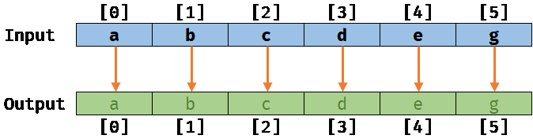
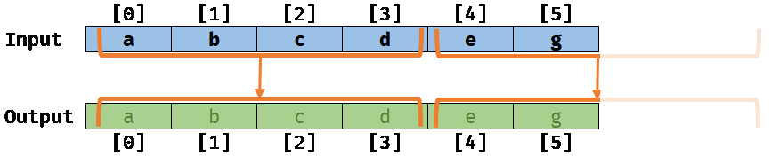
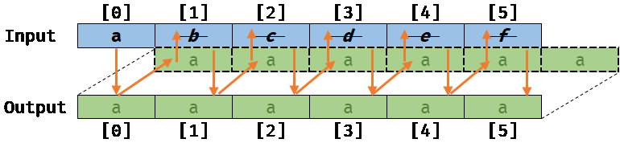
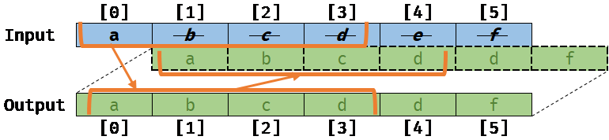

# 内存别名简介

> 原文：[Introduction to memory aliasing](https://docs.unity3d.com/6000.7/Documentation/Manual/burst/aliasing.html)

内存别名向 Burst 提供代码如何使用数据的额外信息，Burst 可以利用这些信息生成更高效的运行时代码。

当内存中的位置相互重叠时，就会发生内存别名。

下面的示例展示了一个从输入数组向输出数组复制数据的 Job：

```csharp
[BurstCompile]
private struct CopyJob : IJob
{
    [ReadOnly]
    public NativeArray<float> Input;

    [WriteOnly]
    public NativeArray<float> Output;

    public void Execute()
    {
        for (int i = 0; i < Input.Length; i++)
        {
            Output[i] = Input[i];
        }
    }
}
```

## 没有内存别名

如果数组 `Input` 和 `Output` 不重叠，即它们各自的内存位置不重叠，那么在示例输入/输出上运行这个 Job 后会得到以下结果：



如果 Burst 获得了所需的 noalias 信息，就可以在 scalar 级别优化前面的标量循环。这个过程称为 **vectorizing**，它会重写循环，使其以小批量处理元素。例如，Burst 可以在 vector 级别一次处理 4×4 个元素：



## 内存别名

如果 `Output` 数组与 `Input` 数组重叠一个元素（例如 `Output[0]` 指向 `Input[1]`），这表示内存存在别名。使用 auto vectorizer 运行 `CopyJob` 时会得到以下结果：



如果 Burst 不知道内存别名，就会尝试对循环进行 auto-vectorize，结果如下：



这段代码的结果无效；如果 Burst 无法识别这种情况，可能导致 bug。

## 生成的代码

在 `CopyJob` 示例中，循环包含面向 AVX2 的 x64 assembly。`vmovups` 指令移动 8 个 float，因此单个 auto-vectorized loop 每次循环移动 4×8 个 float，即每次循环迭代复制 32 个 float，而不是只复制一个：

```x86asm
.LBB0_4:
    vmovups ymm0, ymmword ptr [rcx - 96]
    vmovups ymm1, ymmword ptr [rcx - 64]
    vmovups ymm2, ymmword ptr [rcx - 32]
    vmovups ymm3, ymmword ptr [rcx]
    vmovups ymmword ptr [rdx - 96], ymm0
    vmovups ymmword ptr [rdx - 64], ymm1
    vmovups ymmword ptr [rdx - 32], ymm2
    vmovups ymmword ptr [rdx], ymm3
    sub     rdx, -128
    sub     rcx, -128
    add     rsi, -32
    jne     .LBB0_4
    test    r10d, r10d
    je      .LBB0_8
```

下面的示例展示同一个 Burst 编译的循环，但人为禁用了 Burst 的 aliasing：

```x86asm
.LBB0_2:
    mov     r8, qword ptr [rcx]
    mov     rdx, qword ptr [rcx + 16]
    cdqe
    mov     edx, dword ptr [rdx + 4*rax]
    mov     dword ptr [r8 + 4*rax], edx
    inc     eax
    cmp     eax, dword ptr [rcx + 8]
    jl      .LBB0_2
```

结果完全是 scalar，运行速度大约比原始 alias analysis 产生的高度优化向量化变体慢 32 倍。

## Function cloning

对于 Burst 知道函数参数之间别名关系的函数调用，Burst 可以推断别名，并将其传播到被调用函数以改进优化：

```csharp
[MethodImpl(MethodImplOptions.NoInlining)]
int Bar(ref int a, ref int b)
{
    a = 42;
    b = 13;
    return a;
}

int Foo()
{
    var a = 53;
    var b = -2;

    return Bar(ref a, ref b);
}
```

`Bar` 的 assembly 会是：

```x86asm
mov     dword ptr [rcx], 42
mov     dword ptr [rdx], 13
mov     eax, dword ptr [rcx]
ret
```

这是因为在 `Bar` 函数内部，Burst 不知道 `a` 和 `b` 的别名关系。这与其他 compiler technology 对这段代码的处理一致。

不过，Burst 更进一步。通过 **function cloning**，Burst 创建 `Bar` 的副本，并发现 `a` 和 `b` 不会别名。随后它用对副本的调用替换对原始 `Bar` 的调用，结果是：

```x86asm
mov     dword ptr [rcx], 42
mov     dword ptr [rdx], 13
mov     eax, 42
ret
```

在这种情况下，Burst 不会对 `a` 进行第二次加载。

## 别名检查

由于 aliasing 是 Burst 优化性能的关键，因此提供了一些 aliasing intrinsics：

- `Unity.Burst.CompilerServices.Aliasing.ExpectAliased`：预期两个指针存在别名；如果不存在则生成 compiler error。
- `Unity.Burst.CompilerServices.Aliasing.ExpectNotAliased`：预期两个指针不存在别名；如果存在则生成 compiler error。

下面的示例展示了这些 intrinsic 的用法：

```csharp
using static Unity.Burst.CompilerServices.Aliasing;

[BurstCompile]
private struct CopyJob : IJob
{
    [ReadOnly]
    public NativeArray<float> Input;

    [WriteOnly]
    public NativeArray<float> Output;

    public unsafe void Execute()
    {
        // NativeContainer attributed structs (like NativeArray) cannot alias with each other in a job struct!
        ExpectNotAliased(Input.GetUnsafePtr(), Output.GetUnsafePtr());

        // NativeContainer structs cannot appear in other NativeContainer structs.
        ExpectNotAliased(in Input, in Output);
        ExpectNotAliased(in Input, Input.GetUnsafePtr());
        ExpectNotAliased(in Input, Output.GetUnsafePtr());
        ExpectNotAliased(in Output, Input.GetUnsafePtr());
        ExpectNotAliased(in Output, Output.GetUnsafePtr());

        // But things definitely alias with themselves!
        ExpectAliased(in Input, in Input);
        ExpectAliased(Input.GetUnsafePtr(), Input.GetUnsafePtr());
        ExpectAliased(in Output, in Output);
        ExpectAliased(Output.GetUnsafePtr(), Output.GetUnsafePtr());
    }
}
```

这些检查只在启用优化时运行，因为正确的别名推导与 optimizer 通过 inlining 看穿函数的能力有内在联系。

## 其他资源

- [[03-声明无别名指针和结构体]]
- [[02-别名与Job System]]

---

## 文档导航

- 上一页：[[00-Burst内存别名]]
- 目录：[[00-Burst内存别名]]
- 下一页：[[02-别名与Job System]]
