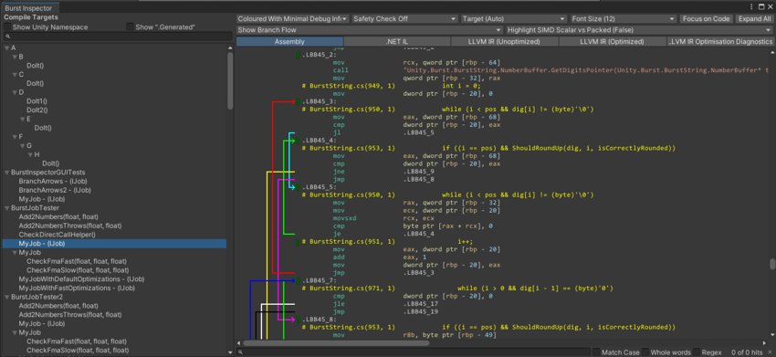

# Burst Inspector 窗口参考

> 原文：[Burst Inspector window reference](https://docs.unity3d.com/6000.7/Documentation/Manual/burst/editor-burst-inspector.html)

Burst Inspector 窗口会显示项目中的所有 Job 和其他 Burst 编译目标。要打开 Burst Inspector 窗口，请转到 **Jobs > Burst > Open Inspector**。

Burst Inspector 会显示 Burst 能够编译的所有 Job，也会显示生成的中间代码和原生汇编代码。

在 Burst Inspector 中打开新的目标 Job 时，它会尝试将视图直接定位到与所选 Burst Job 相关的汇编代码。如果显示了分支流箭头，并且箭头占据汇编视图的一半以上，Inspector 会向右水平滚动，使代码而不是分支成为焦点。

图：启用 Branch Flow 的 Burst Inspector

## Burst Inspector 窗格

窗口左侧的 **Compile Targets** 窗格会按字母顺序列出项目中 Burst 可以编译的 Job。默认情况下，Unity 命名空间中的 Job 或名称包含 `.Generated` 的 Job 会被排除。可以分别通过 **Show Unity Namespace** 和 **Show “.Generated”** 切换项更改此行为。列表中被禁用的 Job 没有 `[BurstCompile]` 属性。

Burst Inspector 窗口右侧的输出窗格提供选项，用于查看 **Compile Targets** 列表中所选 Job 的汇编代码和中间代码。要展开或折叠代码元素，请选择带颜色的方块（其中一些方块显示省略号）。默认情况下，Burst Inspector 会自动折叠非必要代码块，例如大多数指令和数据。

可以选择汇编代码行。选中的行会以下划线标记。如果该行包含寄存器，这些寄存器在整个代码中的使用位置都会突出显示。隐式寄存器不会被突出显示。

要选择并复制此窗格中的文本，可以用鼠标单击并拖动，或使用 Shift + 方向键选择文本。要复制文本，请右键单击并选择 **Copy Selection**，或者按 Ctrl + C（macOS 上为 Command + C）。Burst Inspector 的复制操作默认会包含底层颜色标签。要更改此行为，请在右侧窗格中右键单击打开上下文菜单，然后取消勾选 **Copy Color Tags**。

窗口顶部提供以下显示选项：

| 显示选项 | 功能 |
| --- | --- |
| **Output dropdown** | 使用下拉菜单选择 Burst Inspector 窗口输出信息的方式：  - **Plain Without Debug Information**：显示原始输出。 - **Plain With Debug Information**：显示带调试信息的原始输出。 - **Enhanced with Minimal Debug Information**（仅在 **Assembly** 视图中可用）：将行信息交织显示在汇编代码中，以指示代码中的哪一行对应哪一段汇编输出。启用 **Show Branch Flow** 后，分支流会指示跳转指令可能跳转到的位置。 - **Enhanced With Full Debug Information**（仅在 **Assembly** 视图中可用）：显示与 Enhanced with Minimal Debug Information 相同的信息，并包含调试信息。 - **Coloured With Minimal Debug Information**（仅在 **Assembly** 视图中可用）：显示与 Enhanced with Minimal Debug Information 相同的信息，但以颜色显示输出。 - **Coloured With Full Debug Information**（仅在 **Assembly** 视图中可用）：显示与 Enhanced With Full Debug Information 相同的信息，但以颜色显示输出。 |
| **Safety Checks** | 启用此选项可生成包含容器访问安全检查的代码，例如检查 Job 是否试图写入只读原生容器。 |
| **Font Size** | 选择输出窗格中文本的大小。 |
| **Architecture dropdown** | 选择构建的目标架构。 |
| **Focus on Code**（仅在 **Enhanced** 或 **Coloured** 输出中可用） | 折叠反汇编中最不重要的代码块。选择此项后，Unity 会隐藏大多数汇编语言指令和非代码段，让你专注于代码本身。 |
| **Expand all**（仅在 **Enhanced** 或 **Coloured** 输出中可用） | 展开反汇编中所有已折叠的代码块，并显示所有隐藏的汇编语言指令和数据元素。 |
| **Show Branch Flow**（仅在 **Enhanced** 或 **Coloured** 输出中可用） | 启用此选项可显示表示代码分支流的箭头。启用后，代码会向右移动，为箭头留出空间。 |
| **Highlight SIMD Scalar vs Packed**（仅在 **Enhanced** 或 **Coloured** 输出中可用） | 启用此选项后，会根据 SIMD 指令处理的是打包输入还是标量输入，以不同方式显示这些指令。可以用它快速评估生成的向量化代码质量。 |
| **Assembly** | 显示 Burst 生成的最终优化原生代码。 |
| **.NET IL** | 显示从 Job 方法中提取的原始 .NET IL。 |
| **LLVM IR (Unoptimized)** | 显示优化前的内部 LLVM IR。 |
| **LLVM IR (Optimized)** | 显示优化后的内部 LLVM IR。 |
| **LLVM IR Optimization Diagnostics** | 显示 LLVM 优化诊断信息，例如优化成功或失败。 |

## 其他资源

- [[12-Burst菜单参考]]
- [Job system](https://docs.unity3d.com/6000.7/Documentation/Manual/job-system.html)

---

## 文档导航

- 上一页：[[10-调试和性能分析工具]]
- 目录：[[00-Burst编译]]
- 下一页：[[12-Burst菜单参考]]
