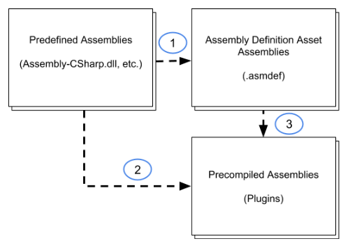

# 引用程序集

> 原文：[Referencing assemblies](https://docs.unity3d.com/6000.7/Documentation/Manual/assembly-definitions-referencing.html)

任何包含类型（例如 Class 或 Struct）的程序集，只要这些类型依赖于另一个程序集中的类型，就必须引用另一个程序集。可以在 Inspector 窗口中配置 Assembly Definition 属性，以控制程序集之间的引用。更多信息请参阅 [[07-程序集定义Inspector窗口参考|Assembly Definition Inspector 窗口参考]]。

## 自动引用

默认情况下，[[09-预定义程序集参考|预定义程序集]]会引用所有其他程序集，包括由 Assembly Definition 创建的程序集（1），以及作为插件添加到项目中的预编译程序集（2）。使用 Assembly Definition 资源创建的自定义程序集会自动引用所有预编译程序集（3）：

*图：Assembly Definition 默认引用关系图。两条独立连接线从预定义程序集出发，一条指向自定义程序集，另一条指向预编译程序集；另有一条连接线从自定义程序集指向预编译程序集。*

在默认设置下，预定义程序集中的 Class 可以使用项目中任意其他程序集定义的所有类型。同样，使用 Assembly Definition 资源创建的程序集可以使用任意预编译（插件）程序集定义的所有类型。

### 关闭自动引用

要防止预定义程序集自动引用某个自定义程序集，请在 Inspector 中取消选中该 Assembly Definition 的 **Auto Referenced** [[07-程序集定义Inspector窗口参考|属性]]。这样，修改该程序集中的代码时，预定义程序集不会重新编译；但这也意味着预定义程序集不能直接使用该程序集中的代码。

要防止预定义程序集或自定义程序集自动引用插件程序集，请在插件资源的 [Plugin Inspector](https://docs.unity3d.com/6000.7/Documentation/Manual/plug-in-inspector.html) 中取消选中 **Auto Referenced** 属性。仍然可以从自定义程序集向插件添加显式引用；更多信息请参阅[引用预编译插件程序集](#reference-precompiled-assembly)。

## 引用规则和限制

Unity 不允许以下类型的引用：

- 由 Assembly Definition 创建的自定义程序集引用预定义程序集。
- 预定义程序集的显式引用。预定义程序集只能使用自动引用程序集中的代码。
- 循环引用，即两个程序集相互引用。如果遇到循环引用错误，必须重构代码以移除循环引用，或者将相互引用的 Class 放入同一个程序集。

## 添加对另一个程序集的引用

要使用另一个程序集中的代码，必须在 Assembly Definition 资源中添加对另一个程序集的引用。

添加对另一个程序集的引用：

1. 选择需要引用的程序集对应的 Assembly Definition，在 [[07-程序集定义Inspector窗口参考|Inspector]] 中查看其属性。
2. 在 **Assembly Definition References** 部分，点击 **+** 按钮添加新引用。
3. 将 Assembly Definition 资源分配给引用列表中新建的插槽。

启用 **Use GUIDs** 选项后，可以更改被引用 Assembly Definition 资源的文件名，而不必更新其他 Assembly Definition 中的引用以反映新名称。

> **注意**：如果删除资源文件的元数据文件，或在 Unity Editor 外部移动文件而没有同时移动元数据文件，则必须重置 GUID。

## 添加对预编译插件程序集的引用

默认情况下，使用 Assembly Definition 创建的所有自定义程序集都会自动引用所有预编译程序集。这意味着更新任意一个预编译程序集时，Unity 会重新编译所有程序集，即使这些程序集没有使用其中的代码。

要避免这种额外开销，可以覆盖自动引用，只指定该程序集实际使用的预编译库：

1. 选择需要引用的程序集对应的 Assembly Definition，在 **Inspector** 中查看其属性。
2. 在 **General Options** 部分启用 **Override References** 选项，使 **Assembly References** 部分可见。
3. 在 **Assembly References** 部分点击 **+** 按钮添加新引用。
4. 使用空插槽中的下拉列表分配对预编译程序集的引用。列表显示当前活动平台的 [Build Profiles](https://docs.unity3d.com/6000.7/Documentation/Manual/build-profiles.html) 中项目的所有预编译程序集。在 [Plugin Inspector](https://docs.unity3d.com/6000.7/Documentation/Manual/plug-in-inspector.html) 中设置预编译程序集的平台兼容性。
5. 点击 **Apply**。
6. 对构建项目所使用的每个平台重复上述操作。

## 其他资源

- [[02-创建程序集定义]]
- [[04-程序集包含规则]]

---

## 文档导航

- 上一页：[[02-创建程序集定义]]
- 目录：[[00-程序集定义]]
- 下一页：[[04-程序集包含规则]]
