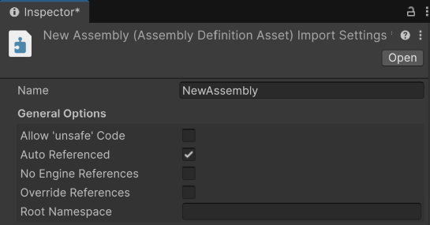
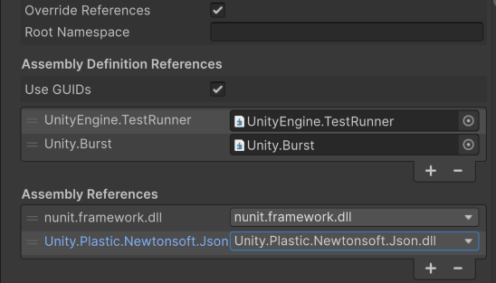
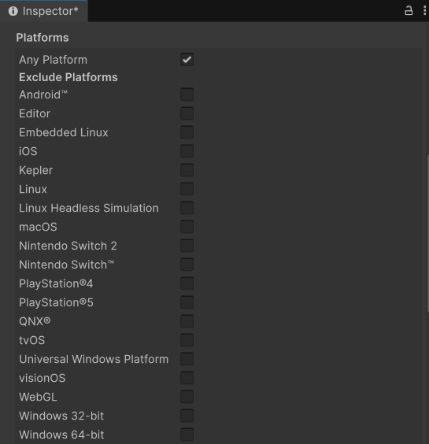
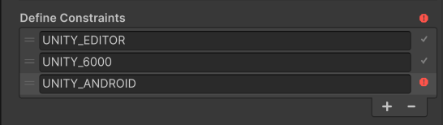
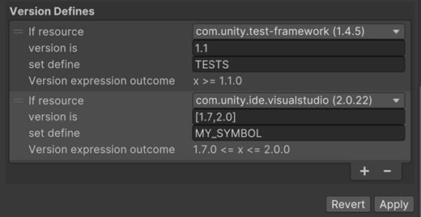

# Assembly Definition Inspector 窗口参考

> 原文：[Assembly Definition Inspector window reference](https://docs.unity3d.com/6000.7/Documentation/Manual/class-AssemblyDefinitionImporter.html)

点击 Assembly Definition Asset，可在 Inspector 窗口中设置程序集的属性。

*图：Assembly Definition importer Inspector 窗口中可配置属性的 Name 和 General 部分。*

## Name

| Property | Description |
| --- | --- |
| **Name** | 程序集的名称（不含文件扩展名）。程序集名称在整个 Project 中必须唯一。如果希望在多个 Project 中使用该程序集，可以考虑使用 reverse-DNS 命名风格，以降低名称冲突的可能性。有关程序集命名的 .NET 要求和建议，请参阅 [.NET Assembly names](https://learn.microsoft.com/en-us/dotnet/standard/assembly/names)。**注意**：Unity 使用分配给 Assembly Definition 资源的名称作为 Name 字段的默认值，但可以按需更改名称。不过，如果通过名称而不是 GUID 引用 Assembly Definition，更改名称会破坏该引用。 |

## General Options

| Property | Description |
| --- | --- |
| **Allow ‘unsafe’ Code** | 如果程序集中的脚本使用了 C# [`unsafe`](https://learn.microsoft.com/en-us/dotnet/csharp/language-reference/keywords/unsafe) 关键字，请启用此选项。启用后，Unity 编译程序集时会向 C# 编译器传递 `/unsafe` 选项。 |
| **Auto Referenced** | 指定 Unity 的预定义程序集是否自动引用该程序集。禁用后，Unity 在编译时不会自动引用该程序集。这不会影响 Unity 是否在构建中包含该程序集。 |
| **No Engine References** | 启用后，Unity 编译程序集时不会添加对 `UnityEditor` 或 `UnityEngine` 程序集的引用。 |
| **Override References** | 启用此选项可以手动指定该程序集依赖的预编译程序集。启用后，Inspector 会显示 Assembly References 部分，可以使用该部分指定引用。预编译程序集是在项目外部编译的库。默认情况下，项目中定义的程序集会引用添加到项目中的所有预编译程序集。启用 Override References 后，该程序集只引用在 Assembly References 下添加的预编译程序集。**注意**：要防止项目程序集自动引用某个预编译程序集，可以禁用该预编译程序集的 Auto Referenced 选项。更多信息请参阅 [Import and configure plug-ins](https://docs.unity3d.com/6000.7/Documentation/Manual/plug-in-inspector.html)。 |
| **Root Namespace** | 此 Assembly Definition 中脚本的默认命名空间。如果使用 [Rider](https://docs.unity3d.com/6000.7/Documentation/Manual/scripting-ide-support.html#rider) 或 [Visual Studio](https://docs.unity3d.com/6000.7/Documentation/Manual/scripting-ide-support.html#visual-studio) 作为代码编辑器，它们会自动将此命名空间添加到在该 Assembly Definition 中创建的新脚本。 |

更多信息请参阅 [[02-创建程序集定义#create-asmdef|创建 Assembly Definition 资源]]。

## Assembly Definition References

*图：Assembly Definition importer Inspector 窗口中的 Assembly Definition References 和 Assembly References 部分。*

| Property | Description |
| --- | --- |
| **Assembly Definition References** | 要从当前程序集引用的程序集列表。点击 **+** 按钮添加新引用，点击 **-** 按钮移除引用。Unity 使用这些引用编译程序集，并定义程序集之间的依赖关系。 |
| **Use GUIDs** | 控制 Unity 如何序列化对其他 Assembly Definition 资源的引用。启用此属性后，Unity 将引用保存为资源的 GUID，而不是 Assembly Definition 名称。建议使用 GUID 而不是名称，因为这样可以更改 Assembly Definition 资源的名称，而不必更新引用该资源的其他 Assembly Definition 文件。 |

更多信息请参阅 [[02-创建程序集定义#create-asmdef|创建 Assembly Definition 资源]]。

## Assembly References

| Property | Description |
| --- | --- |
| **Assembly References** | 只有在 General Options 部分启用 Override References 属性时，才会显示 Assembly References 部分。使用此部分指定该程序集所依赖的预编译程序集。更多信息请参阅“引用程序集”页面中的“引用预编译插件程序集”部分。 |

## Platforms

*图：Assembly Definition importer Inspector 窗口中选中 Any Platform 的 Platforms 部分。*

| Property | Description |
| --- | --- |
| **Platforms** | Platforms 列表定义程序集要针对哪些目标平台进行编译。如果选择 **Any Platform**，Unity 会针对所有平台编译程序集，并排除选择的单个平台。如果取消选择 **Any Platform**，Unity 默认不会针对任何平台编译程序集，只会包含选择的单个平台。 |

更多信息请参阅 [[02-创建程序集定义#create-platform-specific|创建特定于平台的程序集]]。

## Define Constraints

*图：Assembly Definition importer Inspector 窗口 Define Constraints 部分中配置的预处理器符号列表，其中一个约束被突出显示为当前未满足。*

| Property | Description |
| --- | --- |
| **Define Constraints** | Define constraints 指定项目中必须定义的脚本符号，Unity 才会编译或引用程序集。列表中的所有符号都必须已定义，程序集才会编译。约束的工作方式类似于 C# 中的 `#if` [预处理器指令](https://docs.unity3d.com/6000.7/Documentation/Manual/platform-dependent-compilation.html)，但作用于程序集级别而不是脚本级别。在符号前加感叹号（`!`）可以对其取反。例如，`!ENABLE_IL2CPP` 指定符号 `ENABLE_IL2CPP` 必须未定义，程序集才会编译。使用 `||`（OR）运算符可以指定至少一个约束必须存在，约束才满足。例如，`UNITY_IOS || UNITY_EDITOR_OSX` 会在定义了 `UNITY_IOS` 或 `UNITY_EDITOR_OSX` 时编译程序集。如果当前不满足某个约束，Unity 会在该约束和 Define Constraints 部分标记红色信息图标。可以使用 Unity 的[内置脚本符号](https://docs.unity3d.com/6000.7/Documentation/Manual/scripting-symbol-reference.html)和定义的[自定义脚本符号](https://docs.unity3d.com/6000.7/Documentation/Manual/custom-scripting-symbols.html)。更多信息请参阅 [Platform dependent compilation](https://docs.unity3d.com/6000.7/Documentation/Manual/platform-dependent-compilation.html)。**注意**：Define Constraints 应用于项目中当前活动平台的 [Build Profiles](https://docs.unity3d.com/6000.7/Documentation/Manual/build-profiles.html)。要为多个平台定义符号，必须切换到每个平台并单独修改 Define Constraints 字段。 |

更多信息请参阅 [[04-程序集包含规则|有条件地包含程序集]]。

## Version Defines

*图：Assembly Definition importer Inspector 窗口中的 Version Defines 部分，其中为 Unity Test Framework 和 VS Code Package 的特定版本配置了定义。*

根据项目中 Package 和 Module 的版本指定要定义的符号。

| Property | Description |
| --- | --- |
| **If resource** | Package 或 Module。 |
| **version is** | 定义版本或版本范围的表达式。 |
| **set define** | 当适用版本的资源也存在于项目中时要定义的符号。 |
| **Version expression outcome** | 将表达式计算为逻辑语句，其中 `x` 是被检查的版本。如果表达式结果显示 **Invalid**，则表示表达式格式错误。 |

有关这些属性的定义方法和版本表达式的正确语法，请参阅 [[04-程序集包含规则#define-symbols|根据项目 Package 定义符号]]。

## 其他资源

- [[02-创建程序集定义]]
- [[03-引用程序集]]
- [[08-程序集定义引用Inspector窗口参考]]
- [[06-程序集定义文件格式]]

---

## 文档导航

- 上一页：[[05-程序集元数据]]
- 目录：[[00-程序集定义]]
- 下一页：[[08-程序集定义引用Inspector窗口参考]]
