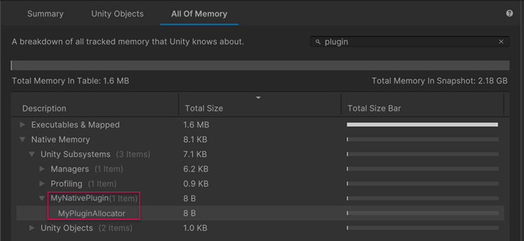

# Native Plug-in Memory Management API

> 原文：[Native plug-in API for memory management](https://docs.unity3d.com/6000.7/Documentation/Manual/low-level-native-plugin-memory-manager-api.html)

`IUnityMemoryManager` Memory Manager API 允许使用 Unity 的 Memory Management 和 Memory Profiling，管理以 C 或 C++ 编写的 Native Plug-in。

该 API 支持：

- 通过 Memory Allocator 访问 Unity Memory Manager。
- 通过 Unity 的 [Memory Profiler package](https://docs.unity3d.com/Packages/com.unity.memoryprofiler@latest) 跟踪 Plug-in 的 Memory 使用情况。

与等效的 C++ Memory Management 方法相比，这些功能更易于管理和分析 Plug-in 的 Memory Allocation。

Plug-in API 由 `IUnityMemoryManager` Interface 提供，该 Interface 声明在 `IUnityMemoryManager.h` Header File 中，位于 [[01-Native Plug-in API简介#Plugin API 文件夹|PluginAPI 文件夹]]。

更多信息请参阅 Header File 中以 Code Comment 提供的文档。

要有效使用此 API，应熟悉以下概念：

- [C++ Pointers](https://learn.microsoft.com/en-us/cpp/cpp/pointers-cpp?view=msvc-170)
- [Unity 中的 Memory](https://docs.unity3d.com/6000.7/Documentation/Manual/performance-memory-overview.html)
- [Memory Profiler package](https://docs.unity3d.com/Packages/com.unity.memoryprofiler@latest)
- [Memory allocator customization](https://docs.unity3d.com/6000.7/Documentation/Manual/memory-allocator-customization.html)
- [Predefined macros](https://learn.microsoft.com/en-us/cpp/preprocessor/predefined-macros?view=msvc-170)

## 在 Unity 中跟踪 Memory 使用情况

要跟踪 Plug-in 的 Memory 使用情况，请使用 [Memory Profiler package](https://docs.unity3d.com/Packages/com.unity.memoryprofiler@latest) 创建 Snapshot，然后在 [All Of Memory](https://docs.unity3d.com/Packages/com.unity.memoryprofiler@latest/index.html?subfolder=/manual/all-memory-tab.html) 屏幕中打开该 Snapshot。使用 `IUnityMemoryManager` 分配 Memory 时，Memory Profiler 会在创建每个 Allocator 时所分配的 Area Name 和 Object Name 下显示 Plug-in 的 Memory Allocation。

下面的截图显示了 Memory Profiler package 窗口，其中展示了使用 `IUnityMemoryManager` API 分配 Memory 的 Native Plug-in 所使用的 Memory。本例调用了 **CreateAllocator** 方法，并将 “MyNativePlugin” 作为 `areaName` 参数，将 “MyPluginAllocator” 作为 `objectName` 参数。更多信息请参阅 [[04-IUnityMemoryManager API参考]]。

> 图：Memory Profiler package 窗口显示名为 Plugin Backend Allocator 的用户定义 Allocator 所使用的 Memory。

更多信息请参阅 [Snapshots](https://docs.unity3d.com/Packages/com.unity.memoryprofiler@latest/index.html?subfolder=/manual/snapshots.html)。

## Memory Management 的限制

该 API 允许在开发 Native Plug-in 时使用 Unity 的 Memory Management System。这如上所述有许多好处，但仍存在限制。Unity 的 Memory Management System：

- 不会自动管理；必须自行分配和释放 Memory。
- 不会由 Garbage Collector 跟踪和清理。

由于 Native C++ 中的 Memory 不受管理，因此需要跟踪 Application 的所有 Memory Requirements。这包括选择正确的 Memory Allocation 大小，并确保不再需要时释放它。

`IUnityMemoryManager` API 会影响性能，因为每次 Allocation 都需要一次 Virtual Call。为尽量减少这种性能影响，应较低频率地分配较大的 Memory Block。若要处理更小且更频繁的 Allocation，可以使用此 API 分配一个较大的 Block，然后编写自己的 Code 管理该 Block 内的 Memory。不要将此 API 用于频繁的小型 Allocation。

## 其他资源

- [[00-Native Plug-in API]]
- [Native plug-ins](https://docs.unity3d.com/6000.7/Documentation/Manual/plug-ins-native.html)
- [Memory in Unity introduction](https://docs.unity3d.com/6000.7/Documentation/Manual/performance-memory-overview.html)
- [Customizing native memory allocators](https://docs.unity3d.com/6000.7/Documentation/Manual/memory-allocator-customization.html)

---

## 文档导航

- 上一页：[[06-Shader Compiler API]]
- 目录：[[00-Native Plug-in API]]
- 下一页：[[04-IUnityMemoryManager API参考]]
