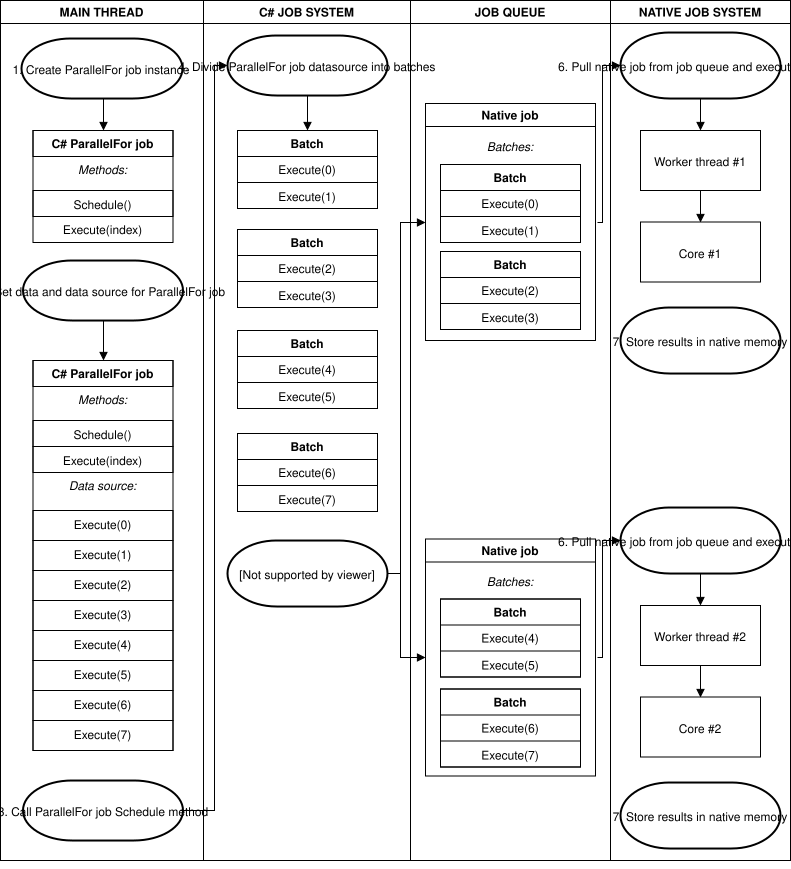

# 并行 Job

> 原文：[Parallel jobs](https://docs.unity3d.com/6000.7/Documentation/Manual/job-system-parallel-for-jobs.html)

当你[调度 Job](03-创建和运行Job.md#调度 Job)时，它的 `Execute` 方法只运行一次。不过，有时你可能需要对大量对象执行相同的操作。此时可以使用 ParallelFor Job 类型，它继承自 [`IJobParallelFor`](https://docs.unity3d.com/6000.7/Documentation/ScriptReference/Unity.Jobs.IJobParallelFor.html)。

ParallelFor Job 使用数据的 [`NativeArray`](https://docs.unity3d.com/6000.7/Documentation/ScriptReference/Unity.Collections.NativeArray_1.html) 作为操作对象的数据源。ParallelFor Job 会跨多个 CPU Core 运行，每个 Core 对应一个 Job，并分别处理工作负载的一个子集。

`IJobParallelFor` 的行为类似于 [`IJob`](https://docs.unity3d.com/6000.7/Documentation/ScriptReference/Unity.Jobs.IJob.html)，但它不是只调用一次 `Execute` 方法，而是针对数据源中的每个项目调用一次 `Execute` 方法。`Execute` 方法还包含一个整数参数 `index`，你可以在 Job 实现中使用它访问并操作数据源的单个元素。

下面是 ParallelFor Job 的定义示例：

```csharp
struct IncrementByDeltaTimeJob: IJobParallelFor
{
    public NativeArray<float> values;
    public float deltaTime;

    public void Execute (int index)
    {
        float temp = values[index];
        temp += deltaTime;
        values[index] = temp;
    }
}
```

## 调度 ParallelFor Job

要调度 ParallelFor Job，必须指定要拆分的 `NativeArray` 数据源长度。如果 Struct 中有多个 `NativeArray`，Job System 不知道应该使用哪个 `NativeArray` 作为数据源。该长度还会告诉 Job System 需要等待多少次 `Execute` 方法调用。

在 Unity 的原生代码中，调度 ParallelFor Job 的过程更加复杂。Unity 调度 ParallelFor Job 时，Job System 会将工作拆分成多个批次，并在各个 Core 之间分配这些批次。每个批次包含一部分 `Execute` 方法调用。随后，Job System 会在 Unity 原生 Job System 中按每个 CPU Core 调度一个 Job，并将该原生 Job 分配给这些批次来完成。



*ParallelFor Job 将批次分配到各个 Core*

如果某个原生 Job 比其他 Job 更早完成自己的批次，它会从其他原生 Job 中[窃取](01-Job%20System概览.md#工作窃取)剩余批次。为确保[缓存局部性](https://en.wikipedia.org/wiki/Locality_of_reference)，它每次只窃取某个原生 Job 剩余批次的一半。

为了优化这个过程，需要指定 Batch Count。Batch Count 控制 Job 的数量，以及线程之间重新分配工作时的粒度。Batch Count 较小（例如 1）可以让工作在线程之间均匀分配，但会产生一定调度开销，因此有时增大 Batch Count 更好。一个好的策略是从 1 开始逐步增大 Batch Count，直到性能收益变得微乎其微。

下面是调度 ParallelFor Job 的示例。

Job 代码：

```csharp
// Job adding two floating point values together
public struct MyParallelJob : IJobParallelFor
{
    [ReadOnly]
    public NativeArray<float> a;
    [ReadOnly]
    public NativeArray<float> b;
    public NativeArray<float> result;

    public void Execute(int i)
    {
        result[i] = a[i] + b[i];
    }
}
```

Main Thread 代码：

```csharp
NativeArray<float> a = new NativeArray<float>(2, Allocator.TempJob);

NativeArray<float> b = new NativeArray<float>(2, Allocator.TempJob);

NativeArray<float> result = new NativeArray<float>(2, Allocator.TempJob);

a[0] = 1.1f;
b[0] = 2.2f;
a[1] = 3.3f;
b[1] = 4.4f;

MyParallelJob jobData = new MyParallelJob();
jobData.a = a;
jobData.b = b;
jobData.result = result;

// Schedule the job with one Execute per index in the results array and only 1 item per processing batch
JobHandle handle = jobData.Schedule(result.Length, 1);

// Wait for the job to complete
handle.Complete();

// Free the memory allocated by the arrays
a.Dispose();
b.Dispose();
result.Dispose();
```

## ParallelForTransform Job

ParallelForTransform Job 是另一种 ParallelFor Job 类型，专门用于操作 [Transform](https://docs.unity3d.com/6000.7/Documentation/Manual/class-Transform.html)。它适合高效地从 Job 中处理 Transform 操作。

## 其他资源

- [ParallelForTransform API reference](https://docs.unity3d.com/6000.7/Documentation/ScriptReference/Jobs.IJobParallelForTransform.html)
- [[03-创建和运行Job]]

---

## 文档导航

- 上一页：[[05-Job依赖]]
- 目录：[[00-Job System]]
- 下一页：[[05-线程安全类型/00-线程安全类型]]
