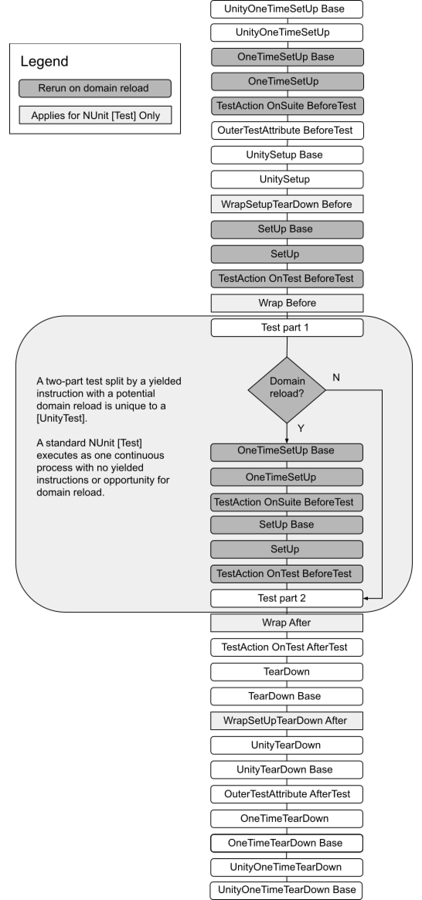

# 测试操作执行顺序

> 原文：[Execution order of test actions](https://docs.unity3d.com/6000.7/Documentation/Manual/test-framework/reference-actions-outside-tests.html)

编写测试时，可以使用 [SetUp 和 TearDown](https://docs.nunit.org/articles/nunit/technical-notes/usage/SetUp-and-TearDown.html) 方法来避免代码重复，这些方法内置于 [NUnit](http://www.nunit.org/) 中。Unity Test Framework 扩展了这些方法，增加了执行 yield 命令和跳过帧的功能，其方式与 [UnityTest](https://docs.unity3d.com/Packages/com.unity.test-framework@latest/index.html?subfolder=/api/UnityEngine.TestTools.UnityTestAttribute.html) 相同。

## 操作执行顺序

与测试相关的操作按以下顺序运行：

- 实现 [IApplyToContext](https://docs.nunit.org/articles/nunit/extending-nunit/IApplyToContext-Interface.html) 的特性（Attribute）。
- 标记了 [`[UnityOneTimeSetUp]`](https://docs.unity3d.com/Packages/com.unity.test-framework@latest/index.html?subfolder=/api/UnityEngine.TestTools.UnityOneTimeSetUpAttribute.html) 的方法。
- 标记了 [`[OneTimeSetUp]`](https://docs.nunit.org/articles/nunit/writing-tests/attributes/onetimesetup.html) 的方法。
- 实现 [IOuterUnityTestAction](https://docs.unity3d.com/Packages/com.unity.test-framework@latest/index.html?subfolder=/api/UnityEngine.TestTools.IOuterUnityTestAction.html) 的任意特性的 `BeforeTest` 方法。
- 标记了 [`[UnitySetUp]`](https://docs.unity3d.com/Packages/com.unity.test-framework@latest/index.html?subfolder=/api/UnityEngine.TestTools.UnitySetUpAttribute.html) 的方法。
- 实现 [IWrapSetUpTearDown](https://docs.nunit.org/articles/nunit/extending-nunit/ICommandWrapper-Interface.html) 的特性（Attribute）。
- 标记了 [`[SetUp]`](https://docs.nunit.org/articles/nunit/writing-tests/attributes/setup.html) 的方法。
- [Action attributes](https://docs.nunit.org/articles/nunit/extending-nunit/Action-Attributes.html?q=action%20a) 的 `BeforeTest` 方法。
- 实现 [IWrapTestMethod](https://docs.nunit.org/articles/nunit/extending-nunit/ICommandWrapper-Interface.html) 的特性（Attribute）。
- **测试本身运行**。
- [Action attributes](https://docs.nunit.org/articles/nunit/extending-nunit/Action-Attributes.html?q=action%20a) 的 `AfterTest` 方法。
- 标记了 [`[TearDown]`](https://docs.nunit.org/articles/nunit/writing-tests/attributes/teardown.html) 的方法。
- 标记了 [`[UnityTearDown]`](https://docs.unity3d.com/Packages/com.unity.test-framework@latest/index.html?subfolder=/api/UnityEngine.TestTools.UnityTearDownAttribute.html) 的方法。
- 实现 [IOuterUnityTestAction](https://docs.unity3d.com/Packages/com.unity.test-framework@latest/index.html?subfolder=/api/UnityEngine.TestTools.IOuterUnityTestAction.html) 的任意特性的 `AfterTest` 方法。
- 标记了 [`[OneTimeTearDown]`](https://docs.nunit.org/articles/nunit/writing-tests/attributes/onetimeteardown.html) 的方法。
- 标记了 [`[UnityOneTimeTearDown]`](https://docs.unity3d.com/Packages/com.unity.test-framework@latest/index.html?subfolder=/api/UnityEngine.TestTools.UnityOneTimeTearDownAttribute.html) 的方法。

对于 `Test` 和 `UnityTest`，操作列表相同。

### 执行顺序流程

*测试操作和回调的执行顺序，其中区分了域重载时会重新运行和不会重新运行的操作。*

## 其他资源

- [[03-UnitySetUp和UnityTearDown]]
- [[04-测试前后执行操作]]

---

## 文档导航

- 上一页：[[00-测试前后的操作]]
- 目录：[[00-测试前后的操作]]
- 下一页：[[02-构建时设置和清理]]
