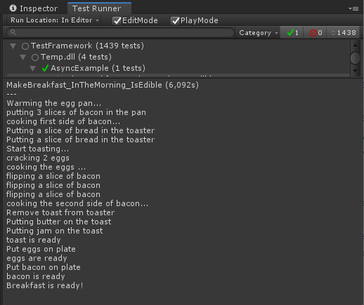

# 编写异步测试

> 原文：[Asynchronous tests](https://docs.unity3d.com/6000.7/Documentation/Manual/test-framework/reference-async-tests.html)

你可以使用 .NET Task 异步编程模型编写异步测试。如果你不熟悉异步编程及其应用，请参阅 [Microsoft 文档](https://docs.microsoft.com/en-us/dotnet/csharp/programming-guide/concepts/async/)中的完整指南。[NUnit Test](https://docs.nunit.org/articles/nunit/writing-tests/attributes/test.html) 文档也说明了异步测试的要求。异步代码在主线程上运行，Unity Test Framework 会在 Play Mode 的每次[更新](https://docs.unity3d.com/ScriptReference/PlayerLoop.Update.html)时，或在 Play Mode 之外的每次 [`EditorApplication.update`](https://docs.unity3d.com/ScriptReference/EditorApplication-update.html) 时检查任务是否完成，从而对其执行 `await`。

请注意，所有失败日志都会在异步测试完成后才首次评估。这意味着，如果异步测试中存在失败日志，直到测试完成后才会报告该日志。

以下代码片段演示了一个基于 Microsoft“制作早餐”示例的异步测试。请注意，测试方法使用 `async` 关键字标记，返回类型为 `Task`。我们创建一个 Task 列表，这些 Task 对应代表制作早餐各个部分的异步方法。我们使用 `await` 以非阻塞方式启动这些任务；每个任务完成时写入日志，并在所有任务完成后再次写入日志。

```csharp
using System.Collections.Generic;
using System.Threading.Tasks;
using NUnit.Framework;
using UnityEngine;

public class AsyncExample
{
    [Test]
    public async Task MakeBreakfast_InTheMorning_IsEdible()
    {
        var eggsTask = FryEggsAsync(2);
        var baconTask = FryBaconAsync(3);
        var toastTask = MakeToastWithButterAndJamAsync(2);

        var breakfastTasks = new List<Task> { eggsTask, baconTask, toastTask };
        while (breakfastTasks.Count > 0)
        {
            Task finishedTask = await Task.WhenAny(breakfastTasks);
            if (finishedTask == eggsTask)
            {
                Debug.Log("eggs are ready");
            }
            else if (finishedTask == baconTask)
            {
                Debug.Log("bacon is ready");
            }
            else if (finishedTask == toastTask)
            {
                Debug.Log("toast is ready");
            }
            breakfastTasks.Remove(finishedTask);
        }

        Debug.Log("Breakfast is ready!");
    }

    static async Task<Toast> MakeToastWithButterAndJamAsync(int number)
    {
        var toast = await ToastBreadAsync(number);
        ApplyButter(toast);
        ApplyJam(toast);

        return toast;
    }

    private static Juice PourOJ()
    {
        Debug.Log("Pouring orange juice");
        return new Juice();
    }

    private static void ApplyJam(Toast toast) =>
        Debug.Log("Putting jam on the toast");

    private static void ApplyButter(Toast toast) =>
        Debug.Log("Putting butter on the toast");

    private static async Task<Toast> ToastBreadAsync(int slices)
    {
        for (int slice = 0; slice < slices; slice++)
        {
            Debug.Log("Putting a slice of bread in the toaster");
        }
        Debug.Log("Start toasting...");
        await Task.Delay(3000);
        Debug.Log("Remove toast from toaster");

        return new Toast();
    }

    private static async Task<Bacon> FryBaconAsync(int slices)
    {
        Debug.Log($"putting {slices} slices of bacon in the pan");
        Debug.Log("cooking first side of bacon...");
        await Task.Delay(3000);
        for (int slice = 0; slice < slices; slice++)
        {
            Debug.Log("flipping a slice of bacon");
        }
        Debug.Log("cooking the second side of bacon...");
        await Task.Delay(3000);
        Debug.Log("Put bacon on plate");

        return new Bacon();
    }

    private static async Task<Egg> FryEggsAsync(int howMany)
    {
        Debug.Log("Warming the egg pan...");
        await Task.Delay(3000);
        Debug.Log($"cracking {howMany} eggs");
        Debug.Log("cooking the eggs ...");
        await Task.Delay(3000);
        Debug.Log("Put eggs on plate");

        return new Egg();
    }

    private static Coffee PourCoffee()
    {
        Debug.Log("Pouring coffee");
        return new Coffee();
    }

    public struct Toast
    {

    }

    public struct Juice
    {

    }

    public struct Bacon
    {

    }

    public struct Egg
    {

    }

    public struct Coffee
    {

    }
}
```

以下是上例在 **Test Runner** 窗口中运行后的结果：



*上一个异步测试代码示例运行后显示 Test Runner 窗口和控制台输出。*

## `Assert.ThrowsAsync` 导致 Editor 冻结及解决方法

NUnit 针对异步代码的断言 [Assert.ThrowsAsync](https://docs.nunit.org/articles/nunit/writing-tests/assertions/classic-assertions/Assert.ThrowsAsync.html) 会阻塞调用线程，直到传入的异步函数完成。默认情况下，Unity 在主线程上运行异步函数，以便这些函数可以调用 Editor API；这意味着 `Assert.ThrowsAsync` 可能锁定主线程并导致 Editor 冻结。

要解决此问题，可以将 `Assert.ThrowsAsync` 的逻辑展开为自己的 `try`/`catch` 代码块，并断言捕获到了某些内容。例如，**请这样做**：

```csharp
[Test]
public async Task ThisDoesNotLockTheMainThread()
 {
  bool caught = false;
  try
  { 
    await Task.Delay(1000); throw new System.Exception("Hello world."); }
    catch (System.Exception x)
   {
     caught = true;
   }
   Assert.That(caught);
}
```

**不要这样做**：

```csharp
[Test]
public void ThisLocksTheMainThread()
 {
  Assert.ThrowsAsync<System.Exception>(async () =>
   { await Task.Delay(1000); throw new System.Exception("Hello world."); }
  );
}
```

## 其他资源

- [使用 Awaitable 类进行异步编程](https://docs.unity3d.com/6000.7/Documentation/Manual/async-await-support.html)
- [[02-断言和比较]]

---

## 文档导航

- 上一页：[[04-编写参数化测试]]
- 目录：[[00-编写测试]]
- 下一页：[[../04-运行测试/00-运行测试]]
